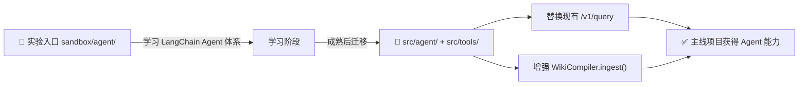
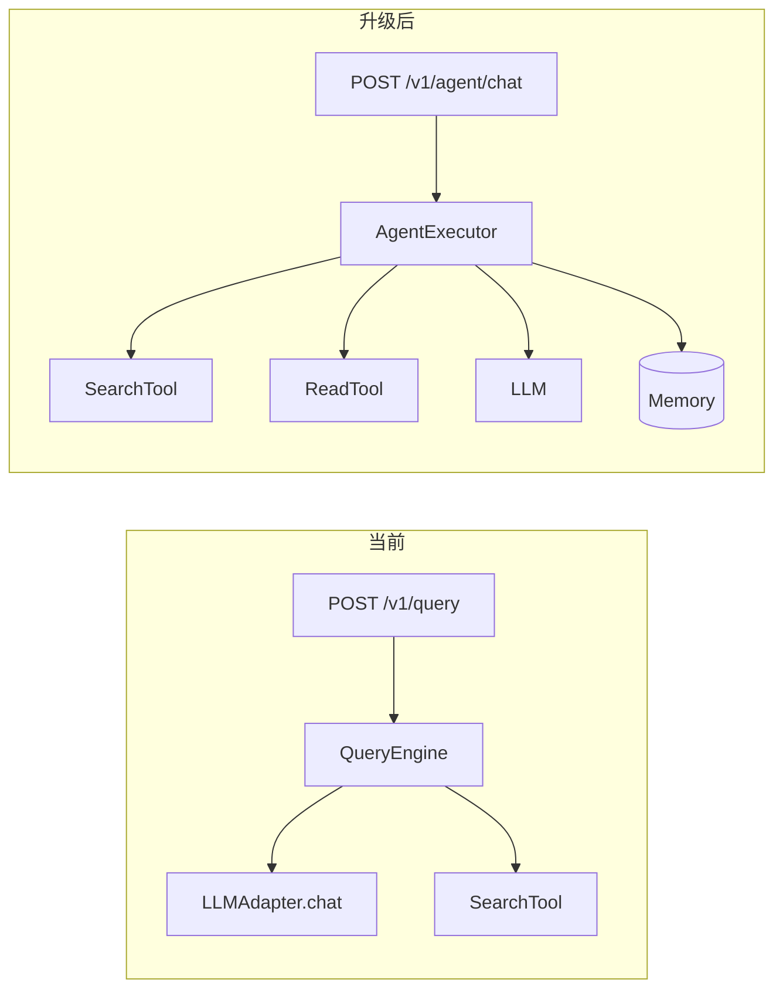
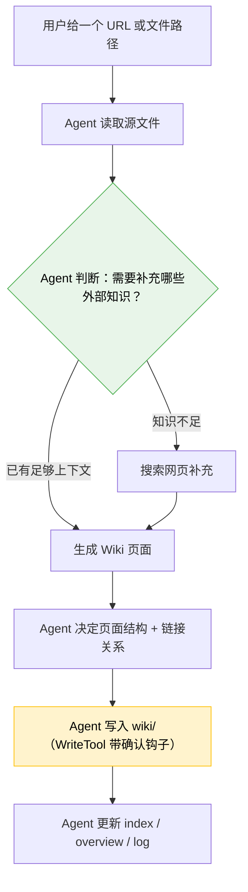

# Agent 对话能力 — 开发计划

> 基于 LangChain 框架，在现有 LLM Wiki 项目中逐步构建 Agent 能力
> 从对话问答 Agent (A) 起步，渐进扩展到 Agentic Ingest (B)
> 学习与实践并行：边学 LangChain 官方教程，边在本项目中落地

---

## 一、战略路线



### 实验与集成的边界

| 状态 | 位置 | 说明 |
|------|------|------|
| 🧪 实验中 | `sandbox/agent/` | 独立，可随意修改、调试、重写 |
| 🔧 待集成 | `sandbox/agent/phase3/agent_api.py` | 实验成熟后移入 `src/` |
| ✅ 已集成 | `src/agent/` | 稳定后的 Agent 模块 |
| 🏗️ 主线增强 | `src/core/compiler/` | Agentic Ingest 增强现有 Compiler |

---

## 二、实验目录结构

```
llm-wiki/
├── sandbox/                        # 实验场（与 src/ 平级）
│   └── agent/                      # Agent 能力实验
│       ├── README.md               # 学习路线 + 实验说明
│       │
│       ├── phase1_basic_agent/     # Phase 1: 最简 Agent
│       │   ├── 01_quickstart.py    #   动手前：通读 LangChain Agent 文档
│       │   ├── 02_tool_basics.py   #   理解 Tool 协议 + 自定义 Tool
│       │   ├── 03_react_agent.py   #   搭建 ReAct Agent
│       │   └── 04_chat_cli.py      #   命令行对话 Agent
│       │
│       ├── phase2_memory/          # Phase 2: 对话记忆
│       │   ├── 01_buffer_memory.py #   ConversationBufferMemory
│       │   ├── 02_summary_memory.py #   ConversationSummaryMemory
│       │   └── 03_memory_agent.py  #   带记忆的 Agent + 多轮对话
│       │
│       ├── phase3_wiki_agent/      # Phase 3: 接入 Wiki 工具
│       │   ├── 01_wiki_tools.py    #   封装 ReadTool/SearchTool → LangChain Tool
│       │   ├── 02_wiki_agent.py    #   Wiki 问答 Agent（替换 /v1/query 原型）
│       │   ├── 03_streaming.py     #   Streaming 输出
│       │   └── 04_agent_api.py     #   FastAPI 集成（新的 /v1/agent/chat）
│       │
│       ├── phase4_agentic_ingest/  # Phase 4: Agentic Ingest
│       │   ├── 01_ingest_tools.py  #   WriteTool 封装 + 网页搜索工具
│       │   ├── 02_ingest_agent.py  #   自主规划 Ingest 流程
│       │   └── 03_recovery.py      #   错误恢复 + 人工确认点
│       │
│       └── requirements.txt        # 额外依赖（如有）
│
├── src/
│   ├── agent/                      # [未来] 集成后的正式 Agent 模块
│   └── ...（现有结构不变）
```

---

## 三、分阶段详细计划

### Phase 1：基础 Agent（学习期：3-5 天）

**目标**：理解 LangChain Agent 核心机制，跑通 ReAct 循环

**前置学习**（LangChain 官方文档）：
- [Agent types](https://python.langchain.com/docs/concepts/agents/)
- [Tools](https://python.langchain.com/docs/concepts/tools/)
- [create_react_agent](https://python.langchain.com/docs/how_to/agent_executor/)

**实验安排**：

| 步骤 | 脚本 | 学习内容 | 产物 |
|------|------|----------|------|
| 1 | `01_quickstart.py` | `ChatOpenAI.bind_tools()`, Tool 协议 | 调用模型返回 tool_call |
| 2 | `02_tool_basics.py` | `@tool` 装饰器, BaseTool, args_schema | 自定义 2-3 个简单工具 |
| 3 | `03_react_agent.py` | `create_react_agent`, AgentExecutor | Agent 自主决定调哪个工具 |
| 4 | `04_chat_cli.py` | 循环输入 + 流式输出 | 命令行能对话的 Agent |

**关键代码示例**（Phase 1 产物形态）：

```python
# phase1_basic_agent/03_react_agent.py

from langchain_core.tools import tool
from langchain_openai import ChatOpenAI
from langgraph.prebuilt import create_react_agent

@tool
def search_wiki(query: str) -> str:
    """在 Wiki 知识库中搜索相关页面"""
    from src.tools.search_tool import SearchTool
    results = SearchTool().search(query)
    return "\n".join(f"- {r['path']}: {r['snippet']}" for r in results)

llm = ChatOpenAI(model=..., api_key=...)
tools = [search_wiki]
agent = create_react_agent(llm, tools)

# Agent 自动决定何时调用 search_wiki，何时直接回答
for chunk in agent.stream({"messages": [("human", "Python 异步编程有哪些页面？")]}):
    print(chunk)
```

---

### Phase 2：对话记忆（学习期：2-3 天）

**目标**：让 Agent 记住对话上下文，支持多轮追问

**前置学习**：
- [Conversation Memory](https://python.langchain.com/docs/concepts/memory/)
- [How to add memory](https://python.langchain.com/docs/how_to/memory_add/)

**实验安排**：

| 步骤 | 脚本 | 学习内容 | 产物 |
|------|------|----------|------|
| 1 | `01_buffer_memory.py` | ConversationBufferMemory | 原始记忆 + 窗口截断 |
| 2 | `02_summary_memory.py` | ConversationSummaryMemory | 长对话压缩摘要 |
| 3 | `03_memory_agent.py` | Memory + Agent 整合 | Agent 能记住上一轮话题 |

**关键决策**：Phase 2 实验两种记忆方案，在 Phase 3 集成时选一种：

- **BufferMemory**：保留最近 N 轮，简单直接，但 token 消耗线性增长
- **SummaryMemory**：LLM 压缩历史，token 可控但有小延迟
- **推荐**：先用 BufferMemory（窗口=6 轮），够用了

---

### Phase 3：Wiki Agent 集成（开发期：3-5 天）

**目标**：将实验成果集成回主线，替换现有 `/v1/query`

**核心变更**：



**实验安排**：

| 步骤 | 脚本 | 内容 | 说明 |
|------|------|------|------|
| 1 | `01_wiki_tools.py` | 将 SearchTool、ReadTool 封装为 LangChain `@tool` | 重点：Tool schema 描述要精准 |
| 2 | `02_wiki_agent.py` | Agent 绑定 Wiki 工具，多轮问答 | 对比和当前 QueryEngine 的效果差异 |
| 3 | `03_streaming.py` | 实现 SSE 流式输出 | Agent 的中间推理过程可以展示 |
| 4 | `04_agent_api.py` | 注册新路由 `/v1/agent/chat` | 集成回 FastAPI |

**新增 API**：

```python
# 最终集成到 src/main.py
from src.agent.api import router as agent_router
app.include_router(agent_router)

# POST /v1/agent/chat
# Request:  {"message": "Python 异步的性能优势", "session_id": "...", "stream": true}
# Response: {"answer": "...", "sources": [...], "thinking": "...", "session_id": "..."}
```

**集成原则**：
- 新建 `src/agent/` 模块，不修改现有 `src/core/` 稳定代码
- 现有 `/v1/query` 保留作为 fallback，新 endpoint 加 `/v1/agent/chat`
- LangChain Tool 封装放在 `src/agent/tools.py`，内部调用 `src/tools/` 的既有实现

---

### Phase 4：Agentic Ingest（开发期：3-5 天）

**目标**：让 Agent 自主规划素材摄入流程

**和 Phase 3 的技术差异**：

| 维度 | Phase 3 (对话问答) | Phase 4 (Agentic Ingest) |
|------|--------------------|-------------------------|
| Tools | SearchTool, ReadTool | **WriteTool**, WebSearchTool |
| 记忆 | 短期对话记忆 | 不需要记忆 |
| 规划 | ReAct（单步推理） | Plan-and-Execute（多步） |
| 风险 | 低（读操作） | **高**（写操作需要确认） |
| 关键设计 | 工具描述准确性 | 人工确认点护栏 |

**实验安排**：

| 步骤 | 脚本 | 内容 | 关键点 |
|------|------|------|--------|
| 1 | `01_ingest_tools.py` | 封装 WriteTool + 网页搜索工具 | WriteTool 加确认钩子 |
| 2 | `02_ingest_agent.py` | Agent 自主执行 Ingest | 对比当前硬编码 pipeline |
| 3 | `03_recovery.py` | 错误处理 + 人工确认机制 | 写操作前暂停确认 |

**Agentic Ingest 流程**：



**安全护栏**：
- WriteTool 在写入前暂停，打印 diff 等待用户确认（默认不跳过）
- 可配置 `auto_write=True` 关闭确认（用于批处理）
- Max steps 限制（防止 Agent 死循环）
- 敏感内容写入触发隐私规则校验（复用现有 PrivacyManager）

---

## 四、和 LangChain 教程的对应关系

每个实验脚本头部标注对应的官方文档链接：

```python
"""
LangChain Agent 快速入门
────────────────────
学习目标：
  1. 理解 Tool 协议 — @tool 装饰器 / BaseTool
  2. 理解 bind_tools 如何绑定工具到 LLM
  3. 理解 create_react_agent 的 Agent 循环

对应文档：
  - https://python.langchain.com/docs/concepts/agents/
  - https://python.langchain.com/docs/how_to/agent_executor/

前置条件：已完成 LangChain 官方 Quickstart
"""
```

建议的学习节奏：

```mermaid
gantt
    title LangChain Agent 学习路线
    dateFormat  D
    axisFormat  第%D天

    section Phase 1 🧪 基础 Agent
    通读 Agent 概念文档     :p1, 0, 2d
    跑 Phase 1 实验脚本     :1, 2d

    section Phase 2 💾 对话记忆
    学 Memory 文档          :p2, after p1, 2d
    跑 Phase 2 实验脚本     :2, 2d

    section Phase 3 🔧 Wiki 集成
    学 Custom Tool 文档     :p3, after p2, 2d
    跑 Phase 3 脚本         :3, 2d
    集成回 API              :4, 2d

    section Phase 4 🤖 Agentic Ingest
    学 Plan-and-Execute     :p4, after p3, 2d
    跑 Phase 4 脚本         :5, 2d
```



---

## 五、风险评估

| 风险 | 可能性 | 缓解措施 |
|------|--------|----------|
| Agent 绕圈子/死循环 | 中 | AgentExecutor.max_iterations 硬限制 |
| Tool 调用参数乱传 | 中 | Tool 参数的 description 写详细+校验 |
| 写操作误覆盖 | 低 | Phase 4 写入前默认暂停确认 |
| 实验代码拖太久不集成 | 中 | Phase 3 明确「集成到 src/」作为完成条件 |
| LangChain 版本兼容 | 低 | requirements.txt 锁定版本，和主线一致 |

---

## 六、成功标准

Phase 3 完成后：
```
curl -X POST http://localhost:8000/v1/agent/chat \
  -H "Content-Type: application/json" \
  -d '{"message": "Python 异步编程", "session_id": "test-1"}'
→ { "answer": "...# 带 Wiki 引用", "sources": [...], "thinking": "..." }

curl -X POST http://localhost:8000/v1/agent/chat \
  -H "Content-Type: application/json" \
  -d '{"message": "性能上有什么优势？", "session_id": "test-1"}'
→ { "answer": "...# 能记住上一轮话题", ... }
```

Phase 4 完成后：
与当前 `ingest()` 对比，Agentic 版本的输出质量（页面结构、链接完整性）不低于硬编码 pipeline。

---

## 七、文档说明

| 项目 | 说明 |
|------|------|
| 设计人 | wula |
| 创建日期 | 2026-07-10 |
| 状态 | 设计稿，待实现 |
| 相关文件 | `.specify/roadmap-phase5.md` |
| 后续入口 | `writing-plans` skill 生成实现计划 |
