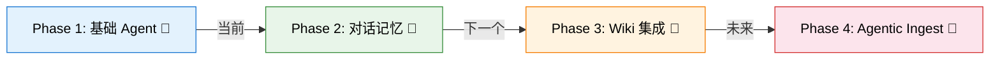

# Phase 1: 基础 Agent — 实现计划

> **For agentic workers:** Inline execution. Steps use checkbox (`- [ ]`) syntax.

**Goal:** 在 `sandbox/agent/phase1_basic_agent/` 下创建 4 个可独立运行的实验脚本，从零到 ReAct Agent 命令行对话

**Architecture:** 每个脚本独立可运行，利用现有项目的 `SearchTool`（封装为 LangChain `@tool`），通过 `langgraph.prebuilt.create_react_agent` 构建 Agent 循环。按学习梯度：bind_tools → 自定义 Tool → ReAct Agent → CLI 交互。

**Tech Stack:** Python 3.11+, langchain-core 1.4.8, langchain-openai 1.3.3, langgraph 1.2.9

## Global Constraints

- 不修改 `src/` 下的任何现有代码
- 每个脚本可在项目根目录执行 `python sandbox/agent/phase1_basic_agent/01_xxx.py` 独立运行
- 每个脚本头部标注对应 LangChain 官方文档链接
- 脚本通过 `sys.path` 添加项目根路径来 import 现有模块（`src.tools.search_tool.SearchTool`）
- 语言模型复用项目的 `.env` 配置（`DEEPSEEK_API_KEY` / `LLM_PROVIDER`）

---

## 文件结构

```
sandbox/
├── agent/
│   ├── README.md                          # 学习路线图 + 实验说明
│   └── phase1_basic_agent/
│       ├── 01_quickstart.py               # ① 理解 Tool 协议 + bind_tools
│       ├── 02_tool_basics.py              # ② 掌握 @tool 装饰器协议
│       ├── 03_react_agent.py              # ③ 搭建 ReAct Agent（SearchTool）
│       └── 04_chat_cli.py                 # ④ 命令行对话循环
```

### Task 1: 目录结构 + README

**Files:**
- Create: `sandbox/agent/README.md`

**Interfaces:**
- Produces: 学习路线图，标注每个脚本的学习目标和前置知识

- [ ] **Step 1: 创建目录并写入 README**

```bash
mkdir -p sandbox/agent/phase1_basic_agent
```

```markdown
# sandbox/agent — Agent 能力实验场

> 边学 LangChain 边实践，逐步构建 Wiki Agent 能力。
> 实验成熟后集成回 `src/agent/` 主线。

## 学习路线



## Phase 1: 基础 Agent

| # | 脚本 | 学习目标 | 前置知识 |
|---|------|----------|----------|
| 1 | `01_quickstart.py` | Tool 协议、bind_tools、create_react_agent 最简循环 | Python + 基本 LLM 概念 |
| 2 | `02_tool_basics.py` | `@tool` 装饰器、Tool 元数据、args_schema | 完成 01 |
| 3 | `03_react_agent.py` | 将 SearchTool 封装为 Tool，观察 Agent 推理过程 | 完成 02 |
| 4 | `04_chat_cli.py` | 命令行交互循环、Streaming、错误恢复 | 完成 03 |

## 运行方式

```bash
# 在项目根目录执行
python sandbox/agent/phase1_basic_agent/01_quickstart.py
python sandbox/agent/phase1_basic_agent/02_tool_basics.py
python sandbox/agent/phase1_basic_agent/03_react_agent.py
python sandbox/agent/phase1_basic_agent/04_chat_cli.py
```

## 设计文档

详细计划见 `.specify/agent-development-plan.md`
```

- [ ] **Step 2: Commit**

```bash
git add sandbox/agent/README.md
git commit -m "feat(sandbox): add agent experiment README with learning roadmap"

Co-Authored-By: Claude <noreply@anthropic.com>
```

---

### Task 2: 01_quickstart.py — 理解 Tool 协议 + bind_tools

**Files:**
- Create: `sandbox/agent/phase1_basic_agent/01_quickstart.py`

**Interfaces:**
- Consumes: 项目根 `.env` 中的 API Key 配置
- Produces: 可独立运行的脚本，打印 Agent 调用工具的过程

- [ ] **Step 1: 创建 01_quickstart.py**

这个脚本的目标是理解 LangChain Agent 的最底层机制：
1. `ChatOpenAI.bind_tools()` — 让 LLM 知道有哪些工具可用
2. 观察 LLM 返回 `tool_call`（而不是直接回答）的行为
3. `create_react_agent` — 最简单完整的 Agent 循环
4. `AgentExecutor` — 如何执行工具并继续

```python
"""
01_quickstart — LangChain Agent 最简示例
────────────────────────────────────────
学习目标：
  1. ChatOpenAI.bind_tools() — 将工具绑定到 LLM
  2. 观察 LLM 返回 tool_call 的行为
  3. create_react_agent + AgentExecutor 的最简循环

对应文档：
  - https://docs.langchain.org.cn/oss/python/langchain/agents
  - https://docs.langchain.org.cn/oss/python/langchain/tools
  - https://reference.langchain.org.cn/python/langchain/agents/factory/create_agent

运行方式：
  python sandbox/agent/phase1_basic_agent/01_quickstart.py

前置条件：
  - 项目根 .env 文件已配置 DEEPSEEK_API_KEY
"""
import sys
import os
from pathlib import Path

# ── 将项目根加入 sys.path（方便 import src/ 下的模块） ──
PROJECT_ROOT = Path(__file__).resolve().parents[3]  # sandbox/agent/phase1_basic_agent/ → 项目根
sys.path.insert(0, str(PROJECT_ROOT))

from dotenv import load_dotenv
from langchain_core.tools import tool
from langchain_openai import ChatOpenAI
from langgraph.prebuilt import create_react_agent

load_dotenv()

# ===============================================================
# 第 1 步：定义工具
# ===============================================================
# @tool 装饰器将普通函数转为 LangChain Tool 对象。
# 函数的 docstring 成为 Tool 的 description（LLM 靠它决定何时调用）。
# 函数的类型注解成为 Tool 的参数 schema。

@tool
def add(a: int, b: int) -> int:
    """将两个数字相加。"""
    return a + b


@tool
def multiply(a: int, b: int) -> int:
    """将两个数字相乘。"""
    return a * b


# Tool 对象可以像函数一样调用
print("\n=== 第 1 步：Tool 对象 ===")
print(f"add(3, 5) = {add.invoke({'a': 3, 'b': 5})}")

# 查看 Tool 的元数据 — LLM 看到的就是这些
print(f"\nTool name: {add.name}")
print(f"Tool description: {add.description}")
print(f"Tool args: {add.args}")

# ===============================================================
# 第 2 步：bind_tools — 让 LLM 知道工具的存在
# ===============================================================
print("\n=== 第 2 步：bind_tools ===")

llm = ChatOpenAI(
    model=os.environ.get("DEEPSEEK_MODEL", "deepseek-v4-flash"),
    api_key=os.environ["DEEPSEEK_API_KEY"],
    base_url=os.environ.get("DEEPSEEK_API_BASE", "https://api.deepseek.com/v1"),
    timeout=15,
    max_retries=1,
)

# bind_tools 不会改变 LLM 的行为，只是将工具描述加入 system prompt。
# LLM 在认为需要时，会返回 AIMessage.tool_calls 而不是直接回复文本。
llm_with_tools = llm.bind_tools([add, multiply])

# 测试：问一个需要计算的问题
response = llm_with_tools.invoke("3 乘以 4 等于多少？")
print(f"\nResponse type: {type(response).__name__}")
print(f"Content: {response.content}")
print(f"Tool calls: {response.tool_calls}")

# 如果 LLM 返回了 tool_calls，可以手动执行工具
if response.tool_calls:
    for tc in response.tool_calls:
        tool_name = tc["name"]
        tool_args = tc["args"]
        print(f"\n  → 调用工具: {tool_name}({tool_args})")
        if tool_name == "add":
            print(f"    结果: {add.invoke(tool_args)}")
        elif tool_name == "multiply":
            print(f"    结果: {multiply.invoke(tool_args)}")

print("\n" + "=" * 50)

# ===============================================================
# 第 3 步：create_react_agent — 完整的 Agent 循环
# ===============================================================
print("\n=== 第 3 步：create_react_agent ===")

# create_react_agent 自动处理：
#   1. 将工具描述注入 system prompt
#   2. 解析 LLM 返回的 tool_calls
#   3. 执行工具并将结果传回
#   4. 重复直到 LLM 不再需要调用工具

tools = [add, multiply]
agent = create_react_agent(llm, tools)

# stream() 返回生成器，逐步输出 Agent 的思考过程
for chunk in agent.stream(
    {"messages": [("human", "请计算 (3 + 5) × 2 的结果")]},
    stream_mode="values",
):
    last_msg = chunk["messages"][-1]
    if hasattr(last_msg, "tool_calls") and last_msg.tool_calls:
        for tc in last_msg.tool_calls:
            print(f"  🤖 LLM 决定调用: {tc['name']}({tc['args']})")
    elif last_msg.content:
        print(f"  💬 {last_msg.content}")

print("\n✅ 01_quickstart 完成！")
```

- [ ] **Step 2: 运行验证**

```bash
cd D:\gtiHub\llm_wiki_selfbuild
python sandbox/agent/phase1_basic_agent/01_quickstart.py
```

预期：脚本打印出 Tool 绑定、tool_calls、Agent 完整循环的输出。

- [ ] **Step 3: Commit**

```bash
git add sandbox/agent/phase1_basic_agent/01_quickstart.py
git commit -m "feat(sandbox): add phase1 01_quickstart — Tool protocol and bind_tools basics"

Co-Authored-By: Claude <noreply@anthropic.com>
```

---

### Task 3: 02_tool_basics.py — 掌握 @tool 装饰器协议

**Files:**
- Create: `sandbox/agent/phase1_basic_agent/02_tool_basics.py`

**Interfaces:**
- Consumes: `src.tools.search_tool.SearchTool`（通过 sys.path 引入）
- Produces: 演示 Tool 定义的各种模式

- [ ] **Step 1: 创建 02_tool_basics.py**

重点：
1. `@tool` 装饰器的多种用法（name、return_direct）
2. Tool 的 description 为什么重要（LLM 靠它选择工具）
3. 将现有项目的 SearchTool 封装为 LangChain Tool
4. Tool 调用的错误处理

```python
"""
02_tool_basics — 掌握 @tool 装饰器协议
────────────────────────────────────────
学习目标：
  1. @tool 装饰器的多种用法（显式 name、return_direct）
  2. Tool description 对 LLM 工具选择的影响
  3. 将现有项目 SearchTool 封装为 LangChain Tool
  4. Tool 调用中的错误处理模式

对应文档：
  - https://docs.langchain.org.cn/oss/python/langchain/tools
  - https://docs.langchain.org.cn/oss/python/langchain/tools#customize-tool-properties
  - https://docs.langchain.org.cn/oss/python/langchain/tools#error-handling

运行方式：
  python sandbox/agent/phase1_basic_agent/02_tool_basics.py
"""
import sys
import os
from pathlib import Path

PROJECT_ROOT = Path(__file__).resolve().parents[3]
sys.path.insert(0, str(PROJECT_ROOT))

from dotenv import load_dotenv
from langchain_core.tools import tool
from langchain_openai import ChatOpenAI
from langgraph.prebuilt import create_react_agent

load_dotenv()

# ===============================================================
# 第 1 步：@tool 的多种用法
# ===============================================================
print("=== 第 1 步：@tool 的各种模式 ===\n")

# --- 模式 A：最简（函数名即 tool name，docstring 即 description） ---
@tool
def get_current_time() -> str:
    """返回当前时间的字符串表示。"""
    from datetime import datetime
    return datetime.now().strftime("%Y-%m-%d %H:%M:%S")

print(f"模式 A — name: {get_current_time.name}")
print(f"  description: {get_current_time.description}")
print(f"  args: {get_current_time.args}")
print(f"  调用: {get_current_time.invoke({})}")

# --- 模式 B：显式指定 name 和 description ---
@tool(name="weather_query")
def get_weather(city: str) -> str:
    """查询指定城市的天气。"""  # 这个被 name 和 description 覆盖
    # 这是一个模拟实现，实际会调用天气 API
    return f"{city} 的天气：晴朗，25°C"

# 但 @tool 的 name 参数优先级最高
print(f"\n模式 B — name: {get_weather.name}")  # 输出 weather_query

# --- 模式 C：复杂的参数 schema ---
from typing import Optional

@tool
def search_database(
    query: str,
    limit: int = 10,
    category: Optional[str] = None,
) -> list[dict]:
    """在数据库中搜索记录，支持分类过滤和数量限制。"""
    results = [{"id": 1, "title": f"结果 {i} for '{query}'"} for i in range(limit)]
    if category:
        results = [r for r in results if category in str(r)]
    return results

print(f"\n模式 C — args: {search_database.args}")
# Tool 参数会自动生成 JSON Schema，限制 LLM 传错参数

# ===============================================================
# 第 2 步：Tool description 的重要性
# ===============================================================
print("\n=== 第 2 步：description 决定 LLM 是否调用工具 ===\n")

# 两个功能相同但描述不同的工具
@tool
def tool_a(query: str) -> str:
    """搜索用户信息。"""
    return f"User info for '{query}'"

@tool
def tool_b(query: str) -> str:
    """搜索产品目录。"""
    return f"Product info for '{query}'"

llm = ChatOpenAI(
    model=os.environ.get("DEEPSEEK_MODEL", "deepseek-v4-flash"),
    api_key=os.environ["DEEPSEEK_API_KEY"],
    base_url=os.environ.get("DEEPSEEK_API_BASE", "https://api.deepseek.com/v1"),
    timeout=15,
    max_retries=1,
)

agent = create_react_agent(llm, [tool_a, tool_b])
print("问：「张三的联系方式是什么？」")
print("期待：Agent 调用 tool_a（因为 description 说"搜索用户信息"）")
for chunk in agent.stream(
    {"messages": [("human", "张三的联系方式是什么？")]},
    stream_mode="values",
):
    last_msg = chunk["messages"][-1]
    if hasattr(last_msg, "tool_calls") and last_msg.tool_calls:
        for tc in last_msg.tool_calls:
            print(f"  → 调用了: {tc['name']}")
    elif last_msg.content:
        print(f"  回答: {last_msg.content[:100]}...")

# ===============================================================
# 第 3 步：将现有项目 SearchTool 封装为 LangChain Tool
# ===============================================================
print("\n=== 第 3 步：封装 SearchTool ===")

from src.tools.search_tool import SearchTool

_search_tool_instance = SearchTool()

@tool
def search_wiki(query: str, limit: int = 5) -> str:
    """
    在 Wiki 知识库中搜索相关页面。
    当用户询问某个知识点、概念或实体时，先搜索 Wiki 看是否有相关内容。
    """
    results = _search_tool_instance.search(query, limit=limit)
    if not results:
        return f"未找到与「{query}」相关的页面。"
    
    lines = [f"找到 {len(results)} 个相关页面："]
    for r in results:
        lines.append(f"\n- {r['path']}")
        lines.append(f"  标题：{r['title']}")
        lines.append(f"  匹配：{r['snippet']}")
    return "\n".join(lines)

print(f"封装后的 Tool — name: {search_wiki.name}")
print(f"  description: {search_wiki.description}")
print(f"  args: {search_wiki.args}")

# 测试 SearchTool 封装
print("\n测试 SearchTool 封装：")
result = search_wiki.invoke({"query": "Python", "limit": 3})
print(result)

# ===============================================================
# 第 4 步：Error Handling
# ===============================================================
print("\n=== 第 4 步：Tool 错误处理 ===\n")

from langchain_core.tools import ToolException

@tool
def fragile_tool(input_str: str) -> str:
    """这个工具有时会失败，展示错误处理模式。"""
    if "error" in input_str.lower():
        raise ToolException(f"处理「{input_str}」时遇到错误")
    return f"成功处理: {input_str}"

# 用 Agent 测试错误恢复
agent_with_error = create_react_agent(llm, [fragile_tool])
print("问：「试试处理 error case」")
for chunk in agent_with_error.stream(
    {"messages": [("human", "试试处理 error case")]},
    stream_mode="values",
):
    last_msg = chunk["messages"][-1]
    if hasattr(last_msg, "tool_calls") and last_msg.tool_calls:
        for tc in last_msg.tool_calls:
            print(f"  → 调用: {tc['name']}({tc['args']})")
    elif last_msg.content:
        print(f"  回答: {last_msg.content[:150]}")

print("\n✅ 02_tool_basics 完成！主要收获：")
print("  1. @tool 的 name/description 参数控制 LLM 行为")
print("  2. description 必须精确，LLM 靠它选工具")
print("  3. 现有项目工具封装为 LangChain Tool 的模式")
print("  4. ToolException 的错误恢复机制")
```

- [ ] **Step 2: 运行验证**

```bash
cd D:\gtiHub\llm_wiki_selfbuild
python sandbox/agent/phase1_basic_agent/02_tool_basics.py
```

预期：脚本完整输出 4 个步骤，包括 SearchTool 封装后的搜索结果。

- [ ] **Step 3: Commit**

```bash
git add sandbox/agent/phase1_basic_agent/02_tool_basics.py
git commit -m "feat(sandbox): add phase1 02_tool_basics — @tool decorator patterns and SearchTool wrapper"

Co-Authored-By: Claude <noreply@anthropic.com>
```

---

### Task 4: 03_react_agent.py — SearchTool ReAct Agent

**Files:**
- Create: `sandbox/agent/phase1_basic_agent/03_react_agent.py`

**Interfaces:**
- Consumes: `SearchTool`（项目已有）、`ReadTool`（项目已有）
- Produces: Agent 观察（observation）的输出，展示 ReAct 推理过程

- [ ] **Step 1: 创建 03_react_agent.py**

核心目标：Agent 在**搜索 → 读取 → 回答**的循环中自动推理，观察它每一步的决策过程。

```python
"""
03_react_agent — SearchTool ReAct Agent
─────────────────────────────────────────
学习目标：
  1. 将多个 Wiki 工具绑定到 Agent（SearchTool + ReadTool）
  2. 观察 Agent 的 ReAct 推理过程：思考→行动→观察→思考...
  3. 理解 Agent 如何自主决定搜索时机和回答问题时机
  4. 对比 Agent 方案和当前 QueryEngine 硬编码流程

对应文档：
  - https://docs.langchain.org.cn/oss/python/deepagents/overview
  - https://docs.langchain.org.cn/oss/python/deepagents/quickstart

运行方式：
  python sandbox/agent/phase1_basic_agent/03_react_agent.py
"""
import sys
import os
from pathlib import Path

PROJECT_ROOT = Path(__file__).resolve().parents[3]
sys.path.insert(0, str(PROJECT_ROOT))

from dotenv import load_dotenv
from langchain_core.tools import tool
from langchain_openai import ChatOpenAI
from langgraph.prebuilt import create_react_agent

load_dotenv()

# ===============================================================
# 第 1 步：封装 Wiki 工具
# ===============================================================
print("=== 第 1 步：封装 Wiki 工具 ===\n")

from src.tools.search_tool import SearchTool
from src.tools.read_tool import ReadTool

_search_tool = SearchTool()
_read_tool = ReadTool("wiki")  # wiki/ 目录作为 base_dir

@tool
def search_wiki(query: str, limit: int = 5) -> str:
    """
    在 Wiki 知识库中搜索相关页面。
    当用户询问某个知识点时，先使用此工具搜索 Wiki。
    输入应该是搜索关键词，如"Python 异步"、"设计模式"。
    """
    results = _search_tool.search(query, limit=limit)
    if not results:
        return f"未找到关于「{query}」的内容。"
    
    lines = [f"搜索结果（共 {len(results)} 条）："]
    for i, r in enumerate(results, 1):
        lines.append(f"\n{i}. {r['path']}")
        lines.append(f"   标题：{r['title']}")
        lines.append(f"   匹配类型：{r['match_type']}")
        lines.append(f"   摘要：{r['snippet'][:100]}")
    return "\n".join(lines)


@tool
def read_wiki_page(path: str) -> str:
    """
    读取 Wiki 知识库中指定页面的完整内容。
    path 参数是页面路径，如 "entities/python-async.md" 或 "concepts/design-patterns.md"。
    需要先通过 search_wiki 获取页面路径后再调用此工具。
    """
    # 确保有 .md 后缀
    if not path.endswith(".md"):
        path = path + ".md"
    try:
        content = _read_tool.read_file(path)
        # 截断避免 token 过多
        if len(content) > 3000:
            content = content[:3000] + "\n\n...（内容已截断）"
        return content
    except FileNotFoundError:
        return f"未找到页面：{path}。请先使用 search_wiki 搜索正确的页面路径。"
    except Exception as e:
        return f"读取页面出错：{e}"


# 测试工具
print("测试 search_wiki：")
result = search_wiki.invoke({"query": "Python 异步"})
print(result)

print("\n✅ 工具封装完成")

# ===============================================================
# 第 2 步：创建 Agent 并观察 ReAct 过程
# ===============================================================
print("\n" + "=" * 60)
print("=== 第 2 步：ReAct Agent 推理过程 ===\n")

llm = ChatOpenAI(
    model=os.environ.get("DEEPSEEK_MODEL", "deepseek-v4-flash"),
    api_key=os.environ["DEEPSEEK_API_KEY"],
    base_url=os.environ.get("DEEPSEEK_API_BASE", "https://api.deepseek.com/v1"),
    timeout=30,  # Agent 可能多步，给更多时间
    max_retries=2,
)

tools = [search_wiki, read_wiki_page]
agent = create_react_agent(llm, tools)

def run_agent_query(question: str, verbose: bool = True):
    """
    运行 Agent 并打印详细的 ReAct 过程。
    
    stream_mode="values" 让每一步的消息都可观察。
    """
    print(f"\n{'─' * 50}")
    print(f"问：{question}")
    print(f"{'─' * 50}")
    
    step = 0
    final_answer = ""
    for chunk in agent.stream(
        {"messages": [("human", question)]},
        stream_mode="values",
    ):
        last_msg = chunk["messages"][-1]
        
        if hasattr(last_msg, "tool_calls") and last_msg.tool_calls:
            step += 1
            for tc in last_msg.tool_calls:
                print(f"\n[Step {step}] 🤖 思考后决定：")
                print(f"  工具：{tc['name']}")
                print(f"  参数：{tc['args']}")
                # 提取思考过程（如果 LLM 在 content 中输出了推理过程）
                if last_msg.content:
                    print(f"  推理：{last_msg.content[:200]}")
        
        elif last_msg.content and not hasattr(last_msg, "tool_calls"):
            final_answer = last_msg.content
    
    print(f"\n{'─' * 20} 最终回答 {'─' * 20}")
    print(final_answer)
    return final_answer

# 测试用例 1：搜索已有内容
run_agent_query("Wiki 中有哪些关于 Python 的内容？")

# 测试用例 2：需要读取具体页面
run_agent_query("Python 异步编程有什么优势？帮我查一下 Wiki 中相关的页面内容。")

# 测试用例 3：Wiki 中没有的内容
run_agent_query("Wiki 中有关于量子计算的页面吗？")

print("\n✅ 03_react_agent 完成！")
```

- [ ] **Step 2: 运行验证**

```bash
cd D:\gtiHub\llm_wiki_selfbuild
python sandbox/agent/phase1_basic_agent/03_react_agent.py
```

预期：Agent 先搜索 Wiki，看到结果后决定是否读取具体页面，最后综合回答。输出中清晰展示 ReAct 推理步骤。

- [ ] **Step 3: Commit**

```bash
git add sandbox/agent/phase1_basic_agent/03_react_agent.py
git commit -m "feat(sandbox): add phase1 03_react_agent — SearchTool/ReadTool ReAct agent with step observation"

Co-Authored-By: Claude <noreply@anthropic.com>
```

---

### Task 5: 04_chat_cli.py — 命令行对话循环

**Files:**
- Create: `sandbox/agent/phase1_basic_agent/04_chat_cli.py`

**Interfaces:**
- Consumes: `03_react_agent.py` 的 Agent 构建逻辑（重构为可复用函数）
- Produces: 交互式命令行 Agent 对话

- [ ] **Step 1: 创建 04_chat_cli.py**

核心目标：支持多轮交互的 CLI Agent，包含：
1. `while True` 对话循环
2. 流式输出（stream 模式展示 Agent 思考过程）
3. 退出命令（/quit, /exit）
4. 清空对话（/clear）
5. 特殊命令（/debug 切换详细模式）

```python
"""
04_chat_cli — 交互式命令行 Agent 对话
───────────────────────────────────────
学习目标：
  1. Agent 的多轮对话循环（不是每次独立调用）
  2. Streaming 输出 — 实时展示 Agent 推理
  3. 对话状态管理 — 保留上下文
  4. 错误恢复 — LLM 超时/异常后的优雅处理

对应文档：
  - https://docs.langchain.org.cn/oss/python/deepagents/overview
  - https://docs.langchain.org.cn/oss/python/deepagents/streaming

运行方式：
  python sandbox/agent/phase1_basic_agent/04_chat_cli.py
"""
import sys
import os
from pathlib import Path

PROJECT_ROOT = Path(__file__).resolve().parents[3]
sys.path.insert(0, str(PROJECT_ROOT))

from dotenv import load_dotenv
from langchain_core.tools import tool
from langchain_openai import ChatOpenAI
from langgraph.prebuilt import create_react_agent
from langgraph.checkpoint.memory import MemorySaver

load_dotenv()

# ===============================================================
# 工具封装
# ===============================================================

print("正在初始化 Agent...", end=" ", flush=True)

from src.tools.search_tool import SearchTool
from src.tools.read_tool import ReadTool

_search_tool = SearchTool()
_read_tool = ReadTool("wiki")


@tool
def search_wiki(query: str, limit: int = 5) -> str:
    """
    在 Wiki 知识库中搜索相关页面。
    当用户询问某个知识点时，先搜索 Wiki 看是否有相关内容。
    """
    results = _search_tool.search(query, limit=limit)
    if not results:
        return f"未找到关于「{query}」的内容。"
    lines = [f"搜索结果（共 {len(results)} 条）："]
    for i, r in enumerate(results, 1):
        lines.append(f"\n{i}. {r['path']} — {r['title']}")
        lines.append(f"   摘要：{r['snippet'][:80]}")
    return "\n".join(lines)


@tool
def read_wiki_page(path: str) -> str:
    """
    读取 Wiki 知识库中指定页面的完整内容。
    需要先通过 search_wiki 获取页面路径后再调用。
    """
    if not path.endswith(".md"):
        path = path + ".md"
    try:
        content = _read_tool.read_file(path)
        if len(content) > 3000:
            content = content[:3000] + "\n\n...（内容已截断）"
        return content
    except FileNotFoundError:
        return f"未找到页面：{path}。请先搜索确认路径。"
    except Exception as e:
        return f"读取出错：{e}"


# ===============================================================
# Agent 初始化
# ===============================================================

llm = ChatOpenAI(
    model=os.environ.get("DEEPSEEK_MODEL", "deepseek-v4-flash"),
    api_key=os.environ["DEEPSEEK_API_KEY"],
    base_url=os.environ.get("DEEPSEEK_API_BASE", "https://api.deepseek.com/v1"),
    timeout=30,
    max_retries=2,
)

tools = [search_wiki, read_wiki_page]

# MemorySaver 让 Agent 记住对话历史（LangGraph 内置）
memory = MemorySaver()
agent = create_react_agent(llm, tools, checkpointer=memory)

print("✅ 就绪！\n")

# ===============================================================
# 对话循环
# ===============================================================

HELP_TEXT = """
可用命令：
  /help     — 显示此帮助
  /clear    — 清空当前对话上下文
  /debug    — 切换详细模式（显示 ReAct 推理过程）
  /quit     — 退出
  /exit     — 退出
"""

debug_mode = False
# 每个会话一个唯一 ID，MemorySaver 用此恢复上下文
session_id = "cli-session-1"
config = {"configurable": {"thread_id": session_id}}


def print_stream(chunks):
    """流式输出 Agent 响应，支持 debug 模式."""
    final = ""
    for chunk in chunks:
        if "messages" not in chunk:
            continue
        last = chunk["messages"][-1]
        
        if debug_mode and hasattr(last, "tool_calls") and last.tool_calls:
            for tc in last.tool_calls:
                print(f"\n  🔧 [{tc['name']}] 参数: {tc['args']}")
        
        if last.content:
            if not debug_mode and hasattr(last, "tool_calls") and last.tool_calls:
                continue  # 非 debug 模式跳过工具调用中间输出
            final += last.content
    return final


print("🤖 Wiki Agent CLI 已启动")
print("输入问题开始对话，输入 /help 查看命令")
print("=" * 50)

while True:
    try:
        user_input = input("\n你 > ").strip()
    except (EOFError, KeyboardInterrupt):
        print("\n\n再见！")
        break
    
    if not user_input:
        continue
    
    # ── 命令处理 ──
    if user_input.startswith("/"):
        cmd = user_input.lower()
        if cmd in ("/quit", "/exit"):
            print("再见！")
            break
        elif cmd == "/help":
            print(HELP_TEXT)
            continue
        elif cmd == "/clear":
            # 开启新会话（旧 session 会被自动清理）
            import uuid
            session_id = f"cli-session-{uuid.uuid4().hex[:8]}"
            config = {"configurable": {"thread_id": session_id}}
            print("🧹 对话上下文已清空")
            continue
        elif cmd == "/debug":
            debug_mode = not debug_mode
            print(f"{'✅' if debug_mode else '❌'} Debug 模式{'已' if debug_mode else '已'}开启")
            continue
        else:
            print(f"未知命令：{cmd}。输入 /help 查看可用命令。")
            continue
    
    # ── Agent 对话 ──
    print("\n🤖 Agent 思考中...", end="\r", flush=True)
    try:
        chunks = agent.stream(
            {"messages": [("human", user_input)]},
            stream_mode="values",
            config=config,
        )
        result = print_stream(chunks)
        if result:
            print(f"\r🤖 {result}")
        else:
            print("\r（Agent 未生成回答）")
    except Exception as e:
        print(f"\r⚠️  出错了：{e}")
        print("   可以试着重试或输入 /clear 清空上下文")
```

- [ ] **Step 2: 运行验证**

```bash
cd D:\gtiHub\llm_wiki_selfbuild
python sandbox/agent/phase1_basic_agent/04_chat_cli.py
```

手动测试：
1. 输入一个提问（如"Python 异步编程"）
2. 追问（"它的性能优势呢？"）— 验证记忆
3. 输入 `/clear` — 验证清空
4. 输入 `/debug` — 验证 debug 模式
5. 输入 `/quit` — 验证退出

- [ ] **Step 3: Commit**

```bash
git add sandbox/agent/phase1_basic_agent/04_chat_cli.py
git commit -m "feat(sandbox): add phase1 04_chat_cli — interactive ReAct agent with memory and streaming"

Co-Authored-By: Claude <noreply@anthropic.com>
```

---

## 验证清单

Phase 1 完成后，确认：

- [ ] `python sandbox/agent/phase1_basic_agent/01_quickstart.py` — 无错误，输出 Tool 协议和 Agent 循环
- [ ] `python sandbox/agent/phase1_basic_agent/02_tool_basics.py` — 无错误，展示 4 种 Tool 模式
- [ ] `python sandbox/agent/phase1_basic_agent/03_react_agent.py` — 无错误，展示 Agent ReAct 推理过程
- [ ] `python sandbox/agent/phase1_basic_agent/04_chat_cli.py` — 可交互对话，记忆/清空/debug 命令正常
- [ ] 未修改 `src/` 下的任何文件
