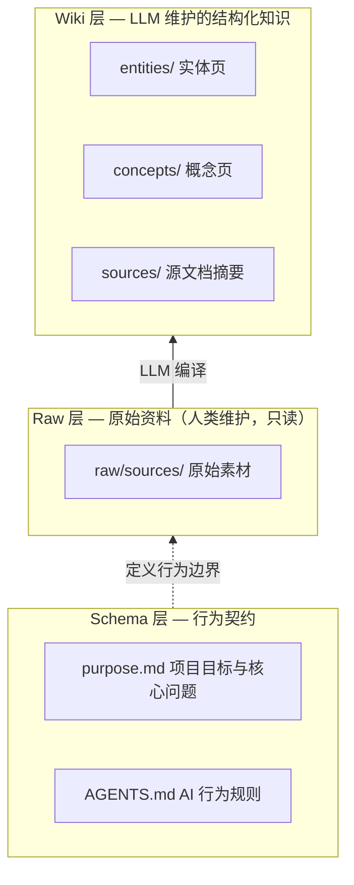
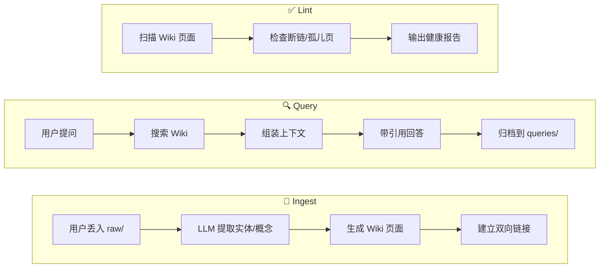
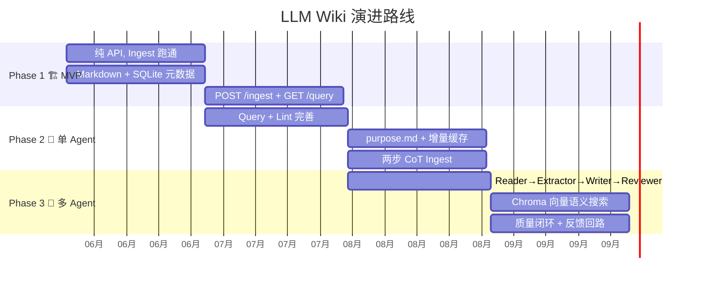

# LLM Wiki — 整体架构设计

> 日期：2026-07-03
> 状态：✅ 已确认
> 版本：v1.0

---

## 1. 项目定位

**LLM Wiki** 是一个知识沉淀管理系统，基于 Andrej Karpathy 提出的 LLM Wiki 理念。

核心思想：不是 RAG（检索时临时拼凑），而是 LLM 将原始资料"编译"为结构化 Wiki，知识越用越厚。

**路线**：跑起来 → 单 Agent → 多 Agent

---

## 2. 技术栈

| 层面 | 选型 | 理由 |
|------|------|------|
| 语言 | Python 3.11+ | Agent 生态最丰富 |
| 核心逻辑 | 纯 Python 自建 | 理解 Agent 底层原理 |
| LLM 封装 | LangChain（仅模型调用层） | 省去手写多 Provider 适配 |
| 模型 | DeepSeek API → 豆包 API | 通过 LangChain 统一接口切换 |
| 内容存储 | Markdown 文件 | 人类可读，Git 版本管理 |
| 元数据索引 | SQLite | 嵌入式，存标签/关系/索引 |
| 向量搜索 | Phase 2-3 加 Chroma | 起步不需要 |
| 对外接口 | 纯 API（FastAPI） | 第 1 版无前端 |

---

## 3. 项目目录结构

```
llm-wiki/
├── CLAUDE.md                  # AI 项目说明书
├── AGENTS.md                  # LLM Agent 行为规则
├── purpose.md                 # 项目目标与核心问题
├── .learnings/                # 学习笔记沉淀
├── .specify/                  # 设计规格文档
│
├── raw/sources/               # 原始素材（只读）
├── wiki/                      # LLM 维护的知识层
│   ├── index.md               # 全局索引
│   ├── log.md                 # 操作日志
│   ├── entities/              # 实体页
│   ├── concepts/              # 概念页
│   ├── sources/               # 源文档摘要
│   └── queries/               # 问答归档
│
├── static/                    # 前端静态资源（图谱可视化等）
│   └── graph.html             # 交互式知识图谱（vis.js）
│
├── src/                       # Python 代码
│   ├── main.py                # FastAPI 入口
│   ├── core/                  # 核心逻辑
│   ├── tools/                 # Agent 工具
│   ├── llm/                   # LLM 接入封装
│   └── db/                    # SQLite 元数据层
│
├── tests/                     # 测试
├── requirements.txt
├── README.md
└── .gitignore
```

---

## 4. 三层架构



### 三大操作



---

## 5. 演进路线



### Phase 1：跑起来（MVP）
- 纯 API，一个文件 Ingest 跑通
- Markdown 文件 + SQLite 元数据
- POST /ingest 和 GET /query

### Phase 2：单 Agent 完善
- Query（搜索 + 带引用回答）+ Lint（健康检查）
- purpose.md 参考、增量缓存、两步 CoT Ingest
- 完整闭环

### Phase 3：多 Agent 架构
- Reader → Extractor → Writer → Reviewer
- Chroma 向量语义搜索
- 质量闭环 + 反馈回路

---

## 6. 存储方案

| 层 | 选型 | 用途 |
|----|------|------|
| 内容 | Markdown 文件 | Wiki 页面，Git 版本管理 |
| 元数据 | SQLite | 页面索引、标签、双链关系、操作日志 |
| 向量 | Phase 2-3 加 Chroma | 语义搜索 |

上限：约 500 页 / 400K 字，超过后加向量层。

---

## 7. 与 nashsu/llm_wiki 的关系

借鉴其设计理念（purpose.md、两步 Ingest、知识图谱思路），不抄代码。技术栈不同（Python API vs Tauri+React），定位不同（学习项目 vs 桌面产品）。

---

## 8. 关键设计决策

| 决策 | 选择 | 理由 |
|------|------|------|
| 不向量库起步 | Markdown + SQLite | 起步不需要语义搜索，降低复杂度 |
| 工具权限校验 | 代码层强校验 | read 只能读 raw/，write 只能写 wiki/ |
| 纯 API 无前端 | FastAPI | 聚焦核心逻辑，前端后续再加 |
| 先单后多 | 先单 Agent 跑通再拆 | 每一步可对比，学习路径清晰 |
