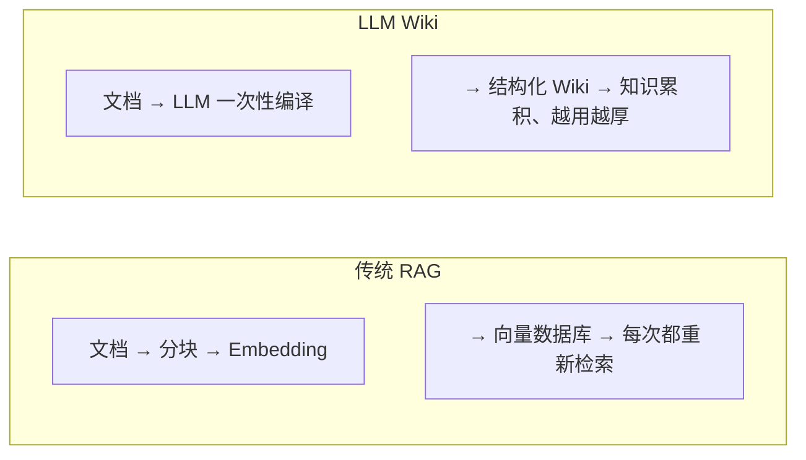
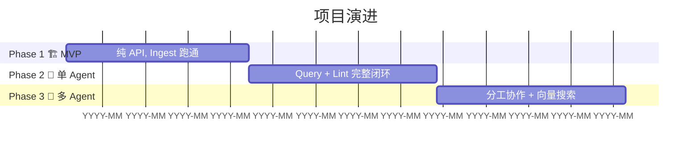

# LLM Wiki

基于 Karpathy LLM Wiki 理念的知识沉淀管理系统。

## 核心理念

**不是 RAG** — RAG 每次都重新检索推理，LLM Wiki 一次编译多次查询，知识越用越厚。



## 项目状态

🚧 正在建设中 — Phase 1（MVP）

## 快速开始

```bash
# 安装依赖
pip install -r requirements.txt

# 启动 API 服务
uvicorn src.main:app --reload

# 访问 API 文档
# http://localhost:8000/docs
```

## 技术栈

- Python 3.11+
- FastAPI
- LangChain
- SQLite

## 演进路线



| Phase | 阶段 | 目标 |
|-------|------|------|
| 1 | MVP | 纯 API，Ingest 跑通 |
| 2 | 单 Agent | Query + Lint 闭环 |
| 3 | 多 Agent | 分工协作 + 向量搜索 |

## 目录结构

```
llm-wiki/
├── raw/          # 原始素材（只读）
├── wiki/         # LLM 维护的知识层
├── src/          # Python 代码
├── tests/        # 测试
├── .specify/     # 设计规格
└── .learnings/   # 学习笔记
```
