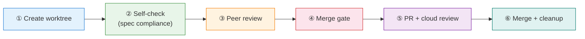

# Standard Operating Procedure

## Workflow (6 steps)

| Step | What | Skill |
|------|------|-------|
| 1 | Create worktree | `worktree` |
| 2 | Self-check (spec compliance) | `quality-gate` |
| 3 | Peer review | `request-review` / `receive-review` |
| 4 | Merge gate | `merge-gate` |
| 5 | PR + cloud review | (merge-gate handles) |
| 6 | Merge + cleanup | (SOP steps) |

## Code Quality

- Biome: `pnpm check` / `pnpm check:fix`
- Types: `pnpm lint`
- File limits: 200 lines warn / 350 hard cap
