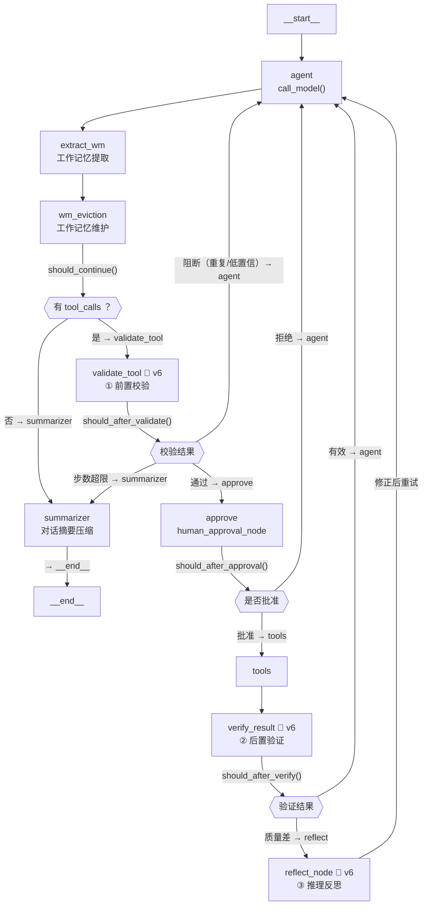
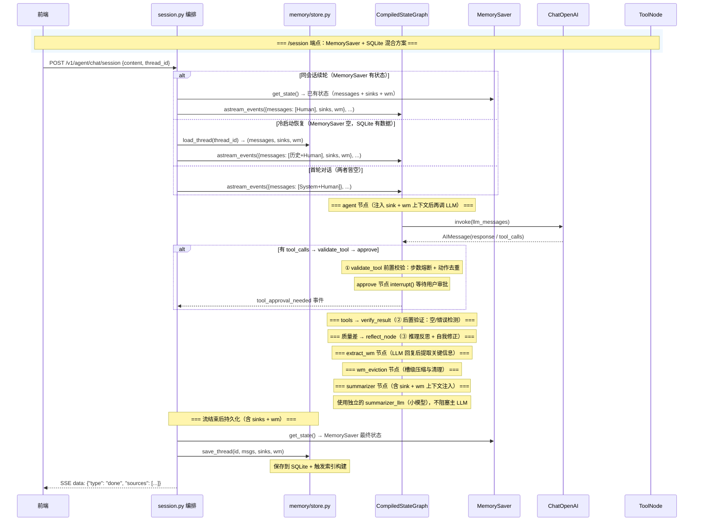
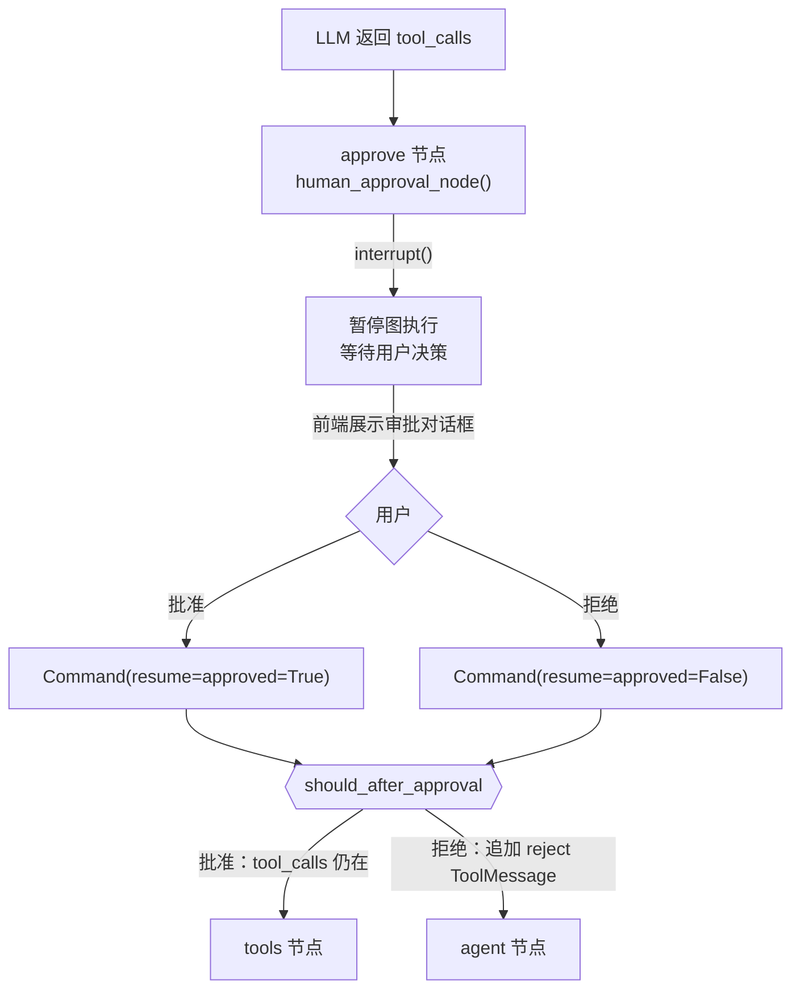
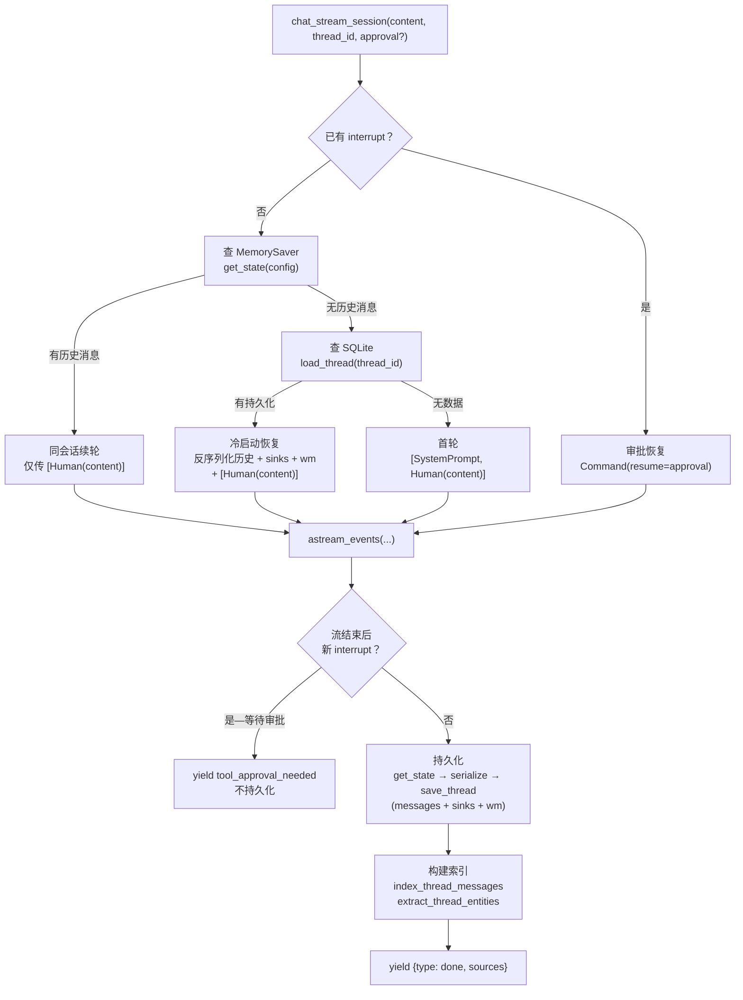
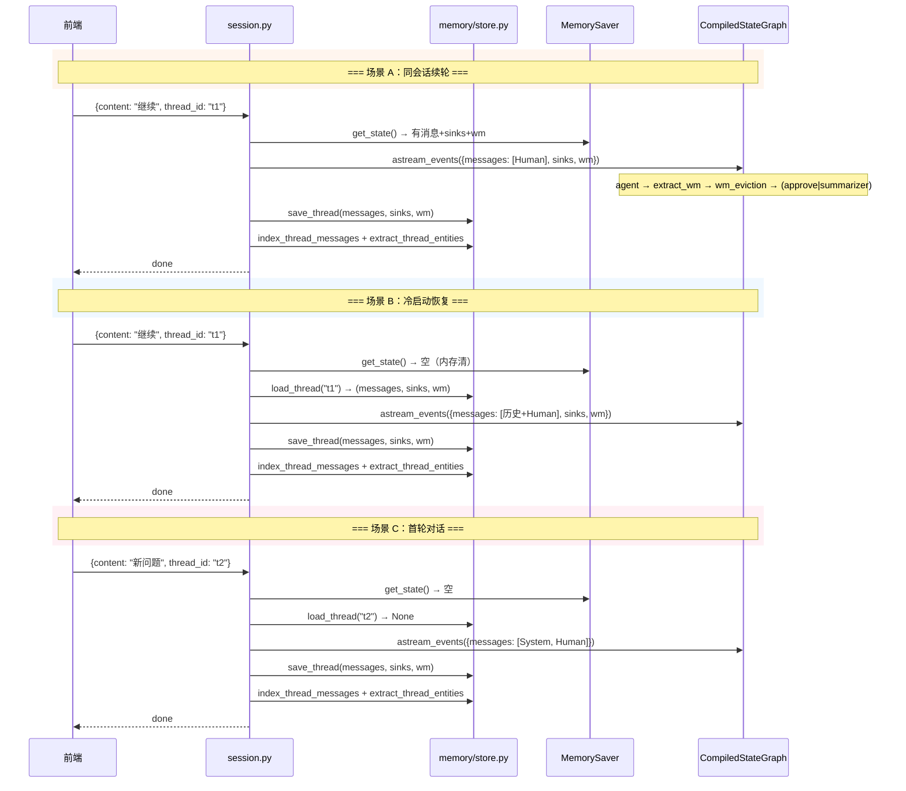
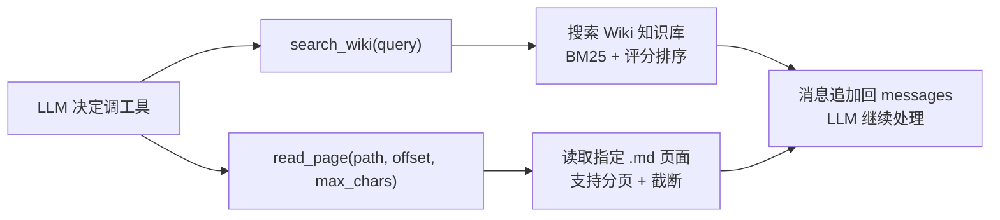

# Agent 架构图 — 当前节点与未来拓展

> 生成日期：2026-07-28
> 对应代码：`src/agent/`（四层模块：perception/planning/memory/action + session.py）
> 关联文档：[2026年7月 AI Agent 面试行情与招聘变化](./ai-agent-interview-market-2026-07.md)

---

## 版本标注规则

每次编辑此文件时，将标记递推一次。三种标记区分**最近三次改动**引入的内容。

| 标记 | 含义 | 当前覆盖内容 |
|:----:|:-----|:-------------|
| `🔴 v6` | 最近一次改动的图例 | ReAct + Self-Correction 三层自修正架构（validate_tool/verify_result/reflect_node）|
| `🟡 v5` | 最近两次改动的图例 | 模块化重构（四层架构）+ Working Memory + Attention Sink + 索引表 + session.py |
| `🟢 v4` | 最近三次改动的图例 | 对话摘要压缩 summarizer 节点 + 结构化输出 |

**更新步骤**（每次编辑此文件时执行）：
1. 全文搜索 `🔴` → 改为 `🟡`
2. 全文搜索 `🟡` → 改为 `🟢`
3. 全文搜索 `🟢` → 删除标记
4. 在本次新增/改动的章节打上 `🔴 v6`

---

## 一、当前 StateGraph 节点与边

### 1.1 图结构（Mermaid）🔴 v6



**三层自修正链路**：
- **① 前置校验** (`validate_tool`)：wm_eviction → 有 tool_calls → 步数熔断 + 动作去重 + 置信度评估 → 通过→approve / 阻断→agent / 超限→summarizer
- **② 后置验证** (`verify_result`)：tools → 工具结果质量检查（空/错误检测）+ 动作记录 → 有效→agent / 质量差→reflect_node
- **③ 推理反思** (`reflect_node`)：LLM 评估上一步推理方向，verdict=revise 时注入自我修正计划 → agent 重试
- `should_continue` 不变，仍然判断 `tool_calls` 有无；改动的是后续路由不再直连 approve，而是经由 validate_tool

### 1.2 节点说明 🔴 v6

| 节点 | 函数 | 职责 | 版本 |
|:-----|:-----|:------|:----:|
| `__start__` | 自动生成 | LangGraph 入口，注入初始状态 | — |
| **`agent`** | `call_model()` | 调 LLM（`llm_with_tools.invoke()`），注入 Attention Sink + Working Memory 上下文 | ✅ 手写 |
| **`extract_wm`** | `extract_wm_node()` | 从最新 AI 回复中提取关键信息到工作记忆（引用页面、用户目标） | ✅ 手写 |
| **`wm_eviction`** | `wm_eviction_node()` | 工作记忆槽级压缩：case-insensitive dedup、容量截断、空值清理 | ✅ 手写 |
| **`validate_tool`** | `validate_tool_node()` 🔴 | **① 前置校验**：步数熔断（≥MAX_STEPS→summarizer）+ 动作去重（executed_actions 哈希表）+ 差质量重复阻断→agent | ✅ 手写 🔴 |
| **`approve`** | `human_approval_node()` | 工具调用前暂停，通过 `interrupt()` 等待用户审批 | ✅ 手写 |
| **`tools`** | `ToolNode(P1_TOOLS)` | 执行 LLM 请求的工具（search_wiki / read_page） | ✅ 手写 |
| **`verify_result`** | `verify_result_node()` 🔴 | **② 后置验证**：工具输出空/错误检测 + 质量评级（good/poor/error）+ 写入 executed_actions 哈希表 | ✅ 手写 🔴 |
| **`reflect_node`** | `reflect_node()` 🔴 | **③ 推理反思**：`with_structured_output(ReflectionResult)` 评估推理方向，verdict=revise 时注入自我修正 AIMessage | ✅ 手写 🔴 |
| **`summarizer`** | `summarizer_node()` | 对话超过阈值时压缩为 LLM 摘要，注入 Attention Sink + Working Memory 上下文 | ✅ 手写 |
| `__end__` | 自动生成 | 图终止 | — |

### 1.3 数据流（含持久化 + 新状态）🟡 v5



### 1.4 状态定义（AgentState）🔴 v6

```
AgentState (TypedDict)
├── messages: Annotated[list[BaseMessage], add_messages]
│   ├── SystemMessage    ← 系统提示词（首轮注入）
│   ├── HumanMessage     ← 用户输入
│   ├── AIMessage        ← LLM 回答（含 tool_calls）
│   ├── ToolMessage      ← 工具执行结果
│   └── ...
│
├── attention_sinks: list[dict]
│   ← 关键信息锚定：用户要求记住或反复提及的信息
│   ← 每条含 {id, type, content, confidence, source_turn, ...}
│   ← 跨摘要压缩存活，每轮注入 LLM 上下文
│
├── working_memory: Annotated[dict, working_memory_reducer]
│   ├── user_identity      ← 用户主动透露的身份信息
│   ├── current_goal       ← 当前对话目标
│   ├── key_facts          ← 已确认的关键事实（列表，上限 20）
│   ├── tool_cache         ← 工具输出缓存（字典，上限 5 条）
│   └── entities_mentioned ← 提及的知识库页面（列表，上限 50）
│
├── step_count: int  🔴 v6
│   ← 推理步数计数器，每次 call_model 自动 +1
│   ← validate_tool 中检查 ≥MAX_STEPS 时路由到 summarizer
│
├── executed_actions: dict[str, Any]  🔴 v6
│   ← 已执行动作的哈希表，key = "tool_name:canonical_args"
│   ← value = {tool, args, result_truncated, quality, timestamp}
│   ← verify_result 中写入，validate_tool 中读取做去重
│
└── self_correction: dict[str, Any]  🔴 v6
    ← 自修正临时标记字段，各节点写入、条件路由函数读取
    ← 字段集：{validated, step_limit_reached, correction_reason,
                poor_result, poor_tools, verified, reflection_verdict}
    ← 不持久化，仅单轮图执行期间有效
```

**两个记忆机制的区分**：

| 维度 | Attention Sink | Working Memory |
|:-----|:---------------|:---------------|
| 驱动力 | 用户驱动（显式记住/高频提及） | 系统驱动（自动提取） |
| 生命周期 | 置信度衰减 + 空闲超时移除 | 槽级上限截断 |
| 数据结构 | 有序列表（按置信度排序） | 结构化字典（多槽位） |
| 持久化 | 随 thread 持久化 | 随 thread 持久化 |
| 注入方式 | SystemMessage 格式文本 | SystemMessage 格式文本 |

### 1.5 人工审批节点（Human-in-the-Loop）

> 未变更，逻辑与 `docs/agent-architecture-diagrams.md` v4 一致。

审批流程：



### 1.6 对话摘要压缩节点（summarizer）🟢 v4

> 更新：`summarizer_node` 现在使用独立小模型 + 注入 Attention Sink + Working Memory 上下文。

在 agent 返回回答（无 tool_calls）后执行，将早期对话压缩为 LLM 生成的摘要。

**触发条件**：非 SystemMessage 数量超过 `SUMMARIZE_THRESHOLD`（40 条）。

**算法流程**：

```
summarizer_node 接收 state["messages"]

  1. 提取已有的 Attention Sink 知识 → sink_context
  2. 提取 Working Memory 关键事实 → fact_context
  3. 合并 context → 注入摘要 prompt

  4. should_summarize() → False → return {}（无操作）
  5. should_summarize() → True
     ├─ 提取已有摘要（如有）
     ├─ 分离 system / conversation 消息
     ├─ 保留最新 SUMMARIZE_KEEP_LATEST_TURNS（10 轮）对话
     ├─ 早期对话 + context → 调用 summarizer_llm（小模型）生成新摘要
     ├─ 构建 RemoveMessage 操作移旧消息
     ├─ 添加新摘要 SystemMessage（[对话摘要]...）
     ├─ 注意：attention_sinks + working_memory 不在 messages 内，不受移除影响
     └─ return {messages: [RemoveMessage, ..., SystemMessage(摘要)]}
```

**小模型独立（P1 优化）** 🟡 v5：

| 机制 | 说明 |
|:-----|:------|
| `summarizer_llm` | 固定使用 DeepSeek v4 Flash，独立于主 LLM |
| 配置独立 | 支持通过 `SUMMARIZER_*` 环境变量覆盖（model/api_key/api_base/timeout） |
| 不阻塞 | 摘要请求不会占用主模型配额，不影响对话响应速度 |
| 默认复用 | 未单独配置 API Key 时，自动复用主 LLM 的凭据 |

### 1.7 结构化输出提取（format_response）🟢 v4

> 未变更。

在 `chat_stream_session` 流结束、持久化之前，对最终 AIMessage 做一次结构化提取：

```
流结束后 → get_state() 取最终 messages
  └─ 从后往前找第一条不含 tool_calls 的 AIMessage
       └─ format_response(content) → LLM with_structured_output
            ├─ 成功 → AgentResponse(answer, cited_pages, follow_up_questions)
            └─ 失败 → 降级，仅保留 answer 文本
  └─ 将 cited_pages 和 follow_up_questions 附加到 done 事件
```

### 1.8 Attention Sink 锚定机制 🟡 v5

**设计原理**：
- 工作记忆（`messages[]`）是线性、可压缩的
- Attention Sink 是结构化、持久化、跨摘要压缩存活的
- 用户说"记住 X"或反复提及某内容时，自动锚定

**生命周期**：

```
用户输入 → detect_sinks() 模式匹配
         → detect_frequent_entities() 频次统计
         → merge_sinks() 合并 + 置信度衰减
         → format_sink_knowledge() → SystemMessage 注入 LLM
         → 随 thread 持久化到 SQLite
```

**检测策略**：

| 策略 | 触发条件 | 初始置信度 |
|:-----|:---------|:----------|
| 显式模式 | 用户说"记住"、"我叫"、"我喜欢"等模式 | 0.8 |
| 频次统计 | 同一实体出现 ≥3 次 | min(0.5 + count×0.1, 0.9) |
| 强化 | 已有锚定内容在用户输入中被再次提及 | 重置为 0.9 |

**衰减与清理**：

| 条件 | 动作 |
|:-----|:-----|
| ≥5 轮未强化且未过空闲期 | 每轮衰减 confidence -= 0.05 |
| confidence < 0.3 | 移除 |
| idle_turns > 20 | 超时移除 |
| 已达 15 条上限 | 新锚定无法加入 |

**注入时机**：每轮 `call_model()` 时，将锚定格式化为 SystemMessage 注入 LLM 输入（不污染 `messages[]` 历史）。

### 1.9 Working Memory 工作记忆 🟡 v5

**设计原理**：
- Attention Sink 由用户驱动（用户说"记住"），Working Memory 由系统驱动（自动提取）
- 从对话中持续提取结构化上下文，注入 LLM 辅助理解
- 不同槽位有不同的合并策略

**槽位定义与合并策略**：

| 槽位 | 类型 | 上限 | 合并策略 |
|:-----|:-----|:-----|:---------|
| `user_identity` | dict | key-level merge | 用户身份信息合并 |
| `current_goal` | string | — | 直接覆盖（取最新用户问题） |
| `key_facts` | list | 20 | dedup 追加，超上限截断尾部 |
| `tool_cache` | dict | 5 | 最新覆盖，超上限丢弃最旧 |
| `entities_mentioned` | list | 50 | dedup 追加，超上限截断尾部 |

**提取节点（extract_wm_node）**：

```
在 call_model 后执行，从最新 AI 回复中提取：
1. 引用的 Wiki 页面路径 → entities_mentioned
2. 用户最新问题摘要 → current_goal
3. 后续可扩展：关键事实提取
```

**维护节点（wm_eviction_node）**：

```
在 extract_wm 后执行，清理低价值数据：
1. entities_mentioned: case-insensitive dedup
2. key_facts: 超上限截断
3. tool_cache: 移除空值
```

**注入 LLM 上下文**：

```python
# 格式示例
【工作记忆】
用户当前目标: 对比 Python 和 JavaScript 异步编程

已确认的关键事实:
- Python 使用 asyncio 库实现协程
- JavaScript 使用 async/await 关键字

提及的知识库页面: entities/python.md, entities/javascript.md

用户信息: name=张三, role=后端开发
```

### 1.10 索引表 🟡 v5

**设计目标**：跨会话消息搜索 + 实体关联，支持用户记忆召回和知识发现。

**表结构**：

```
SQLite 索引表（同文件 memory/store.py）
├── thread_messages    ← 消息逐条存储，支持时序和按 thread_id 检索
│   ├── id, thread_id, role, content, created_at, turn_index
│   └── idx_tm_thread, idx_tm_created
│
├── msg_fts (FTS5)     ← 全文搜索虚拟表，跨会话关键词搜索
│   ├── content, role (UNINDEXED), thread_id (UNINDEXED)
│   └── unicode61 分词器（含中文自动降级 LIKE 模式）
│
├── thread_entities    ← 线程级关键实体
│   └── id, thread_id, entity, frequency, last_seen
│
└── global_entities    ← 跨线程实体聚合（用户画像）
    └── entity, total_frequency, thread_count, last_seen
```

**搜索策略**：

| 查询类型 | 引擎 | 降级路径 |
|:---------|:-----|:---------|
| 英文/ASCII | FTS5 MATCH | → LIKE（FTS5 不可用时） |
| 中文（CJK） | LIKE 模式 | 直接跳过 FTS5（unicode61 不擅中文） |

**实体提取**：

- 英文单词（≥3 字符）
- 中文词组（2-4 字）
- Wiki 页面引用（`xxx.md`）
- 频次 ≥ 2（`THREAD_ENTITY_MIN_FREQ`）才写入索引

**索引触发时机**：在 `chat_stream_session` 中每次 `save_thread()` 后自动调用。

---

## 二、多轮会话隔离（MemorySaver + SQLite 混合方案）

> 2026-07-27 确立。2026-07-28 更新：新增 Attention Sink + Working Memory 持久化。

### 2.1 架构决策 🟡 v5

```
┌─────────────────────────────────────────────────────────────┐
│              运行时状态管理                                   │
│  MemorySaver（内存）← 管理 messages + attention_sinks + wm  │
│       ↑  get_state() 按 thread_id 查已存状态                 │
│       │  空 → 查 SQLite；有 → 仅传本轮用户消息                │
├─────────────────────────────────────────────────────────────┤
│              跨重启持久化                                     │
│  memory/store.py（SQLite）← 备份 messages + sinks + wm      │
│       ↑  load_thread() / save_thread()                      │
│       │  启动时 MemorySaver 空 → 从 SQLite 加载完整三元组     │
│       │  （messages, attention_sinks, working_memory）       │
├─────────────────────────────────────────────────────────────┤
│              索引表（搜索加速）                                │
│  index_thread_messages() + extract_thread_entities()        │
│       ↑  save_thread 后自动触发，异步不阻塞                    │
│       │  支持 FTS5 全文搜索 + 实体关联检索                    │
└─────────────────────────────────────────────────────────────┘
```

### 2.2 混合方案流程图 🟡 v5



### 2.3 序列化/反序列化细节 🟡 v5

| 函数 | 输入 | 输出 | 关键映射 |
|:-----|:-----|:-----|:---------|
| `serialize_messages` | `list[BaseMessage]` | `list[{role, content}]` | Human→`"user"`, AI→`"assistant"` |
| `deserialize_messages` | `list[{role, content}]` | `list[BaseMessage]` | `"user"`→Human, `"assistant"`→AI |
| 过滤规则 | — | — | 跳过 ToolMessage（前端不需要） |

### 2.4 典型时序 🟡 v5



### 2.5 两条 API 路径 🟡 v5

```mermaid
flowchart LR
    Client["前端"]

    subgraph POST /v1/agent/chat
        direction TB
        A1["请求: {messages: [...]}"]
        A2["chat_stream() — action/stream.py"]
        A3["传全量消息列表<br/>无状态<br/>不持久化"]
        A1 --> A2 --> A3
    end

    subgraph POST /v1/agent/chat/session
        direction TB
        B1["请求: {content, thread_id, approval?}"]
        B2["chat_stream_session() — session.py"]
        B3["MemorySaver + SQLite 混合<br/>冷启动恢复 sinks+wm<br/>只传本轮消息"]
        B1 --> B2 --> B3
    end

    subgraph GET /v1/agent/threads
        direction TB
        C1["查询参数: limit, offset"]
        C2["P.list_threads()"]
        C3["返回 thread_id / title<br/>message_count / 时间戳"]
        C1 --> C2 --> C3
    end

    Client -->|"无状态版"| POST /v1/agent/chat
    Client -->|"会话隔离版"| POST /v1/agent/chat/session
    Client -->|"列出会话"| GET /v1/agent/threads
```

---

## 三、工具节点详情

> 未变更。`P1_TOOLS` = `[search_wiki, read_page]`



---

## 四、未来拓展节点

### 4.1 路线图 🔴 v6

```mermaid
flowchart TD
    subgraph CURRENT["当前（已完成）"]
        AGENT["agent<br/>call_model()"]
        APPROVE["approve<br/>人工审批"]
        TOOLS["tools<br/>ToolNode"]
        SUMM["summarizer<br/>对话摘要压缩"]
        CHECK["MemorySaver<br/>运行时状态"]
        SQLITE["SQLite 持久化"]
        WM["working_memory<br/>结构化工作记忆"]
        SINK["attention_sink<br/>关键信息锚定"]
        INDEX["index_table<br/>全文搜索+实体索引"]
        VALIDATE["validate_tool 🔴 v6<br/>① 前置校验"]
        VERIFY["verify_result 🔴 v6<br/>② 后置验证"]
        REFLECT["reflect_node 🔴 v6<br/>③ 推理反思"]
    end

    subgraph P1["近期待办"]
        PERCEPT_INTENT["intent 意图分类"]
        TOOL_REGISTRY["tool_registry<br/>工具注册中心"]
    end

    subgraph P2["中期拓展"]
        SUPERVISOR["supervisor<br/>主管分配"]
        WORKER1["worker_a<br/>搜索专家"]
        WORKER2["worker_b<br/>分析专家"]
        CONDENSER["condenser<br/>长上下文压缩"]
    end

    subgraph P3["远期拓展"]
        PROFILE["user_profile<br/>用户画像长期记忆"]
        SUBAGENT["subagent<br/>子 Agent 沙箱"]
        ROUTER["router<br/>意图路由"]
        PLANNER["planner<br/>多步推理规划"]
        VALIDATOR["validator<br/>输出校验"]
        RETRY["retry_handler<br/>工具重试+降级"]
    end

    CURRENT --> P1
    P1 --> P2
    P2 --> P3
```



### 4.2 拓展节点说明 🔴 v6

| 阶段 | 节点 | 触发条件 | 职责 |
|:----:|:-----|:---------|:------|
| **✅ 当前** | `approve` | LLM 返回 tool_calls | `interrupt()` 暂停图等审批 |
| **✅ 当前** | `SQLite 持久化` | 流结束 / 重启 | 跨重启保存 messages+sinks+wm |
| **✅ 当前** | `summarizer` | messages ≥40 条 | 压缩早期对话为摘要（小模型） |
| **✅ 当前** | `extract_wm` | 每次 LLM 回复后 | 提取关键事实到工作记忆 |
| **✅ 当前** | `wm_eviction` | extract_wm 后 | 槽级压缩与空值清理 |
| **✅ 当前** | `attention_sink` | 每轮用户输入 | 锚定 → 衰减 → 注入 LLM |
| **✅ 当前** | `index_table` | save_thread 后 | FTS5 + 实体索引 |
| **✅ 当前** | `validate_tool` 🔴 | LLM 返回 tool_calls 后 | **① 前置校验**：步数熔断 + 动作去重 + 路由决策 |
| **✅ 当前** | `verify_result` 🔴 | tools 节点执行后 | **② 后置验证**：工具输出质量检查 + 动作记录到 executed_actions |
| **✅ 当前** | `reflect_node` 🔴 | verify_result 检测到差质量结果 | **③ 推理反思**：LLM 评估推理方向 + 注入自我修正计划 |
| **P1** | `intent_classifier` | 用户新输入 | 预分类：知识查询/闲聊/操作 |
| **P1** | `tool_registry` | 扩展工具集 | 统一注册/发现/权限校验 |
| **P2** | `supervisor` | 需多专家协作 | 分发到对应 worker |
| **P2** | `worker_a/b` | supervisor 分配 | 搜索 / 分析垂直分工 |
| **P2** | `condenser` | 长工具输出 | 去重/摘要/结构化 |
| **P3** | `profile` | 重复模式检测 | 多线程用户画像持久化 |
| **P3** | `subagent` | 需隔离上下文 | 子任务独享 Agent 实例 |
| **P3** | `router` | 新输入 | 预分类路由 |
| **P3** | `planner` | 多跳问题 | 拆解 → DAG 执行计划 |
| **P3** | `validator` | 最终回答前 | 校验引用准确性、格式 |
| **P3** | `retry_handler` | 工具失败 | 自动重试/降级/替代 |

### 4.3 自校正（Self-Correction）实现回顾 🔴 v6

> 基于 commit `d3342d8`（2026-07-28）。三层自修正架构已在 LangGraph StateGraph 中实现。

**实现状态**：

| 需求 | 方案 | 实现状态 | 说明 |
|:-----|:-----|:---------|:------|
| 步数熔断器（≤15 步） | `step_count` 在 `call_model` 中自动 +1，`validate_tool` 检查 ≥MAX_STEPS | ✅ 实现 | 超限时注入 `ToolMessage` + 路由到 `summarizer` 强制输出 |
| 重复检测（hash 表） | `_make_action_key()` 生成规范键，`executed_actions` 哈希表记录结果 | ✅ 实现 | 差质量（poor/error）结果才阻断；good 结果允许重调用 |
| 状态验证 | `verify_result_node` 检测空结果/错误前缀 + 写入 `executed_actions` | ✅ 实现 | 三档质量评级：good / poor（空结果）/ error（调用失败） |
| 推理反思 | `reflect_node` 用 `with_structured_output(ReflectionResult)` 评估 | ✅ 实现 | verdict=revise 时注入 `AIMessage` 含修正计划；LLM 失败时默认 proceed |
| 置信度阈值 | 工具级置信度评估 | ❌ 推迟 | 待 P2 结合 `tool_registry` 统一实现 |

**实际实现 vs 最初方案差异**：

| 维度 | 最初建议方案 | 实际实现 |
|:-----|:------------|:---------|
| 重复检测触发条件 | 连续 3 次相同工具+参数 → 反思 | 1 次差质量重复即阻断 → agent（非反射），good 结果不阻断 |
| 状态验证位置 | 设计阶段考虑 LLM 判断 | 规则引擎（硬编码前缀/空检测），零 LLM 调用，低成本 |
| 反思降级 | 未考虑 | LLM 调用失败时默认 proceed，不阻断流程 |
| 图结构变化 | 仅增加 reflect 节点 | 增加 3 个节点 + 5 条新边 + 2 个条件路由函数 |

**图拓扑变更**（vs v5 之前的四层架构）：

```
v5 旧链路:          agent → extract_wm → wm_eviction → should_continue
                       ↑                                    ↓
                    tools ← approve ← (有 tool_calls)        ↓ (无)
                                                        summarizer → END

v6 新链路:          agent → extract_wm → wm_eviction → should_continue
                    ↑  ↑                                 ↓          ↓
                    ↑  └──── refl──── verify ← tools ← approve ← validate
                    ↓                             ↓     (通过)      ↑
               (重复/低置信)                    (质量差)          (去重)
                                              refl → agent
                                                    ↑
                                               (修正后重试)
```

**剩余约束**：
- 置信度阈值（<0.7 人工确认）推迟到 `tool_registry` 统一接入后（P2）
- reflect_node 使用主 LLM（非独立小模型），成本可接受（仅在质量差时触发）

---

## 五、常量体系总览 🔴 v6

> 🔴 v6 新增：`Self-Correction` 常量组（步数熔断/动作去重/校验/反思）

```
src/agent/constants.py（380+ 常量）
├── LLM 配置
│   ├── ENV_DEEPSEEK_*          ← 主 LLM
│   └── ENV_SUMMARIZER_*       ← 摘要压缩专用小模型（独立配置）
│
├── 对话窗口
│   ├── MAX_MESSAGE_TURNS       = 20
│   ├── SUMMARIZE_THRESHOLD     = 40
│   └── SUMMARIZE_KEEP_LATEST_TURNS = 10
│
├── LangGraph 图结构
│   ├── 节点
│   │   ├── NODE_AGENT, NODE_TOOLS, NODE_APPROVE, NODE_SUMMARIZER
│   │   ├── NODE_EXTRACT_WM, NODE_WM_EVICTION
│   │   └── NODE_VALIDATE_TOOL, NODE_VERIFY_RESULT, NODE_REFLECT  🔴 v6
│   └── 状态键
│       ├── STATE_MESSAGES
│       ├── STATE_ATTENTION_SINKS
│       ├── STATE_WORKING_MEMORY
│       ├── STATE_STEP_COUNT         🔴 v6
│       ├── STATE_EXECUTED_ACTIONS   🔴 v6
│       └── STATE_SELF_CORRECTION    🔴 v6
│
├── SSE 事件协议
│   ├── EVENT_TOKEN, EVENT_TOOL_START, EVENT_TOOL_END
│   ├── EVENT_DONE, EVENT_ERROR, EVENT_SUMMARIZE
│   └── FIELD_*                  ← 所有事件字段名
│
├── 对话摘要压缩
│   ├── SUMMARIZE_PREFIX, SUMMARIZE_SYSTEM_PROMPT
│   └── EVENT_SUMMARIZE, FIELD_*
│
├── 结构化输出
│   └── FIELD_ANSWER, FIELD_CITED_PAGES, FIELD_FOLLOW_UP_QUESTIONS
│
├── Working Memory
│   ├── STATE_WORKING_MEMORY
│   ├── WM_SLOT_*               ← 5 个槽位名
│   ├── WM_SLOT_CRITICAL/HIGH/MEDIUM/LOW  ← 优先级
│   └── WM_MAX_*                ← 各槽位上界
│
├── 索引表
│   ├── THREAD_ENTITY_MIN_FREQ  = 2
│   ├── SEARCH_CONVERSATIONS_LIMIT = 20
│   └── GLOBAL_ENTITIES_LIMIT   = 50
│
├── Attention Sink
│   ├── STATE_ATTENTION_SINKS
│   ├── SINK_PATTERNS           ← 20+ 触发模式
│   ├── ATTENTION_SINK_MAX      = 15
│   ├── SINK_CONFIDENCE_*       ← 置信度常量
│   ├── SINK_DECAY_PER_TURN     = 0.05
│   ├── FREQUENCY_SINK_THRESHOLD = 3
│   └── SINK_SYSTEM_PROMPT      ← 注入模板
│
├── 消息角色
│   ├── ROLE_USER, ROLE_ASSISTANT, ROLE_SYSTEM
│   └── DEFAULT_ROLE
│
├── 工具配置（之前散落各处，现集中定义）
│   ├── WIKI_DIR, SEARCH_LIMIT, SNIPPET_MAX_CHARS
│   ├── READ_PAGE_MAX_CHARS, TRUNCATION_MARKER
│   ├── MATCHED_NODES_LIMIT, NEIGHBOR_NODES_LIMIT
│   └── WIKI_PATH_REGEX
│
├── Self-Correction  🔴 v6
│   ├── MAX_STEPS               = 15  ← 步数熔断上限
│   ├── STATE_SELF_CORRECTION   ← 临时标记字段
│   ├── STATE_STEP_COUNT        ← 步数计数器
│   ├── STATE_EXECUTED_ACTIONS  ← 已执行动作哈希表
│   ├── SC_FIELD_*              ← 标记字段：validated, step_limit, correction_reason
│   │                              poor_result, poor_tools, verified, verdict
│   ├── SC_FIELD_VERDICT_REVISE / PROCEED  ← 反思 verdict 枚举
│   ├── SC_FIELD_CORRECTION_TYPE_DUP       ← 重复阻断类型
│   ├── LOG_STEP_LIMIT_EXCEEDED  ← 日志模板
│   ├── LOG_DUPLICATE_ACTION     ← 日志模板
│   ├── LOG_VALIDATE_PASS        ← 日志模板
│   ├── LOG_REFLECTION           ← 日志模板
│   ├── LOG_VERIFY_PASS          ← 日志模板
│   ├── LOG_VERIFY_POOR_RESULT   ← 日志模板
│   ├── NO_MATCHES_MESSAGE       ← 空结果检测
│   └── EMPTY_CONTENT_MESSAGE    ← 空内容检测
│
├── 错误模板
│   └── ERROR_*                 ← 全部收归常量
│
└── 日志模板
    └── LOG_*                   ← 全部收归常量
```

---

## 六、文件全景 🔴 v6

> 测试总数：agent 模块 214 通过 + API 路由 43 通过（共 257 项 agent 相关测试）
> 17 个 wiki_compiler 测试为预存故障（独立于 agent 模块）
> d3342d8 实测：645 passed / 17 failed（仅 wiki_compiler 预存故障）

### 6.1 四层模块化架构

```
src/
├── agent/                              ← Agent 模块
│   ├── __init__.py                     ← 导出 build_agent / chat_stream / chat_stream_session
│   ├── constants.py                    ← 380+ 全局常量（唯一真相源）
│   ├── session.py                      ← 会话编排层（冷启动恢复 + 审批 + 持久化 + 索引）
│   │
│   ├── perception/                     ← 感知层
│   │   └── handler.py                  ← 消息序列化/反序列化/来源提取
│   │
│   ├── planning/                       ← 规划层
│   │   ├── graph.py                    ← AgentState + 9 个节点 + 图构建（ReAct + Self-Correction）
│   │   └── prompt.py                   ← SYSTEM_PROMPT + REFLECTION_SYSTEM_PROMPT  🔴 v6
│   │
│   ├── memory/                         ← 记忆层
│   │   ├── store.py                    ← SQLite 持久化 + 索引表（FTS5 + 实体）
│   │   ├── summarizer.py               ← 对话摘要压缩（condense_history + RemoveMessage）
│   │   └── attention.py                ← Attention Sink 锚定检测 + 衰减 + 格式化
│   │
│   └── action/                         ← 执行层
│       ├── tools.py                    ← 2 个 @tool（search_wiki / read_page）
│       ├── stream.py                   ← SSE 流式事件 + chat_stream 无状态接口
│       └── response.py                 ← format_response / AgentResponse 结构化输出
│
├── api/routes/
│   └── chat.py                         ← FastAPI 路由（/chat / /chat/session / /threads）
│
└── tests/test_agent/
    ├── test_agent.py                   ← 图构建 + 路由 + 审批 + 摘要 + 自修正（50+ 个 @pytest.mark.parametrize）
    ├── test_attention.py               ← Attention Sink 检测/合并/衰减/格式化
    ├── test_indexes.py                 ← 索引表创建/FTS5 搜索/实体提取/聚合/删除
    ├── test_persistence.py             ← SQLite CRUD（save/load/list/delete/并发/边界）
    ├── test_summarizer.py              ← should_summarize/condense_history/边界/降级
    ├── test_qa_approve_summarizer.py   ← approve + summarizer 集成（含 interrupt/恢复/边界）
    └── test_tools.py                   ← search_wiki / read_page / query_graph 工具测试
```

### 6.2 模块依赖方向

```
perception → planning → action ↕ memory
         ↘         ↙
        session.py（编排层）
            ↓
      api/routes/chat.py（HTTP 层）
```

关键规则：
- **禁止反向依赖**：planning 不 import action，memory 不 import planning
- **session.py 是编排枢纽**：它持有 4 个模块的引用，协调感知→规划→执行→记忆
- **constants.py 全局唯一**：所有魔法值收归一处，各模块 import constants as C

### 6.3 旧→新文件映射

| 旧文件（v4 及之前） | 新文件（v5） | 变更 |
|:-------------------|:-------------|:-----|
| `agent.py` | `planning/graph.py` + `action/response.py` + `action/stream.py` | 按职责拆分 |
| `persistence.py` | `memory/store.py` | 移至记忆层 + 新增索引功能 |
| `summarizer.py` | `memory/summarizer.py` | 移至记忆层 |
| `tools.py` | `action/tools.py` | 移至执行层 |
| — | `session.py` | 新增编排层 |
| — | `memory/attention.py` | 新增锚定模块 |
| — | `perception/handler.py` | 新增感知模块 |
