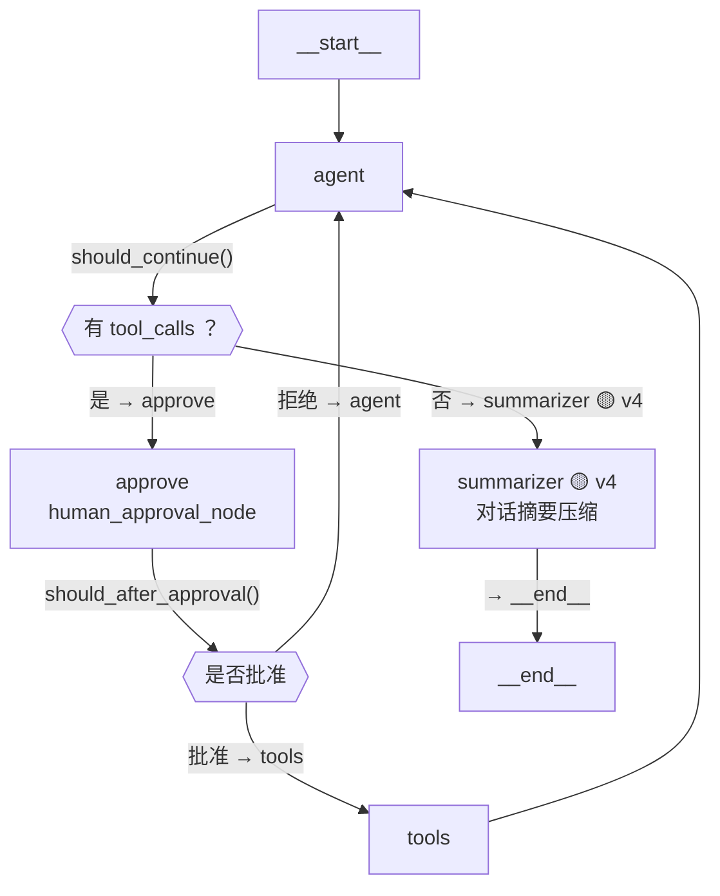
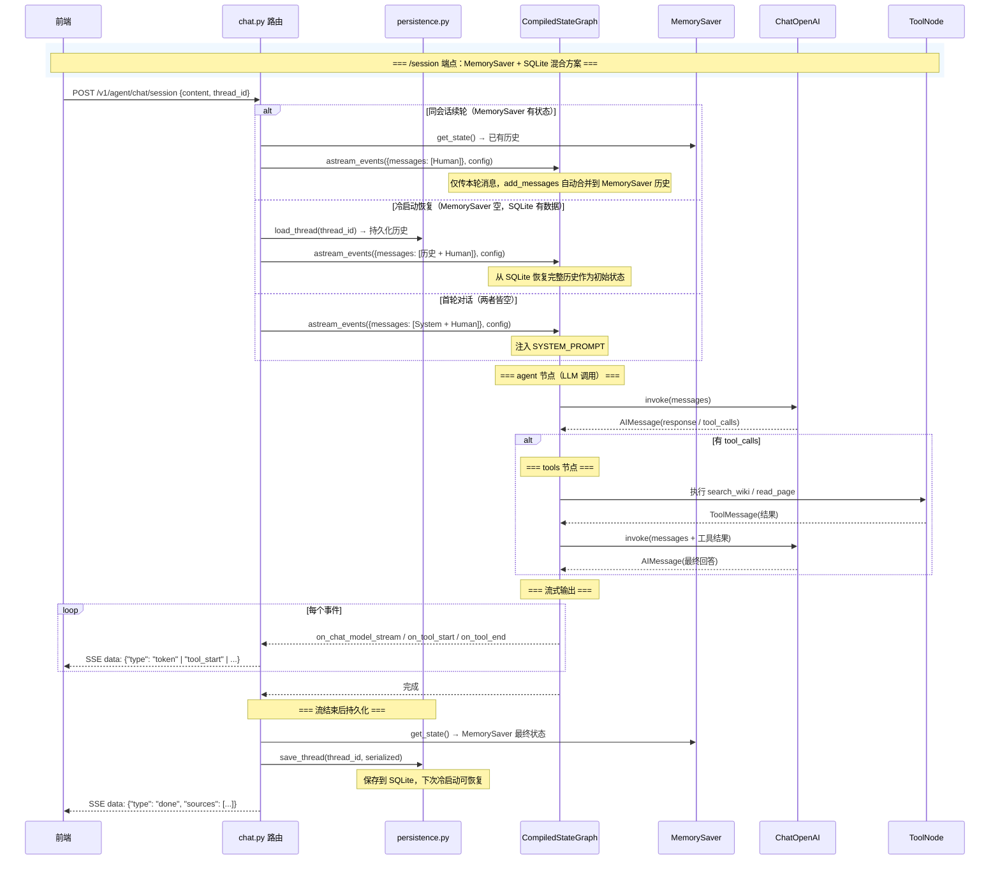
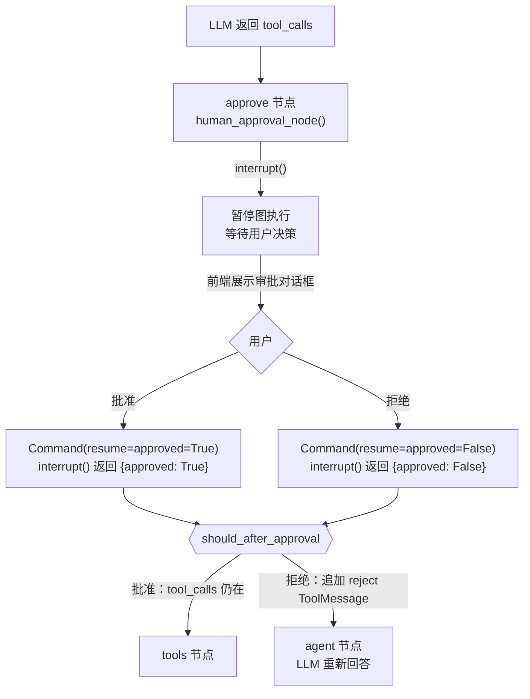
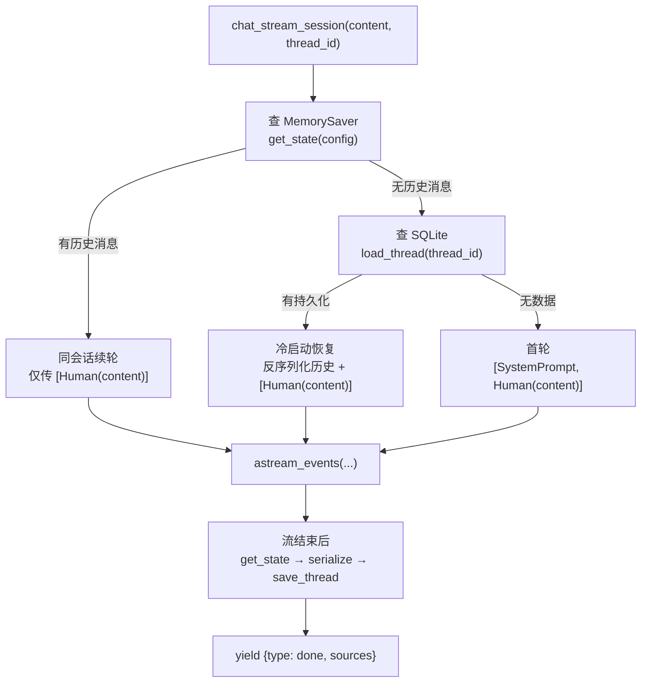
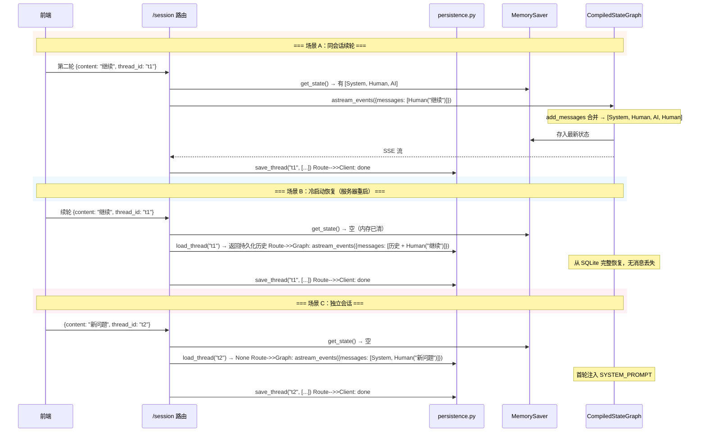
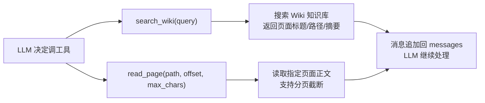
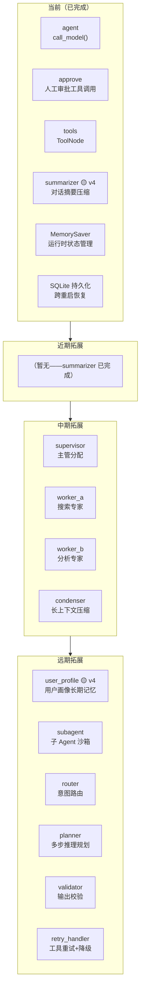
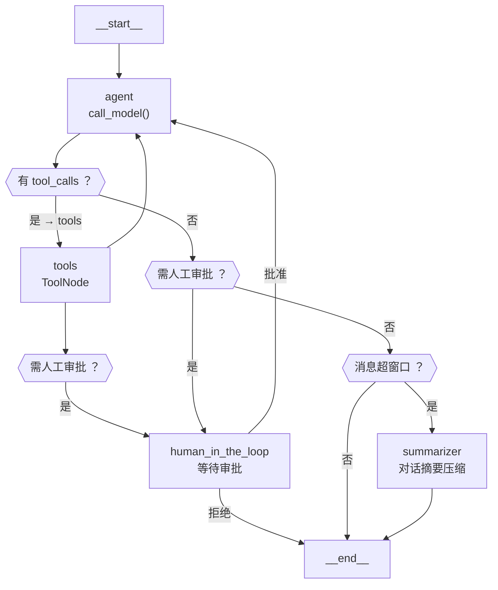
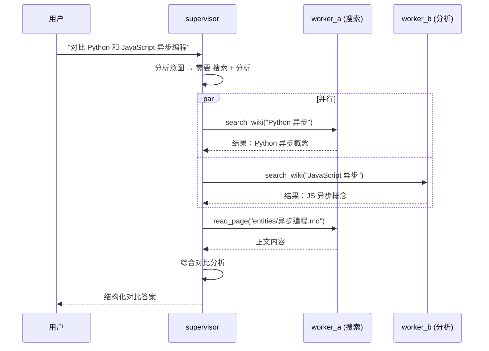

# Agent 架构图 — 当前节点与未来拓展

> 生成日期：2026-07-27
> 对应代码：`src/agent/`（agent.py / tools.py / summarizer.py / constants.py / persistence.py / chat.py）
> 关联文档：[2026年7月 AI Agent 面试行情与招聘变化](./ai-agent-interview-market-2026-07.md) — 面试考点对照与求职策略

---

## 版本标注规则

每次编辑此文件时，将标记递推一次。三种标记区分**最近三次改动**引入的内容，之前的不做标记。

| 标记 | 含义 | 当前覆盖内容 |
|:----:|:-----|:-------------|
| `🟡 v4` | 最近一次改动的图例 | 对话摘要压缩 summarizer 节点 + 结构化输出 |
| `🟢 v3` | 最近两次改动的图例 | Human-in-the-Loop approve 节点 |
| (无标记) | 三次版本之前的内容 | SQLite 持久化层 + MemorySaver 混合方案、原始纯 MemorySaver 架构、工具节点、未来规划 |

**更新步骤**（每次编辑此文件时执行）：
1. 全文搜索 `🔴` → 改为 `🟡`
2. 全文搜索 `🟡` → 改为 `🟢`
3. 全文搜索 `🟢` → 删除标记（即去掉 ` 🟢 v#` / `🟢` 字样）
4. 在本次新增/改动的章节打上 `🔴 v5`（标题行、关键节点、说明行）

---

## 一、当前 StateGraph 节点与边

### 1.1 图结构（Mermaid）🟡 v4



### 1.2 节点说明 🟡 v4

| 节点 | 函数 | 职责 | 版本 |
|:-----|:-----|:------|:----:|
| `__start__` | 自动生成 | LangGraph 入口，注入 `{"messages": [...]}` 初始状态 | — |
| **`agent`** | `call_model()` | 调 LLM（`llm_with_tools.invoke()`），决定返回回答还是调工具 | ✅ 手写 |
| **`approve`** | `human_approval_node()` | 工具调用前暂停，通过 `interrupt()` 等待用户审批 | ✅ 手写 |
| **`tools`** | `ToolNode(P1_TOOLS)` | 执行 LLM 请求的工具（search_wiki / read_page），结果追加回 messages | ✅ 手写 |
| **`summarizer`** 🟡 v4 | `summarizer_node()` | 对话超过阈值时压缩早期对话为 LLM 摘要，代替硬截断 | ✅ 手写 |
| `__end__` | 自动生成 | 图终止，返回最终状态 | — |

### 1.3 数据流（含持久化）


### 1.4 状态定义（AgentState）

```
AgentState (TypedDict)
├── messages: Annotated[list[BaseMessage], add_messages]
│   ├── SystemMessage    ← 系统提示词（首轮注入）
│   ├── HumanMessage     ← 用户输入
│   ├── AIMessage        ← LLM 回答（含 tool_calls）
│   ├── ToolMessage      ← 工具执行结果
│   └── ...              ← 多轮对话的完整历史（通过 add_messages 增量追加）
```

### 1.5 人工审批节点（Human-in-the-Loop）🟢 v3

审批流程：



**关键代码逻辑**（`human_approval_node`）：

```
def human_approval_node(state):
    msg = state["messages"][-1]
    tool_calls = msg.tool_calls
    if not tool_calls:
        return {}

    approval = interrupt({
        "question": "是否批准以下工具调用？",
        "tool_calls": [...],
    })

    if approval and approval.get("approved"):
        return {}         # 批准 → 路由到 tools 节点
    else:
        msgs = [ToolMessage("用户拒绝", ...) for tc in tool_calls]
        return {"messages": msgs}
```

**chat_stream_session 中的 interrupt 检测与恢复**：

```
流结束后 → get_state().interrupts 非空
  → yield {type: "tool_approval_needed", tool_calls: [...]}
  → 不 yield done, 不持久化

下一次请求带 approval → 检测到 interrupt 状态
  → astream_events(Command(resume=approval), config)
  → 图从 approve 节点继续执行
  → 流正常结束 → 持久化 + yield done
```

---

### 1.6 对话摘要压缩节点（summarizer）🟡 v4

在 agent 返回回答（无 tool_calls）后执行，将早期对话压缩为 LLM 生成的摘要。

**触发条件**：`should_summarize()` 检测非 SystemMessage 数量超过 `SUMMARIZE_THRESHOLD`（16 条）。

**算法流程**：

```
summarizer_node 接收 state["messages"]
  ├─ should_summarize() → False → return {}（无操作）
  └─ should_summarize() → True
       ├─ 提取已有摘要（如有）
       ├─ 分离 system / conversation 消息
       ├─ 保留最新 SUMMARIZE_KEEP_LATEST_TURNS（6 轮）对话
       ├─ 将早期对话格式化为文本 → 调用 LLM 生成新摘要
       ├─ 构建 RemoveMessage 操作移除旧消息
       ├─ 添加新摘要 SystemMessage（[对话摘要]...）
       └─ return {messages: [RemoveMessage, ..., SystemMessage(摘要)]}
```

**关键技术**：

| 机制 | 说明 |
|:-----|:------|
| `RemoveMessage` | LangGraph 特殊消息类型，通过 `add_messages` reducer 从状态中移除指定 ID 的消息 |
| 自动 ID 分配 | `add_messages` 自动为 HumanMessage/AIMessage 分配 UUID，`RemoveMessage` 可通过 ID 精确移除 |
| LLM 摘要生成 | 使用独立的 `llm.invoke()`（不绑定工具），200 字内精炼摘要 |
| 降级策略 | LLM 调用失败时返回空操作，不阻塞图执行 |
| 已有摘要合并 | 检测已存在的 `[对话摘要]` SystemMessage，将其与新增对话合并生成新摘要 |

**与持久化的关系**：summarizer 运行后，MemorySaver 存储压缩后的状态；SQLite 持久化时也存储压缩后的版本，冷启动时自动恢复。

---

### 1.7 结构化输出提取（format_response）🟡 v4

在 `chat_stream_session` 流结束、持久化之前，对最终 AIMessage 做一次结构化提取：

```
流结束后 → get_state() 取最终 messages
  └─ 从后往前找第一条不含 tool_calls 的 AIMessage
       └─ format_response(content) → 调用 LLM with_structured_output
            ├─ 成功 → AgentResponse(answer, cited_pages, follow_up_questions)
            └─ 失败 → 降级，仅保留 answer 文本
  └─ 将 cited_pages 和 follow_up_questions 附加到 done 事件
```

**AgentResponse 模型**：

```python
class AgentResponse(BaseModel):
    answer: str                     # Agent 的回答正文
    cited_pages: list[str]          # 引用的 Wiki 页面路径
    follow_up_questions: list[str]  # 基于回答建议的追问话题
```

**关键技术**：

| 机制 | 说明 |
|:-----|:------|
| `with_structured_output` | 工具绑定 LLM 实例之外，另建一个 `AgentResponse` 模型绑定的 LLM 调用，字段格式由 Pydantic 保证 |
| 降级策略 | 提取失败时仅返回 answer 文本，不阻塞正常流程 |
| 前端消费 | cited_pages 展示来源链接，follow_up_questions 展示追问建议 |

---

## 二、多轮会话隔离（MemorySaver + SQLite 混合方案）
> **2026-07-27 重大更新**：从纯 MemorySaver 改为 MemorySaver 优先 + SQLite 冷启动恢复的混合方案。

### 2.1 架构决策

```
┌─────────────────────────────────────────────────────────────┐
│              运行时状态管理                                   │
│  MemorySaver（内存）← 主存，处理同会话续轮的消息合并           │
│       ↑  get_state() 按 thread_id 查已存状态                 │
│       │  空 → 查 SQLite；有 → 仅传本轮用户消息                │
├─────────────────────────────────────────────────────────────┤
│              跨重启持久化                                     │
│  persistence.py（SQLite）← 备份，服务器重启后恢复历史         │
│       ↑  load_thread() / save_thread()                      │
│       │  启动时 MemorySaver 空 → 从 SQLite 加载初始状态       │
├─────────────────────────────────────────────────────────────┤
│              序列化桥接                                       │
│  _serialize_messages()   BaseMessage → [{role, content}]     │
│  _deserialize_messages() [{role, content}] → BaseMessage     │
│  类型映射：human→user, ai→assistant, system→system         │
└─────────────────────────────────────────────────────────────┘
```

### 2.2 混合方案流程图


### 2.3 序列化/反序列化细节
| 函数 | 输入 | 输出 | 关键映射 |
|:-----|:-----|:-----|:---------|
| `_serialize_messages` | `list[BaseMessage]` | `list[{role, content}]` | HumanMessage.type=`human`→`"user"`，AIMessage.type=`ai`→`"assistant"` |
| `_deserialize_messages` | `list[{role, content}]` | `list[BaseMessage]` | `"user"`→HumanMessage，`"assistant"`→AIMessage |
| 过滤规则 | — | — | 跳过 ToolMessage（前端不需要展示工具内部调用） |

### 2.4 典型时序


### 2.5 两条 API 路径

```mermaid
flowchart LR
    Client["前端"]

    subgraph POST /v1/agent/chat
        direction TB
        A1["请求: {messages: [...]}"]
        A2["chat_stream()"]
        A3["传全量消息列表<br/>无状态"]
        A1 --> A2 --> A3
    end

    subgraph POST /v1/agent/chat/session
        direction TB
        B1["请求: {content, thread_id}"]
        B2["chat_stream_session()"]
        B3["MemorySaver 主存<br/>SQLite 冷启动恢复<br/>只传本轮消息"]
        B1 --> B2 --> B3
    end

    subgraph GET /v1/agent/threads
        direction TB
        C1["查询参数: limit, offset"]
        C2["P.list_threads()"]
        C3["返回 thread_id / title<br/>message_count / 时间戳"]
        C1 --> C2 --> C3
    end

    Client -->|"无状态版（前端管理历史）"| POST /v1/agent/chat
    Client -->|"会话隔离版 "| POST /v1/agent/chat/session
    Client -->|"列出会话 "| GET /v1/agent/threads
```

---

## 三、工具节点详情



- **search_wiki**：BM25 搜索，返回匹配页面列表 + 匹配度评分
- **read_page**：按路径读取 .md 文件正文，支持 offset 分页 + max_chars 截断
- ~~**query_graph**~~：P1 暂不启用（`P1_TOOLS` 只含以上两个）

---

## 四、未来拓展节点

### 4.1 路线图



### 4.2 每个拓展节点说明

| 阶段 | 节点 | 触发条件 | 职责 |
|:----:|:-----|:---------|:-----|
| **✅ 当前** | `approve` | LLM 返回 tool_calls | 通过 `interrupt()` 暂停图，等待用户审批后再执行工具 |
| **✅ 当前** | `SQLite 持久化` | 流结束 / 服务器重启 | 跨重启保存对话历史，冷启动时自动恢复 |
| **✅ 当前** | `summarizer 🟡 v4` | messages 长度超过阈值 | 调用 LLM 压缩早期对话为摘要，代替硬截断 |
| **P2** | `supervisor` | 用户问题需要多专家协作 | 分析意图，分发到对应 worker |
| **P2** | `worker_a` | supervisor 分配搜索任务 | 专注搜索 Wiki 知识库 |
| **P2** | `worker_b` | supervisor 分配分析任务 | 专注分析已读内容、归纳总结 |
| **P2** | `condenser` | context window 即将溢出 | 对工具输出做去重/摘要/结构化 |
| **P3** | `profile` | 用户主动透露偏好 / Agent 检测到重复模式 | 通过 remember/get 工具读写用户画像（跨 thread 持久化） |
| **P3** | `subagent` | 子任务需要隔离上下文 | 为主 Agent 的每个独立子任务创建隔离的 agent 实例，上下文互不干扰 |
| **P3** | `router` | 新用户输入 | 预分类：闲聊、知识问答、操作指令 |
| **P3** | `planner` | 复杂多跳问题 | 拆解子问题，生成执行计划 DAG |
| **P3** | `validator` | LLM 返回最终回答前 | 校验输出格式、引用准确性 |
| **P3** | `retry_handler` | 工具调用失败 | 自动重试/降级/替代方案 |

### 4.3 P1 拓展后的完整图（已包含 summarizer）



### 4.4 P2 多智能体协作（Supervisor + Worker）



---

## 五、常量体系总览

> 🟡 v4 新增 `NODE_SUMMARIZER`、`SUMMARIZE_THRESHOLD`、`SUMMARIZE_PREFIX`、`SUMMARIZE_SYSTEM_PROMPT`、`EVENT_SUMMARIZE`、`LOG_SUMMARIZE_*`、`ERROR_SUMMARIZE_FAILED`

```
src/agent/constants.py（100+ 常量）
├── LLM 配置 → ENV_DEEPSEEK_*, DEFAULT_MODEL, LLM_TIMEOUT, ...
├── 对话窗口 → MAX_MESSAGE_TURNS, SUMMARIZE_THRESHOLD 🟡 v4, SUMMARIZE_KEEP_LATEST_TURNS 🟡 v4
├── 图节点名 → NODE_AGENT, NODE_TOOLS, NODE_APPROVE, NODE_SUMMARIZER 🟡 v4
├── 状态键   → STATE_MESSAGES
├── Config键 → CONFIG_CONFIGURABLE, CONFIG_THREAD_ID
├── 事件协议 → EVENT_*, FIELD_*, EVENT_SUMMARIZE 🟡 v4, ...
├── 对话摘要 → SUMMARIZE_PREFIX 🟡 v4, SUMMARIZE_SYSTEM_PROMPT 🟡 v4
├── 消息角色 → ROLE_*, DEFAULT_ROLE
├── 工具配置 → SEARCH_LIMIT, SNIPPET_MAX_CHARS, ...
├── 正则     → WIKI_PATH_REGEX
├── 错误模板 → ERROR_*, ERROR_SUMMARIZE_FAILED 🟡 v4
└── 日志模板 → LOG_*, LOG_SUMMARIZE_* 🟡 v4, LOG_APPROVAL_*, ...
```

---

## 六、文件全景

> 测试总数：149（tests/test_agent/ 106 个 + tests/test_api/ 43 个）

```
src/agent/
├── constants.py       ← 所有常量集中管理（100+ 常量）
├── agent.py           ← Hand-written LangGraph StateGraph + 3 个流式接口
│                        （含 human_approval_node + summarizer_node 🟡 v4）
├── summarizer.py 🟡 v4   ← 对话摘要压缩（condense_history + RemoveMessage）
├── tools.py           ← 2 个 @tool（search_wiki / read_page）
├── persistence.py     ← SQLite 持久化层（save/load/list/delete）
└── __init__.py        ← 空（包标记）

src/api/routes/chat.py
├── POST /v1/agent/chat            ← 无状态版（前端管理全量消息）
├── POST /v1/agent/chat/session    ← 多轮会话版（MemorySaver + SQLite 混合）
│                                    （含 approval + summarizer 🟡 v4）
└── GET  /v1/agent/threads         ← 列出所有持久化会话

tests/test_agent/
├── test_agent.py        ← 44 个测试（含审批 + summarizer 路由 + 结构化输出）
├── test_persistence.py  ← 23 个测试（save/load/list/delete/并发/边界）
├── test_summarizer.py 🟡 v4 ← 23 个测试（should_summarize/condense_history/边界/降级）
├── test_qa_approve_summarizer.py 🟡 v4 ← 16 个测试（approve + summarizer QA 集成）
└── test_tools.py        ← 20 个测试（search_wiki / read_page）

tests/test_api/
└── test_chat_routes.py  ← 16 个测试（chat + session + threads 端点）
```
