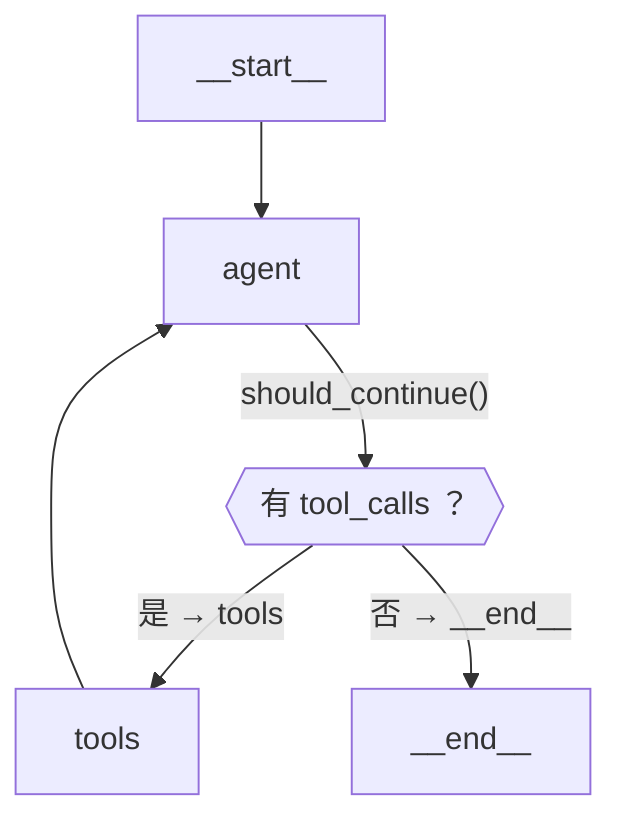
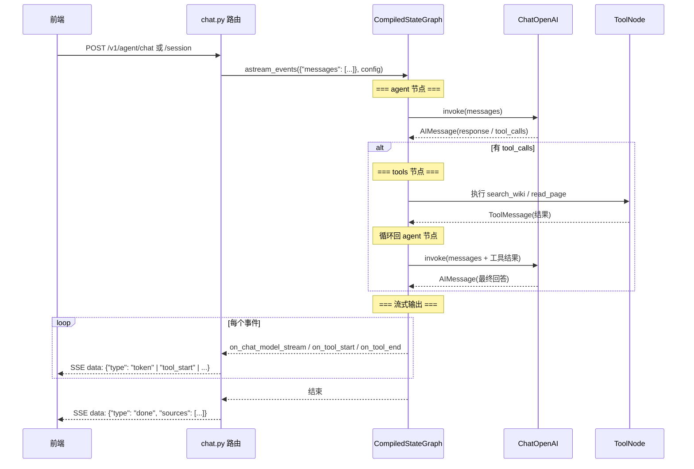
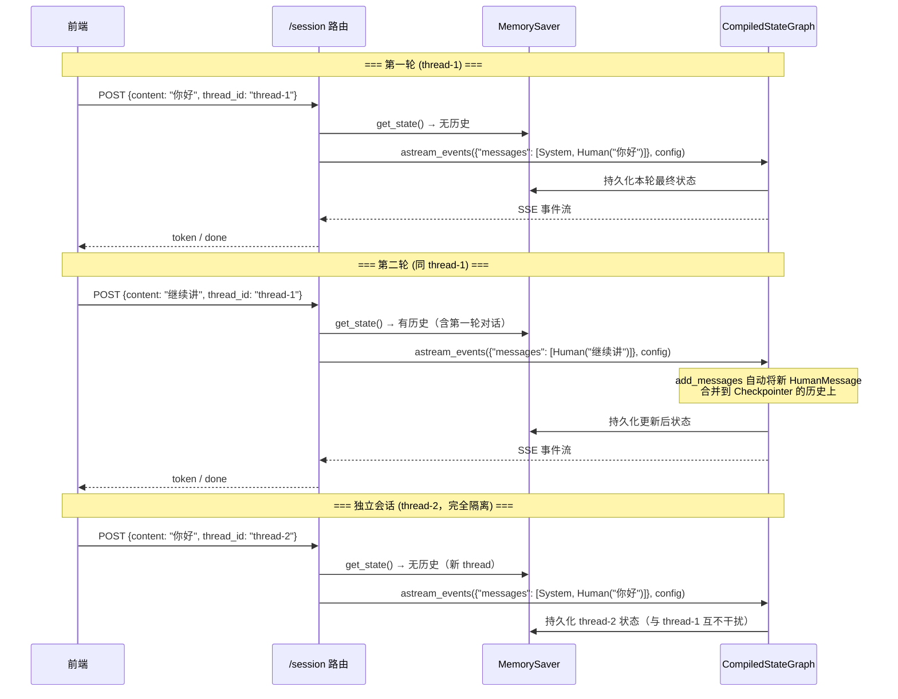
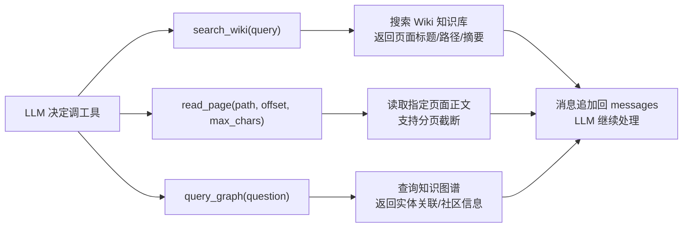
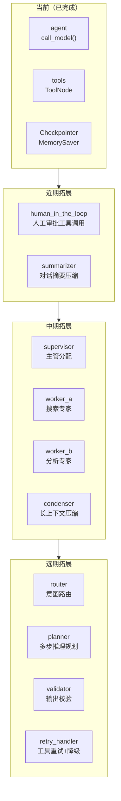
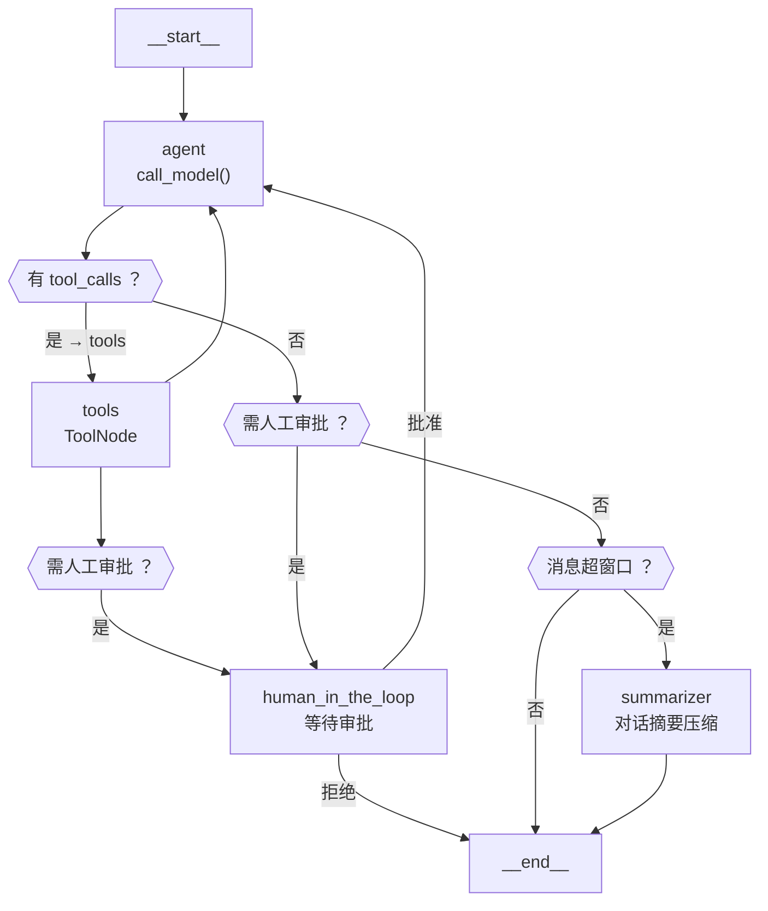
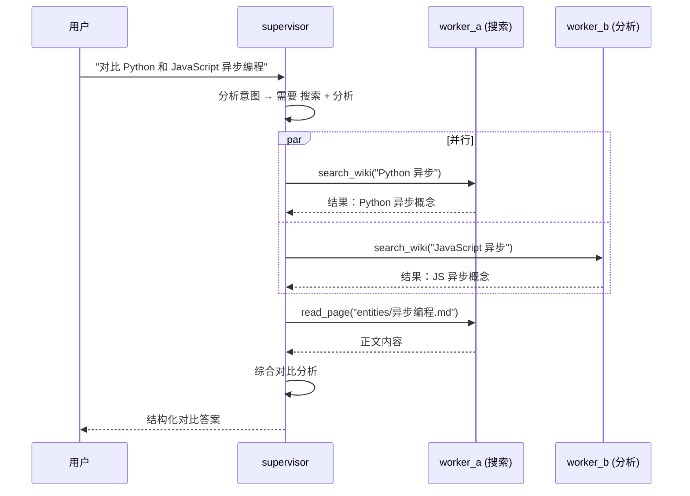

# Agent 架构图 — 当前节点与未来拓展

> 生成日期：2026-07-27
> 对应代码：`src/agent/`（agent.py / tools.py / constants.py / chat.py）

---

## 一、当前 StateGraph 节点与边

### 1.1 图结构（Mermaid）



### 1.2 节点说明

| 节点 | 函数 | 职责 |
|:-----|:-----|:------|
| `__start__` | 自动生成 | LangGraph 入口，注入 `{"messages": [...]}` 初始状态 |
| **`agent`** | `call_model()` | 调 LLM（`llm_with_tools.invoke()`），决定返回回答还是调工具 |
| **`tools`** | `ToolNode(P1_TOOLS)` | 执行 LLM 请求的工具（search_wiki / read_page），结果追加回 messages |
| `__end__` | 自动生成 | 图终止，返回最终状态 |

### 1.3 数据流



### 1.4 状态定义（AgentState）

```
AgentState (TypedDict)
├── messages: Annotated[list[BaseMessage], add_messages]
│   ├── SystemMessage    ← 系统提示词（首轮注入）
│   ├── HumanMessage     ← 用户输入
│   ├── AIMessage        ← LLM 回答（含 tool_calls）
│   ├── ToolMessage      ← 工具执行结果
│   └── ...              ← 多轮对话的完整历史（通过 add_messages 增量追加）
```

---

## 二、多轮会话隔离（新增）

### 2.1 Checkpointer + thread_id



### 2.2 两条 API 路径

```mermaid
flowchart LR
    Client["前端"]
    
    subgraph POST /v1/agent/chat
        direction TB
        A1["请求: {messages: [...]}"]
        A2["chat_stream()"]
        A3["传全量消息列表"]
        A1 --> A2 --> A3
    end
    
    subgraph POST /v1/agent/chat/session
        direction TB
        B1["请求: {content, thread_id}"]
        B2["chat_stream_session()"]
        B3["只传本轮输入<br/>Checkpointer 管理历史"]
        B1 --> B2 --> B3
    end
    
    Client -->|"无状态版"| POST /v1/agent/chat
    Client -->|"会话隔离版"| POST /v1/agent/chat/session
```

---

## 三、工具节点详情



- **search_wiki**：BM25 搜索，返回匹配页面列表 + 匹配度评分
- **read_page**：按路径读取 .md 文件正文，支持 offset 分页 + max_chars 截断
- **query_graph**：图谱实体关联查询，找邻居节点

---

## 四、未来拓展节点

### 4.1 路线图



### 4.2 每个拓展节点说明

| 阶段 | 节点 | 触发条件 | 职责 |
|:----:|:-----|:---------|:-----|
| **P1** | `human_in_the_loop` | 工具调用涉及敏感操作（如修改） | 中断图执行，等待人工审批/拒绝 |
| **P1** | `summarizer` | messages 长度超过阈值 | 调用 LLM 压缩早期对话为摘要，代替硬截断 |
| **P2** | `supervisor` | 用户问题需要多专家协作 | 分析意图，分发到对应 worker |
| **P2** | `worker_a` | supervisor 分配搜索任务 | 专注搜索 Wiki 知识库 |
| **P2** | `worker_b` | supervisor 分配分析任务 | 专注分析已读内容、归纳总结 |
| **P2** | `condenser` | context window 即将溢出 | 对工具输出做去重/摘要/结构化 |
| **P3** | `router` | 新用户输入 | 预分类：闲聊、知识问答、操作指令 |
| **P3** | `planner` | 复杂多跳问题 | 拆解子问题，生成执行计划 DAG |
| **P3** | `validator` | LLM 返回最终回答前 | 校验输出格式、引用准确性 |
| **P3** | `retry_handler` | 工具调用失败 | 自动重试/降级/替代方案 |

### 4.3 P1 拓展后的完整图



### 4.4 P2 多智能体协作（Supervisor + Worker）



---

## 五、常量体系总览

```
src/agent/constants.py (83 个常量)
├── LLM 配置 → ENV_DEEPSEEK_*, DEFAULT_MODEL, LLM_TIMEOUT, ...
├── 对话窗口 → MAX_MESSAGE_TURNS
├── 图节点名 → NODE_AGENT, NODE_TOOLS
├── 状态键   → STATE_MESSAGES
├── Config键 → CONFIG_CONFIGURABLE, CONFIG_THREAD_ID
├── 事件协议 → EVENT_*, FIELD_*, KIND_*
├── 消息角色 → ROLE_*, DEFAULT_ROLE
├── 工具配置 → SEARCH_LIMIT, SNIPPET_MAX_CHARS, ...
├── 正则     → WIKI_PATH_REGEX
├── 错误模板 → ERROR_*
└── 日志模板 → LOG_*
```

---

## 六、文件全景

```
src/agent/
├── constants.py   ← 所有常量集中管理（新增）
├── agent.py       ← Hand-written LangGraph StateGraph + 2 个流式接口
├── tools.py       ← 3 个 @tool（search_wiki / read_page / query_graph）
└── __init__.py    ← 空（包标记）

src/api/routes/chat.py
├── POST /v1/agent/chat           ← 无状态版（前端管理全量消息）
└── POST /v1/agent/chat/session   ← 多轮会话版（后端 Checkpointer 管理历史）

tests/test_agent/
├── test_agent.py   ← 17 个测试（build_agent + chat_stream + chat_stream_session）
└── test_tools.py   ← 20 个测试（search_wiki / read_page / query_graph）
```
