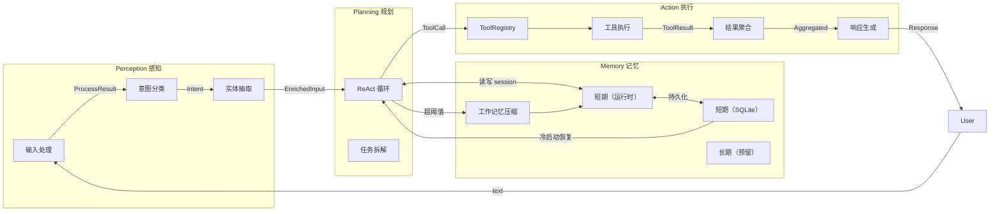

# Agent 四模块架构 — 重构方案

> 生成日期：2026-07-27
> 基于导购助手四模块设计理念，适配 LLM Wiki 知识问答场景。
> 对应代码：`src/agent/`（重构目标）

---

## 设计原则

1. **垂直切分** — 按职责拆为四个独立模块，每个模块内高内聚
2. **依赖方向固定** — `perception → planning → action ↕ memory`，禁止反向依赖
3. **接口先于实现** — 先定义模块间数据流协议，再填充代码
4. **导购→Wiki 适配** — 去掉下单/比价/商品等电商逻辑，保留结构

---

## 一、模块总览与数据流



---

## 二、Perception（感知模块）

### 职责

接收用户输入 → 识别意图 → 抽取关键实体 → 给下游结构化的 `EnrichedInput`

### 与导购版的差异

| 导购版 | Wiki 版 | 原因 |
|--------|---------|------|
| 多模态输入（文本+图像+语音） | 纯文本 | 当前 Wiki 知识库无多模态需求 |
| 意图：比价/咨询/购买 | 意图：知识查询/概念对比/wiki搜索/闲聊 | 场景不同 |
| 实体：品牌/商品/属性 | 实体：Wiki 页面/概念/技术术语 | 知识域不同 |
| NLU 模型 + 规则引擎 | LLM + 简单规则 | 项目初期直接调 LLM 分类 |

### 数据模型

```python
# ── Perception 内部数据流 ──

class Intent(Enum):
    KNOWLEDGE_QUERY = "知识查询"       # "什么是 Python 异步？"
    CONCEPT_COMPARE = "概念对比"        # "对比 Flask 和 FastAPI"
    WIKI_SEARCH = "wiki搜索"           # "搜索关于数据库的页面"
    CHITCHAT = "闲聊"                  # "你好" / "谢谢"

@dataclass
class Entity:
    type: str                          # "page" | "concept" | "term"
    value: str                         # "entities/python.md" | "异步编程"

@dataclass
class EnrichedInput:
    raw_text: str                      # 原始用户输入
    intent: Intent                     # 分类后的意图
    entities: list[Entity]             # 抽取的实体
```

### 接口

```python
class PerceptionModule:
    async def process(self, text: str, context: Context) -> EnrichedInput:
        """入口：文本 → 意图 + 实体"""
```

### 文件结构

```
src/agent/perception/
├── __init__.py          # 导出 PerceptionModule
├── types.py             # Intent, Entity, EnrichedInput
├── intent.py            # IntentClassifier — LLM 分类
└── entity.py            # EntityExtractor — LLM + 规则提取
```

---

## 三、Planning（规划模块）

### 职责

接收 `EnrichedInput` → 执行 ReAct 循环 → 决定调什么工具 → 判断何时结束

### 与导购版的差异

| 导购版 | Wiki 版 | 原因 |
|--------|---------|------|
| 任务拆解（多步：查商品→比价→推荐） | 可选的单步知识查询 | Wiki 场景多数问题可直接回答 |
| 工具选择引擎（按意图匹配工具池） | 简化版 ToolRegistry | 当前仅 2 个工具 |

### 当前代码映射

| 当前函数 | 目标模块 | 说明 |
|----------|----------|------|
| `call_model()` + `should_continue()` | `planning/react.py` | ReAct 主循环 |
| `human_approval_node()` | `planning/approval.py` | 审批闸门，归属 planning（决策） |
| `should_after_approval()` | `planning/approval.py` | 审批后路由 |
| `build_agent()` | `planning/builder.py` | 图构建工厂 |
| `AgentState` | `planning/state.py` | 图状态定义 |

### 数据模型

```python
@dataclass
class ToolCall:
    name: str                          # "search_wiki" | "read_page"
    args: dict                         # {"query": "..."} | {"path": "..."}
    id: str                            # 唯一标识

@dataclass
class ApprovalRequest:
    tool_calls: list[ToolCall]
    question: str                      # "是否批准以下工具调用？"
```

### 接口

```python
class PlanningModule:
    async def execute(self, input: EnrichedInput, memory: MemoryModule) -> Response:
        """执行完整的 ReAct 循环，返回最终响应"""
```

### 文件结构

```
src/agent/planning/
├── __init__.py
├── react.py             # call_model + should_continue（ReAct 主循环）
├── approval.py          # human_approval_node + should_after_approval
├── builder.py           # build_agent() — 组装图
├── state.py             # AgentState — TypedDict
└── types.py             # ToolCall, ApprovalRequest
```

---

## 四、Memory（记忆模块）

### 职责

管理对话历史的三个层次：运行时状态、跨会话持久化、长上下文压缩

### 与导购版的差异

| 导购版 | Wiki 版 | 原因 |
|--------|---------|------|
| 短期：Redis（独立服务） | MemorySaver（内存） | 单进程单用户 |
| 长期：用户偏好 + 商品知识向量库 | 仅持久化会话历史 | Wiki 无用户画像需求 |
| 工作记忆：任务中间状态 | 对话摘要压缩 | 当前已有 summarizer |

### 当前代码映射

| 当前文件 | 目标 | 说明 |
|----------|------|------|
| `persistence.py` (SQLite) | `memory/persistence.py` | 跨会话持久化，不动 |
| `summarizer.py` | `memory/summarizer.py` | 对话压缩，不动 |
| `agent.py` 中的 MemorySaver | `memory/short_term.py` | 运行时状态管理 |

### 数据模型

```python
@dataclass
class SessionState:
    thread_id: str
    messages: list[BaseMessage]
    updated_at: datetime
```

### 接口

```python
class MemoryModule:
    def load_session(self, thread_id: str) -> SessionState | None
    def save_session(self, state: SessionState) -> None
    def should_compress(self, state: SessionState) -> bool
    def compress(self, state: SessionState) -> SessionState
```

### 文件结构

```
src/agent/memory/
├── __init__.py
├── persistence.py       # SQLite CRUD（当前 persistence.py 迁移至此）
├── summarizer.py        # 对话压缩（当前 summarizer.py 迁移至此）
└── short_term.py        # MemorySaver 运行时状态封装
```

---

## 五、Action（执行模块）

### 职责

管理工具注册、执行工具调用、聚合多工具结果、生成最终自然语言响应

### 与导购版的差异

| 导购版 | Wiki 版 | 原因 |
|--------|---------|------|
| 商品查询/价格计算/下单 | search_wiki / read_page / query_graph | 工具集不同 |
| 多工具结果聚合（比价表） | 简单结果拼接 | Wiki 场景通常单工具调用 |
| 自然语言回复 | format_response（结构化输出） | 已有实现 |

### 当前代码映射

| 当前函数/文件 | 目标 | 说明 |
|---------------|------|------|
| `tools.py` | `action/tools/` | 工具函数独立目录 |
| `ToolNode(P1_TOOLS)` | `action/executor.py` | 工具执行节点 |
| `format_response()` + `AgentResponse` | `action/response.py` | 响应生成 |
| `P1_TOOLS = [search_wiki, read_page]` | `action/registry.py` | ToolRegistry 管理 |

### 数据模型

```python
@dataclass
class ToolResult:
    tool_name: str
    output: str
    success: bool

@dataclass
class AgentResponse:
    answer: str
    cited_pages: list[str]        # 引用的 Wiki 页面路径
    follow_up_questions: list[str]  # 建议追问
```

### 接口

```python
class ActionModule:
    def register_tool(self, name: str, tool: Callable) -> None
    def get_tool(self, name: str) -> Callable | None
    async def execute(self, tool_call: ToolCall) -> ToolResult
    async def respond(self, content: str, context: EnrichedInput) -> AgentResponse
```

### 文件结构

```
src/agent/action/
├── __init__.py
├── registry.py          # ToolRegistry（新建）
├── executor.py          # ToolNode 封装（新建）
├── response.py          # format_response + AgentResponse 迁移至此
├── approval.py          # human_in_loop（与 planning/approval.py 对应，可选合入）
└── tools/
    ├── __init__.py
    ├── wiki_search.py   # search_wiki 迁移至此
    └── wiki_read.py     # read_page 迁移至此
```

---

## 六、重构后的完整文件树

```
src/agent/
├── __init__.py              # from .planning.builder import build_agent
│
├── perception/              # 感知模块
│   ├── __init__.py
│   ├── types.py
│   ├── intent.py
│   └── entity.py
│
├── planning/                # 规划模块
│   ├── __init__.py
│   ├── state.py             # AgentState
│   ├── types.py             # ToolCall, ApprovalRequest
│   ├── react.py             # call_model + should_continue
│   ├── approval.py          # human_approval_node + should_after_approval
│   └── builder.py           # build_agent()
│
├── memory/                  # 记忆模块
│   ├── __init__.py
│   ├── persistence.py       # ← 当前 persistence.py
│   ├── summarizer.py        # ← 当前 summarizer.py
│   └── short_term.py        # MemorySaver 封装
│
├── action/                  # 执行模块
│   ├── __init__.py
│   ├── registry.py          # ToolRegistry（新建）
│   ├── executor.py          # ToolNode 封装（新建）
│   ├── response.py          # format_response / AgentResponse
│   └── tools/
│       ├── __init__.py
│       ├── wiki_search.py   # ← 当前 tools.py 中 search_wiki
│       └── wiki_read.py     # ← 当前 tools.py 中 read_page
│
├── constants.py              # 保留（全局常量）
└── __init__.py               # 导出 build_agent

src/api/routes/chat.py        # 不变（只改 import 路径）

tests/test_agent/             # 测试结构对齐
├── test_perception/
├── test_planning/
├── test_memory/
├── test_action/
└── test_integration/
```

---

## 七、迁移路径

```
Phase 1（本次）: 代码重组
  ├── 新建目录结构（perception / planning / memory / action）
  ├── 迁移 tools.py → action/tools/
  ├── 迁移 summarizer.py → memory/summarizer.py
  ├── 迁移 persistence.py → memory/persistence.py
  ├── 拆分 agent.py → planning/* + action/response.py
  └── 更新 import 路径，测试通过

Phase 2（之后）: 新增功能
  ├── perception/intent.py — 意图分类
  ├── perception/entity.py — 实体抽取
  └── action/registry.py — ToolRegistry

Phase 3（远期）: 分布式
  └── memory 对接向量库 / profile 长期记忆
```

---

## 八、不变的部分

以下内容不受重构影响，不动：

| 内容 | 原因 |
|------|------|
| `src/api/routes/chat.py` | API 接口协议不变，只改 import |
| `src/agent/constants.py` | 常量集中管理，可保留或拆分到各模块 |
| `src/agent/__init__.py` | 导出 `build_agent` 保持向后兼容 |
| LangGraph 图结构 | 边、节点逻辑不变，只重新分布到模块 |
| SQLite schema | `persistence.py` 表结构不变 |
| MemorySaver Checkpointer | 运行时状态管理方式不变 |
| SSE 事件协议 | 前端对接协议不变 |
