# LLM Wiki 深度技术文档

> 面向面试官 / 技术评估 / 项目复盘，涵盖 RAG 对比、检索实现、记忆管理、差异化亮点。
> 纯文档回答，不涉及代码改动。

---
## 排列规则

本文档采用 **优先级分组** 排列：

### 排列原则

1. **导航表按优先级排序** — P0 → P1 → P2，同优先级内部保持原有内容顺序
2. **详细解答按优先级分组** — 每组使用一级标题（H3），组内问题为二级标题（H4）
3. **优先级定义**：
   - **🔴 P0** = 核心架构认知，必须理解清楚，面试必考
   - **🟠 P1** = 重要优化方向或已实现但需了解的能力，面试高频
   - **🟡 P2** = 亮点展示或实操层面，锦上添花
4. **导航表最后一列「备注（自己填）」** — 由文档作者自行填写说明
5. **每个问题保留原始编号** — 编号不随排列顺序变化而改变，方便跨版本追溯

---
## 快速导航表（按优先级从高到低排列）

| # | 问题 | 优先级 | 一句话回答 | 备注（自己填） |
|---|------|--------|-----------|---------|
| 1 | **项目有没有 RAG？RAG 和 Wiki 定位有何不同？** | 🔴 P0 | 项目是 **Wiki 知识库**（结构化知识沉淀），**没有传统 RAG 的 chunk-召回-生成 流水线**。首版对标 Karpathy 的 LLM Wiki 理念——"编译"而非"检索"。 | 需要背诵    |
| 2 | **向量召回、关键词召回有没有？怎么实现的？** | 🔴 P0 | **两者都有**。BM25 关键词搜索 + Chroma 向量语义搜索 + **RRF 融合**（hybrid 模式），启闭由配置开关控制。 |     需要背诵    |
| 3 | **有没有做 chunk 切分？向量化怎么做的？** | 🔴 P0 | **没有做 chunk 切分**。整页编码（前 8000 字符），这可能是一个需要改进的短板。 |         |
| 4 | **上下文管理对标 LangGraph 官方体系如何？** | 🔴 P0 | 自研记忆层功能完整（MemorySaver + SQLite + Attention Sink + WM），但**缺 SqliteSaver、BaseStore、Time Travel、Delta Channels**。P1 最少需升级 SqliteSaver。 |         |
| 5 | **向量维度是多少？是稠密还是稀疏？** | 🟠 P1 | **384 维稠密向量**（all-MiniLM-L6-v2），不是 128 维。使用 cosine 距离。 |         |
| 6 | **Query 模糊/歧义如何处理的？** | 🟠 P1 | **没有显式的模糊处理**。依赖 ReAct Agent 的"搜索→阅读→推理"循环，以及 LangGraph 的三层自修正机制。 |         |
| 7 | **Embedding 模型有做 A/B 测试吗？评估指标如何设计？** | 🟠 P1 | **当前没有**。首版卡在"有比没有好"阶段，评估体系留待 Phase 5。 |         |
| 8 | **单 Agent 项目需要上下文压缩和记忆存储吗？做到了哪一步？** | 🟠 P1 | **已经做了，而且做得比较多**——MemorySaver + SQLite 持久化 + Attention Sink + Working Memory + 摘要压缩 + 归档降级。 |         |
| 9 | **MCP Server 怎么接入的？需要升级吗？** | 🟠 P1 | 已实现 8 个 MCP 工具（`@wiki_tool` 装饰器），但 Agent 内部工具与 MCP 工具**两套重复定义**，建议统一为 MCP-first 架构。 |         |
| 10 | **未来多 Agent 方向怎么走？** | 🟠 P1 | 2026 官方推荐 **Subagents as Tools**（主管 Agent 通过 @tool 调子 Agent），当前项目基础设施大部分可直接复用。 |         |
| 11 | **LangSmith 集成和前端验证怎么样？** | 🟠 P1 | 当前**零集成**（无 LANGCHAIN_TRACING_V2），加 3 行 .env 配置即可启用。前端 SSE 流已通但**缺审批 UI、会话列表同步、来源引用渲染**。 |         |
| 12 | **外部搜索集成：审计阶段能否补充外部知识？** | 🟠 P1 | **当前没有**。项目只有内部 Wiki 搜索，缺外部 Web 搜索。审核/编译阶段应集成外部搜索自动补充概念定义与参考资料。 |         |
| 13 | **项目有哪些特色亮点可以写简历？** | 🟡 P2 | ReAct + 三层自修正、BM25+向量+RRF 融合搜索、Attention Sink、Human-in-the-Loop 审批、SSE 流式、记忆降级归档。 |         |
| 14 | **前端能用吗？项目能部署吗？** | 🟡 P2 | **能**——React 前端 + FastAPI 后端 + Vite 代理。部署缺 Dockerfile，需手动部署。 |         |

---

## 详细解答

### 🔴 P0 — 核心架构问题

---

#### 1. RAG vs Wiki：项目定位与本质区别

> 🔴 **P0 — 核心认知问题**

##### 1.1 概念区分

| 维度 | 传统 RAG | LLM Wiki（本项目） |
|------|----------|-------------------|
| **核心理念** | 检索增强生成——召回 → 阅读理解 → 生成 | **知识编译**——将原始资料"编译"为结构化 Wiki 知识库 |
| **存储单位** | Chunk（固定长度文本片段）| **整页** Markdown 文档（entity / concept / source / query） |
| **检索粒度** | 向量相似度 Top-K | **四层定位**：关键词(BM25) → 语义(向量) → 图谱(wikilinks) → LLM 兜底 |
| **生成方式** | LLM 基于检索片段即席生成 | **Agent 推理**——搜索 → 阅读 → 推理 → 回答，支持工具调用 |
| **知识迭代** | 重新索引即可 | **增量编译**——新 raw 素材 → 生成/更新 Wiki 页面 |
| **知识可读性** | 低（chunk 碎片）| **高**（完整页面，人可直接阅读）|
| **典型场景** | 私域文档问答 | 个人/团队知识沉淀 + 智能问答 |

##### 1.2 项目实际做的事

项目**不是**经典 RAG（无 chunk、无固定相似度召回流水线），但**具备 RAG 的核心能力**：

```
用户 Query
    │
    ▼
┌─────────────────────────────────────────────────┐
│  ReAct Agent                                    │
│  ┌──────────────┐   ┌──────────────┐           │
│  │ search_wiki  │ → │ read_page    │           │
│  │ (BM25+向量+  │   │ (获取完整页   │           │
│  │  图谱检索)   │   │  面内容)     │           │
│  └──────────────┘   └──────────────┘           │
│         ↓                                       │
│  ┌──────────────────────────────────────────────┐│
│  │  三层自修正：validate → verify → reflect    ││
│  └──────────────────────────────────────────────┘│
│         ↓                                       │
│  ┌──────────────────────────────────────────────┐│
│  │  LLM 推理 + 结构化输出                       ││
│  └──────────────────────────────────────────────┘│
└─────────────────────────────────────────────────┘
```

**区别定位总结**：
- 传统 RAG = **"找到相关内容片段，拼给 LLM 看"**
- LLM Wiki = **"Agent 自己决定怎么搜、读什么、怎么推理"**

---

#### 2. 向量检索 + 关键词检索：双引擎 + RRF 融合

> 🔴 **P0 — 核心能力认知**

##### 2.1 检索架构总览

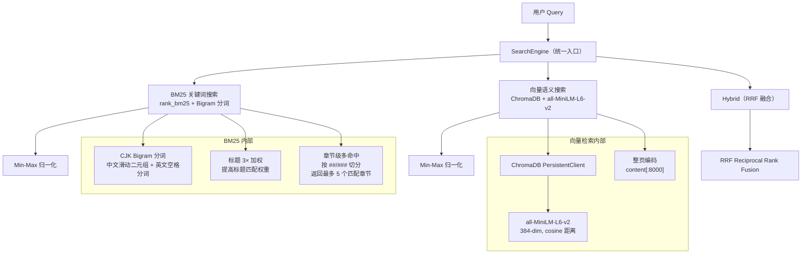

##### 2.2 BM25 关键词搜索

- **库**：`rank_bm25`（纯 Python，零 C 扩展）
- **分词策略**（`src/core/search/bigram.py`）：
  - **CJK 字符**：滑动 bigram（"机器学习" → "机器"、"器学"、"学习"）
  - **英文/数字**：空格分词 + 小写化
  - **停用词过滤**：中文停用词表
  - **标题加权**：标题内容在索引中重复 3 次，提升标题匹配权重
- **章节级多命中**：按 `##`/`###` 切分章节，返回最多 5 个匹配章节及其行号
- **生命周期**：启动时构建 → ingest 后标记脏 → 懒重建

##### 2.3 向量语义搜索

- **向量库**：ChromaDB（PersistentClient，磁盘持久化）
- **Embedding 模型**：`all-MiniLM-L6-v2`（384 维，cosine 距离）
- **索引策略**：**整页编码**（`content[:8000]`），不做 chunk 切分
- **启停控制**：`EMBEDDING_ENABLED` 环境变量，默认关闭

##### 2.4 Hybrid 融合（RRF）

```
RRF 公式：score(path) = Σ 1/(k + rank(path))

对 BM25 和向量结果分别排序后：
  - BM25 第 1 名 → 1/(60+1) ≈ 0.0164
  - 向量第 1 名 → 1/(60+1) ≈ 0.0164
  - BM25 第 2 名 → 1/(60+2) ≈ 0.0161
  - ...
同路径在两个列表中得分累加 → 重排序

注意：用了 rank_bm25（pypi 包），不是 whoosh/jieba
```

##### 2.5 搜索结果最终流向

Agent 工具 `search_wiki` 调 `SearchTool.search()`，**默认用的是文件遍历搜索（不是 SearchEngine）**。SearchEngine 是独立于 Agent 的 Wiki 检索模块。

```
SearchTool.search()               SearchEngine.search()
    │                                   │
    ├─ 文件遍历所有 .md                  ├─ BM25 / Vector / Hybrid
    ├─ 文件名匹配 > 标题匹配 > 正文匹配   ├─ 统一 search() 接口
    ├─ 纯算法，不调 LLM                  ├─ 带分页 (offset)
    └─ 供 Agent 的 search_wiki 工具使用   └─ 供 QueryEngine / API 使用
```

---

#### 3. Chunk 切分：一个已知的短板

> 🔴 **P0 — 架构级注意事项**

##### 3.1 现状

**没有做 chunk 切分。** 整页作为向量化的最小单位：
- `embed_page()` 取 `content[:8000]` 编码
- `read_page` 工具最多返回 4000 字符（支持 offset 分页读取）

##### 3.2 为什么不切

项目设计的 **Wiki 页面粒度本身就比较细**（entity / concept 级别），默认偏小、主题聚焦。页面被刻意设计为"小而精"——每个页面讲清楚一个概念或实体。

##### 3.3 不切 chunk 的问题

| 问题 | 影响 |
|------|------|
| 页面 8000 字符上限被截断 | 长页面丢失尾部信息 |
| 向量搜索命中精度低 | 整页编码 → 模糊匹配 |
| 无法精准定位到段落 | 只能返回页面级结果 |
| 跨页面主题混合 | 单个页面多主题时检索困难 |

##### 3.4 改进方向（Phase 5 规划）

```
页面 → 按 ## 标题切分 → 每个 section 独立 chunk
     → chunk 向量化 → 检索时返回 section 级别结果
     → 检索结果合并：同一页面的多个匹配 section 按分数聚合
```

---

#### 11. 上下文管理深度解析：能否对标 LangGraph 官方体系？

> 🔴 **P0 — 架构核心，必须理解清楚**

##### 11.1 LangGraph 官方上下文管理体系（2026）

LangGraph 将上下文管理分为两个正交维度：

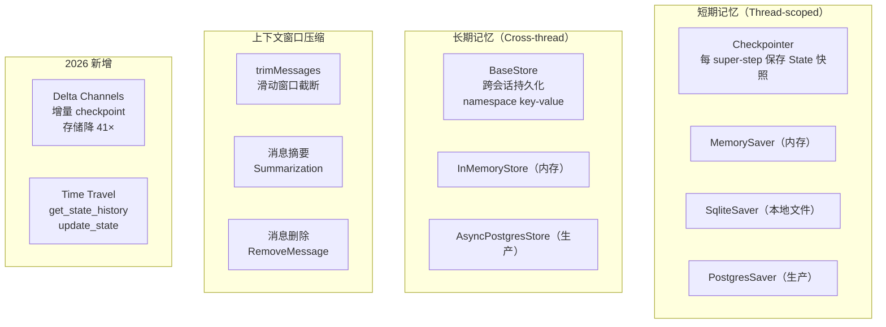

**短期记忆 vs 长期记忆的官方划分**：

| 维度 | Checkpointer（短期） | Store/BaseStore（长期） |
|------|--------------------|----------------------|
| 作用域 | 单 thread（一次会话） | 跨 thread（所有会话） |
| 存储内容 | 图状态（messages + 中间变量） | 自定义数据（用户偏好、实体知识） |
| 接口 | compile(checkpointer=...) | store.put() / .get() / .search() |
| key 架构 | thread_id | (namespace_tuple, key) |
| 生产推荐 | PostgresSaver | AsyncPostgresStore |

##### 11.2 当前项目 vs 官方体系：差距矩阵

| LangGraph 官方能力 | 项目当前状态 | 实现方式 | 差距评级 |
|-------------------|-------------|---------|---------|
| **Checkpointer（MemorySaver）** | ✅ 已实现 | `checkpointer=MemorySaver()` | 🟢 无 |
| **Checkpointer（SqliteSaver）** | ❌ 未使用 | 项目用应用层 SQLite 代替 | 🟡 可用但非官方 |
| **Checkpointer（PostgresSaver）** | ❌ 未实现 | — | 🔴 生产缺失 |
| **Store/BaseStore** | ❌ 未使用 | 自研 Attention Sink + Working Memory | 🟡 功能等效但非标准 |
| **trimMessages** | ⚠️ 部分 | 硬窗口 `MAX_MESSAGE_TURNS=20` | 🟡 有但简陋 |
| **消息摘要** | ✅ 已实现 | Summarizer 节点 + `RemoveMessage` | 🟢 完善 |
| **Delta Channels** | ❌ 未实现 | — | 🟡 长对话优化 |
| **Time Travel** | ❌ 未实现 | — | 🟡 面试加分项 |
| **get_state_history** | ❌ 未使用 | 代码可能可用但前端无入口 | 🟡 可加 |
| **update_state（分支）** | ❌ 未实现 | — | 🟡 可加 |

##### 11.3 需要拓展的功能（按优先级）

###### P1：Checkpointer 升级至 SqliteSaver

当前项目用 `MemorySaver()`（纯内存）+ 应用层 SQLite 持久化。**LangGraph 官方提供 `SqliteSaver`**，可以直接替代 MemorySaver：

```python
# 当前（MemorySaver 纯内存，重启丢失）
from langgraph.checkpoint.memory import MemorySaver
app = builder.compile(checkpointer=MemorySaver())

# 升级（SqliteSaver 文件持久化，重启恢复）
from langgraph.checkpoint.sqlite import SqliteSaver
app = builder.compile(checkpointer=SqliteSaver.from_conn_string("checkpoints.db"))
```

这一改动的收益：
- MemorySaver 不需要再从 SQLite 冷启动恢复了（checkpointer 自己持久化状态）
- `get_state()` / `get_state_history()` 重启后仍然可用
- Time Travel 功能天然可用（checkpointer 存储了全量历史快照）

**注意**：2026 年 6 月爆出 SQLite Checkpointer 的 SQL 注入漏洞（CVE-2025-67644），需使用 `langgraph-checkpoint-sqlite >= 3.0.1`。

###### P2：引入 BaseStore 替代自研记忆

当前自研的 Attention Sink + Working Memory **功能上等价于 BaseStore 的长期记忆**，但接口非标准。如果项目要作为"产品化"展示，建议：

```python
# 当前（自研记忆）
state["attention_sinks"] = [...]       # 自定义状态字段
state["working_memory"] = {...}        # 自定义状态字段
store.save_thread(...)                 # 自研持久化接口

# 升级（使用官方 BaseStore）
from langgraph.store.base import BaseStore
store.put(("user", thread_id, "sinks"), "attention", sinks_data)
store.put(("user", thread_id, "wm"), "working_memory", wm_data)
```

是否改取决于目标——如果面试或产品化需要展示 **LangGraph 完整能力**就改，否则自研实现功能完整且更灵活。

###### P2：实现 Time Travel

Time Travel 是 LangGraph checkpointer 的**原生能力**，只需要一个 API 端点暴露：

```python
# 1. 浏览历史 — GET /v1/agent/threads/{thread_id}/history
history = list(agent.get_state_history(config))
# 返回 [state_snapshot, ...] 按时间倒序

# 2. 分支/修改 — POST /v1/agent/threads/{thread_id}/fork
from langgraph.types import Checkpoint
fork_config = agent.update_state(
    target_checkpoint.config,  # 从历史中选择一个 checkpoint
    {"messages": [new_message]},  # 修改状态
)
# 返回新的 config，按新分支继续对话

# 3. 恢复 — POST /v1/agent/chat/session（带 resume）
# 现有接口已支持：用 fork_config 的 thread_id 继续对话
```

前端对应：
- 对话历史侧边栏增加"查看历史版本"入口
- 时间轴展示每个 checkpoint 的摘要
- "从此分支继续"按钮 → 调 fork 接口

###### P3：Delta Channels（长对话存储优化）

当对话超过 200 轮时，MemorySaver 的**全量快照**存储膨胀严重（LangGraph 官方数据：200 轮编码 agent → 5.3 GB）。Delta Channels 将存储降到 **110 MB**（41× 减少）。

```python
from langgraph.channels.delta import DeltaChannel
from typing_extensions import Annotated

class AgentState(TypedDict):
    messages: Annotated[list[BaseMessage], DeltaChannel(
        reducer=add_messages,
        snapshot_frequency=50,  # 每 50 步写一次全量快照
    )]
```

但对于当前项目（对话轮次通常 < 100），**优先级不高**。

##### 11.4 总结：需要改吗？

```
当前架构：MemorySaver（短） + 自研 SQLite（持久） + 自研记忆（长）
   ↑ 功能完整，但接口非标准
   ↑ 面试官可能会问："为什么不用 SqliteSaver？"
   
升级目标：SqliteSaver（短+持久） + BaseStore（长） + Time Travel（调试）
   ↑ 完全对齐 LangGraph 官方实践
   ↑ 面试时可以直接说"遵循 LangGraph persistence 最佳实践"
   
建议：
  - P1 立即升级 SqliteSaver（代码改动小，收益大）
  - P2 酌情加 Time Travel API（加分项）
  - P3 记忆层改为 BaseStore（长远）
```

---

##### 11.5 容错性体系审计：对照 LangGraph Fault Tolerance 官方规范

> 🔴 **P0 — 你说得对，容错性确实不够**

2026 年 6 月 LangGraph v1.2 正式引入了**声明式容错三件套**：`RetryPolicy`、`TimeoutPolicy`、Error Handler，直接嵌入图节点声明。当前项目在这三个维度均有严重缺失。

###### 11.5.1 官方三件套 vs 项目现状

| 维度 | LangGraph v1.2 官方能力 | 当前项目状态 | 差距 |
|------|------------------------|-------------|------|
| **RetryPolicy** | `retry_policy=RetryPolicy(max_attempts=3, backoff_factor=2.0)` — 节点级自动重试，指数退避 + jitter | ❌ **无** — LLM 级有 `max_retries=1`（ChatOpenAI 参数），但 SDK 层重试不是图节点级重试。`validate_tool` / `verify_result` 等业务节点完全无重试 | 🔴 |
| **TimeoutPolicy** | `timeout=RunTimeout(30)` / `IdleTimeout(60, refresh_on="heartbeat")` — 节点级超时，超时抛 `NodeTimeoutError`（可自动重试） | ⚠️ **部分** — LLM 级别有 `timeout=15/30`（ChatOpenAI 参数），但图节点级别无超时保护。`tool_node` 执行工具时无超时，一旦工具 hang 住整个链路口阻塞 | 🔴 |
| **Error Handler** | 重试耗尽后执行，`Command(update, goto)` 实现 Saga 补偿模式 | ❌ **无** — `src/api/errors.py` 的 `global_exception_handler` 是 HTTP 层的兜底，不是图节点级的错误处理。节点异常时无补偿动作 | 🔴 |
| **set_node_defaults** | 图级统一设置 `retry_policy` + `timeout` + `error_handler` | ❌ **无** — 每个节点各自为政 | 🟡 |
| **LangSmith 可见性** | 重试/超时/错误处理事件全量追踪 | ✅ 有日志，但无 LangSmith 集成 | 🟡 |

###### 11.5.2 逐节点审计

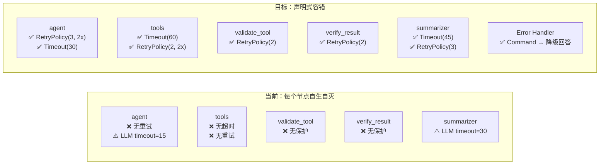

###### 11.5.3 需要补的代码改动

```python
# ========== 当前 ==========
builder.add_node("agent", call_model)
builder.add_node("tools", tool_node)

# 编译 — 无图级容错
app = builder.compile(checkpointer=MemorySaver())

# ========== 目标（LangGraph v1.2+）==========
from langgraph.policies import RetryPolicy, RunTimeout, IdleTimeout

# 图级默认值
builder.set_node_defaults(
    retry=RetryPolicy(max_attempts=3, backoff_factor=2.0, jitter=True),
    timeout=RunTimeout(seconds=30),
)

# 节点级覆盖（工具执行可能较慢，单独设更长的超时）
builder.add_node("tools", tool_node,
    retry=RetryPolicy(max_attempts=2),
    timeout=RunTimeout(seconds=60),
)

# Error Handler — 重试耗尽后的降级
def error_handler(state: AgentState, error: NodeError) -> Command:
    logger.error("节点 %s 失败: %s", error.node, error.error)
    return Command(
        update={"messages": [AIMessage(content=f"处理过程遇到错误，已跳过此步骤")]},
        goto="agent",  # 路由回 agent 重新思考
    )

builder.set_node_defaults(error_handler=error_handler)

app = builder.compile(checkpointer=MemorySaver())
```

###### 11.5.4 补充建议

| 问题 | 当前 | 修复方案 | 复杂度 |
|------|------|---------|--------|
| ToolNode 执行工具无超时 | 工具 hang → 整个流阻塞 | `TimeoutPolicy` 设 60s | 低 |
| LLM 调用失败后手动重试 | `try-except` 分散在各处 | `RetryPolicy(3, 2x)` 统一 | 低 |
| 工具返回空/错误后笨重 | `verify_result` 手动检查 | Error Handler + `Command(goto)` | 中 |
| 无图级默认值 | 每个节点各自配置 | `set_node_defaults` 一行代码 | 低 |

---

##### 11.6 中断规则符合度检查：对照 LangGraph Interrupts 官方规范

> 🔴 **P0 — 你问过"我们做到了么"，现逐条检查**

###### 11.6.1 当前实现 vs 官方规则

| # | LangGraph Interrupts 官方规则 | 当前项目 | 符合？ |
|---|------------------------------|---------|--------|
| 1 | **中断必须有持久化 checkpointer**，否则无法恢复 | `MemorySaver()` — 纯内存，重启后中断丢失 | ⚠️ **部分** |
| 2 | `interrupt()` 的 payload 必须 **JSON 可序列化** | `{"question": "...", "tool_calls": [...]}` — 纯 dict ✅ | 🟢 |
| 3 | **恢复必须使用相同 `thread_id`** | `chat_stream_session` 全程用同一 `thread_id` ✅ | 🟢 |
| 4 | **`Command(resume=...)` 是唯一的恢复方式** | 代码中用了 `Command(resume=approval)` ✅ | 🟢 |
| 5 | **中断前不能有不可逆副作用**（如发送邮件） | `human_approval_node` 仅在 LLM 输出 tool_calls 后中断，无副作用 ✅ | 🟢 |
| 6 | **节点从开头重新执行**（interrupt 之前的代码在恢复时重跑） | `human_approval_node` 的 interrupt 前无逻辑，恢复后直接进 `should_after_approval` → `tools` 节点 ✅ | 🟢 |
| 7 | **中断应放在不可逆操作之前**，而非之后 | approve 在 tools 之前执行 ✅ | 🟢 |
| 8 | **支持 Dynamic Interrupt（运行时条件判断）** | 当前仅对所有 tool_calls 中断，无细粒度条件（如仅对 write/sql 类工具中断） | 🟡 可优化 |
| 9 | **支持 Static Breakpoint（编译时声明）** | 未使用 `interrupt_before` / `interrupt_after` | 🟡 可加 |
| 10 | **流式场景检测 interrupt** | 当前在流结束后用 `agent.get_state(config).interrupts` 检测 | 🟡 非标准方式 |
| 11 | **中断可嵌套（子图中断冒泡到父图）** | 无子图，无嵌套场景 | 🟡 N/A |
| 12 | **多个工具同时中断时，每个需独立决策** | 当前所有 tool_calls 一起审批（`approval: {"approved": True/False}`），**不支持逐个审批** | 🔴 **缺失** |

###### 11.6.2 关键差距详解

**差距 1：MemorySaver 导致中断状态重启丢失**

```
场景：用户正在审批 tool call 时服务器重启
  → MemorySaver 清空 → 中断状态丢失 → 审批无法恢复

修复：换 SqliteSaver（见 11.3 P1）
```

**差距 12：不支持逐个工具审批**

```
当前：approval = {"approved": True}  → 一次性批准/拒绝全部
官方最佳实践：每个 tool_call 独立决策：
  [
    {"tool_call_id": "call_1", "decision": "approve"},
    {"tool_call_id": "call_2", "decision": "reject", "feedback": "换个关键词"},
    {"tool_call_id": "call_3", "decision": "edit", "args": {"query": "新关键词"}},
  ]

修复：前端展示每个工具的独立审批 UI，后端逐个处理
  - 前端：每个 tool 显示独立的 approve/reject/edit 按钮
  - 后端：interrupt payload 包含每个 tool 的独立审批状态
```

**差距 10：中断检测方式不标准**

```
当前：astream_events 结束后调 get_state(config).interrupts
官方推荐：stream_mode="values" 时在流中直接收 interrupt 事件
  for event in agent.stream(input, config, stream_mode="values"):
      if '__interrupt__' in event:
          # 实时检测中断，不等流结束
```

###### 11.6.3 升级方案

| 改进项 | 改动量 | 收益 |
|--------|--------|------|
| MemorySaver → SqliteSaver | 2 行 | 中断状态持久化 |
| 逐个工具审批 | 中（前端 + 后端） | 精细控制 |
| astream 实时检测 interrupt | 小 | 流中即时感知 |
| 加 `interrupt_before` 静态断点 | 小 | 调试便利 |

---

##### 11.7 流式处理完整度：astream_events v1 vs v2 审计

> 🟠 **P1 — 当前项目用了 v1，需要评估是否升 v2**

###### 11.7.1 当前实现

```python
# src/agent/session.py:224
async for event in agent.astream_events(
    stream_input,
    config,
    version="v1",  # ← 当前用 v1
):
```

###### 11.7.2 v1 vs v2 对比

| 维度 | v1（当前）| v2 |
|------|----------|-----|
| 事件粒度 | `on_chat_model_stream` / `on_tool_start` / `on_tool_end` | **相同事件名 + 新增**：`on_chain_stream`、`on_parallel_node_stream`、`on_subgraph_stream` |
| Token 输出 | 每个 chunk 单独 yield，需用 `emit_token` 过滤内容为空的事件 | **流更干净**：过滤了空 content chunk |
| Tool 事件 | `on_tool_start` 有 `input`，`on_tool_end` 有 `output` | **不变** |
| Interrupt 事件 | **无法在流中直接收**（流结束后通过 `get_state(config).interrupts` 检查） | **支持流中 interrupt 事件**：`on_interrupt` / `on_resume` |
| Subgraph 事件 | 不支持 | 子图节点的流事件会冒泡到父图流 |
| 性能 | 全量事件 | v2 做了事件过滤优化，减少无关事件传输 |

###### 11.7.3 当前项目使用的事件

当前 `chat_stream_session` 监听了 3 种事件 + 1 种后处理：

| 事件 | LangGraph kind | 当前处理 | 够用？ |
|------|---------------|---------|--------|
| LLM token 输出 | `on_chat_model_stream` | ✅ → `emit_token` → yield `token` | 🟢 |
| 工具开始 | `on_tool_start` | ✅ → yield `tool_start` | 🟢 |
| 工具结束 | `on_tool_end` | ✅ → yield `tool_end` + 提取引用来源 | 🟢 |
| 中断 | （无流中事件） | ⚠️ → 流结束后 `get_state().interrupts` | 🟡 延迟检测 |
| 摘要通知 | `on_chat_model_stream`（摘要模型的 token 和主模型 token 混在一起） | ❌ **无法区分** | 🔴 摘要 token 与回答 token 混淆 |
| 错误 | `on_chain_error` / `on_custom_event` | ❌ 未监听 | 🟡 异常时只能靠 try-except 兜底 |

###### 11.7.4 摘要 token 与回答 token 混淆问题（当前代码 Bug）

```
当前问题：
  summarizer 节点也调用 LLM，产生的 token 事件和主 agent 的 token 事件
  都通过 on_chat_model_stream 发出，前端无法区分"这是摘要压缩的 token"
  还是"这是最终回答的 token"。

影响：
  - 摘要压缩时，前端可能会闪烁显示"回答中"然后消失
  - 调试日志难以区分 token 来源

修复方案（两个选一个）：
  方案 A（推荐）：summarizer 节点不流式输出（改为后台静默执行），
    用自定义 SSE 事件通知前端"摘要已执行"。
  方案 B：升级 v2 + 自定义事件标记。在 summarizer 节点执行的 LLM 调用中
    注入 metadata 标记，前端根据 tag 过滤。
```

###### 11.7.5 升级建议

```
当前（v1）→ 目标（v2）需要改动：
  1. `version="v2"` — 改 1 个参数
  2. 监听 `on_chat_model_stream` + 过滤空 content（v2 已内置过滤）
  3. 可选监听 `on_interrupt` / `on_resume` 实现流中实时检测中断
  4. 可选监听 `on_chain_error` 实现更细粒度的错误反馈

结论：v1 对当前项目足够用。升级 v2 的收益主要在 interrupt 实时检测，
  建议和"逐个工具审批"功能一起做。
```

---

##### 11.8 时间旅行 API 设计

> 🟠 **P1 — 你问过"应该单独走个接口吧"，现给完整方案**

###### 11.8.1 原理

LangGraph 的 checkpointer 天然支持时间旅行——每个 super-step 都会保存一个 checkpoint。**只要把 checkpointer 从 MemorySaver 换成持久化版本**（如 SqliteSaver），时间旅行能力自动可用。

```python
# 升级 checkpointer 后，以下方法自动生效：
history = list(agent.get_state_history(config))  # 浏览所有历史 checkpoint
fork_config = agent.update_state(target_config, values)  # 从某 checkpoint 分支
```

###### 11.8.2 API 接口设计

```
# ── 1. 浏览历史 checkpoint ──
GET /v1/agent/threads/{thread_id}/history

Response:
{
  "checkpoints": [
    {
      "checkpoint_id": "1ef2a3b4...",
      "step": 3,
      "timestamp": "2026-07-29T18:00:00Z",
      "parent_checkpoint_id": "1ef2a3b3...",
      "next_node": "tools",             # 下一个要执行的节点
      "node_executed": "agent",          # 刚执行完的节点
      "messages_preview": [              # 截取的消息预览（不传全量）
        {"role": "user", "content": "什么是...", "truncated": false},
        {"role": "assistant", "content": "让我查一下...", "truncated": true}
      ],
      "interrupt": null                 # 是否有中断等待
    },
    ...
  ],
  "total": 15,
  "thread_id": "abc-123"
}

# ── 2. 从某 checkpoint 分支 ──
POST /v1/agent/threads/{thread_id}/fork

Request:
{
  "checkpoint_id": "1ef2a3b4...",
  "new_message": "换一个角度回答"   // 可选：注入新指令
}

Response:
{
  "new_thread_id": "def-456",             # 新 thread（原 thread 不变）
  "fork_from_checkpoint": "1ef2a3b4...",
  "forked_at_step": 3,
  "checkpoint_id": "2ab3c4d5..."          # 分支后的新 checkpoint
}

# ── 3. 查看单 checkpoint 详情 ──
GET /v1/agent/threads/{thread_id}/checkpoints/{checkpoint_id}

Response:
{
  "checkpoint_id": "1ef2a3b4...",
  "step": 3,
  "messages": [...]                      # 全量消息（用于前端展示完整状态）
}
```

###### 11.8.3 前端交互流程

```
对话侧边栏 → 每个会话增加"📜 历史版本"入口
  → 弹出时间轴列表（每个 checkpoint 一个条目，显示 step 编号 + 节点名）
  → 点击条目 → 展示该时刻的消息快照（全量消息渲染）
  → "从此分支继续"按钮 → 调 /fork 接口
  → 生成新 thread → 前端自动切换到新 thread → 继续对话

用户场景：
  1. 用户对之前的回答不满意
  2. 点击"历史版本" → 找到 agent 执行前的 checkpoint
  3. 在输入框补充"从不同角度回答" → 调 /fork
  4. 系统创建新 thread，原 thread 保留不变
  5. 用户在新 thread 中继续
```

###### 11.8.4 实现优先级

| 步骤 | 内容 | 技术依赖 |
|------|------|---------|
| P1 | SqliteSaver 升级（checkpoint 持久化才有时光旅行） | 无 |
| P1 | `get_state_history` → GET /history API 暴露 | SqliteSaver |
| P2 | `update_state` → POST /fork API | 无 |
| P3 | 前端时间轴 UI | P1+P2 |

---

##### 11.9 Store/长期记忆/落库架构澄清

> 🟠 **P1 — 你问过"store 如何和落库相关联"，这个关系确实容易混淆**

###### 11.9.1 三层记忆的关系（关键概念澄清）

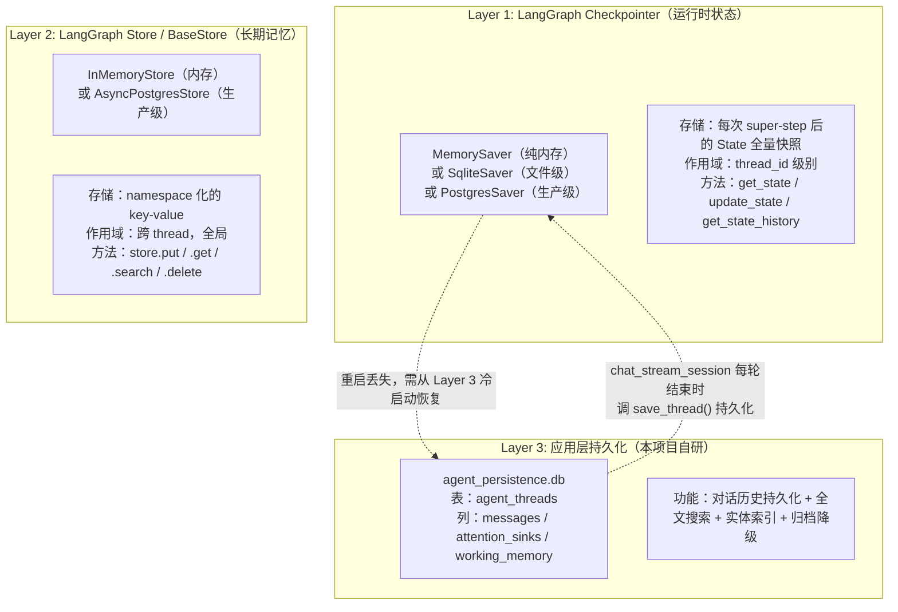

###### 11.9.2 当前项目架构（各司其职）

| 层 | 技术 | 用途 | 存什么 | 生命周期 |
|---|------|------|--------|---------|
| **Checkpointer**（Layer 1）| `MemorySaver` | 运行时图状态管理 | LangGraph State（messages + 中间变量）| 进程级（重启丢失）|
| **应用层持久化**（Layer 3）| `agent_persistence.db` SQLite | 对话历史备份 + 全文搜索 + 实体索引 | 序列化后的 messages / sinks / wm | 磁盘级（重启还在）|
| **自研"长期记忆"**（Layer 2 替代）| Attention Sink + Working Memory | 跨摘要存活的关键信息锚定 | 用户显式记忆 + 频次实体 + 工作记忆槽 | 随 thread 持久化（SQLite）|
| **LangGraph BaseStore**（Layer 2 官方）| ❌ **未使用** | 跨 thread 全局记忆 | 用户画像 / 全局偏好 | 需 Postgres 支持 |

###### 11.9.3 "Store 如何和落库相关联"——直接回答

```
回答你的问题：

当前项目 "store" = src/agent/memory/store.py（不是 LangGraph 的 BaseStore）。
这个 store 直接读写 SQLite 文件（agent_persistence.db），
"落库"就是每轮对话结束时调 save_thread() 将 messages / attention_sinks / working_memory
序列化为 JSON 写入 SQLite 的 agent_threads 表。

"store 和落库的关系"是：store 就是落库的调用方。
  - save_thread() = 写入 SQLite
  - load_thread() = 从 SQLite 读取
  - list_threads() = 查询 SQLite

如果你问的是 LangGraph 的 BaseStore 和我们的 store 有什么区别：
  项目没有用 LangGraph 的 BaseStore。
  自研的 Attention Sink + Working Memory 在功能上等效于 BaseStore 的"跨 thread 长期记忆"，
  但接口、命名空间、读写方式都是自定义的。

如果你想集成官方 BaseStore：
  pip install langgraph-checkpoint-postgres
  from langgraph.store.postgres import AsyncPostgresStore
  
  store = AsyncPostgresStore.from_conn_string("postgresql://...")
  await store.setup()
  
  app = builder.compile(checkpointer=checkpointer, store=store)
  
  # 然后在任意节点中：
  # await store.put(("wiki", "sinks"), thread_id, {"sinks": [...]})
  # value = await store.get(("wiki", "sinks"), thread_id)
```

###### 11.9.4 是否需要改动？

| 论点 | 改 BaseStore | 保持现状 |
|------|-------------|---------|
| 面试官认可 | ✅ "我们按 LangGraph 最佳实践" | ⚠️ "我们自研了记忆层，功能更丰富" |
| 功能完整度 | 标准（需要自建 index 等）| ✅ 完整（有 FTS5 + 实体索引 + 归档） |
| 接口规范性 | ✅ 标准 namespace API | ❌ 自定义 |
| 依赖复杂度 | ❌ 需 Postgres | ✅ 纯 SQLite，零外部依赖 |
| 迁移成本 | ❌ 需要重写 persist 层 | 无 |

**建议**：保持现状，面试时解释"我们为了索引全文搜索和归档的灵活性自研了记忆层，架构上等效于 LangGraph 的 Checkpointer + BaseStore 组合，但增加了 FTS5 全文搜索、实体索引、记忆降级归档等 BaseStore 没有的能力。"

---

##### 11.10 子图（Subgraph）在项目中的定位

> 🟡 **P2 — 当前不需要，但面试时可能被问到**

###### 11.10.1 当前状态

**项目没有使用子图。** 当前是一个单一 `StateGraph`，9 个节点 + 条件边。

###### 11.10.2 什么时候需要子图？

| 场景 | 需要子图吗？ | 说明 |
|------|------------|------|
| 简单知识问答 | ❌ 不需要 | 当前架构足够 |
| 多 Agent 协作 | ✅ 需要 | 每个子 Agent 是独立子图 |
| 模块隔离（如审批流程拆独立图） | ✅ 可以考虑 | 隔离复杂度 |
| 子图需独立持久化 | ⚠️ 看需求 | `checkpointer=True` 让子图状态跨线程累积 |
| 子图需独立中断 | ✅ 需要 | 子图中断冒泡到父图 |

###### 11.10.3 子图 Checkpointer 配置速查

```python
# 子图编译时的 checkpointer 参数
sub_builder = StateGraph(SubState)

# 模式 1: 无持久化，无中断 — 纯计算节点
subgraph = sub_builder.compile(checkpointer=False)

# 模式 2: Stateless（默认）— 支持中断，但每次父图调用都重置状态
# 适用于：每个子 agent 调用是"一次独立任务"
subgraph = sub_builder.compile()

# 模式 3: Stateful — 状态跨调用累积，支持多轮记忆
# 适用于：子 agent 需要记忆多轮对话
# 注意：不能并行调用同一个 stateful 子图实例
subgraph = sub_builder.compile(checkpointer=True)
```

###### 11.10.4 本项目子图规划

```
Phase A（当前）：无子图 — 单一 ReAct Agent

Phase B（多 Agent 起步）：每个 Worker 作为独立子图
  supervisor (parent graph, checkpointer=SqliteSaver)
    ├── wiki_agent (subgraph, checkpointer=False)
    │   每个知识查询是独立任务，无需跨调用状态
    ├── research_agent (subgraph, checkpointer=False)
    │   每个调研是独立任务
    └── code_agent (subgraph, checkpointer=False)
        每个编码任务是独立任务

Phase C（高级）：嵌套子图 + Stateful 子图
  supervisor (parent graph, checkpointer=SqliteSaver)
    ├── wiki_agent (stateful subgraph, checkpointer=True)
    │   需跨轮记忆的深度知识探索
    │   └── search_subagent (stateless subgraph)
    │       每次搜索独立
    └── memory_agent (stateful subgraph, checkpointer=True)
        长期记忆管理（读写 BaseStore）
```

### 🟠 P1 — 检索与记忆优化

---

#### 4. 向量维度：384 维稠密向量（不是 128 维）

> 🟠 **P1 — 常见认知偏差纠正**

##### 4.1 实际配置

| 参数 | 值 |
|------|-----|
| Embedding 模型 | `sentence-transformers/all-MiniLM-L6-v2` |
| 向量维度 | **384 维**（不是 128 维）|
| 距离度量 | **cosine** |
| 存储 | ChromaDB PersistentClient |
| 编码文本 | `content[:8000]` 无 chunk |

##### 4.2 为什么你记得可能是 128 维？

可能是因为项目中有一段**图谱节点 embedding 的代码**使用了 128 维（`src/core/graph/graph.py` 的 node2vec 或类似实现）。Wiki 页面搜索使用的是 384 维。

##### 4.3 关于稀疏向量

**没有使用稀疏向量（如 SPLADE、BM25 本身是关键词匹配，稀疏向量是另一个概念）。**
项目同时拥有：
- **BM25 关键词搜索**（算法层，不是向量）
- **稠密向量搜索**（384 维，语义匹配）

这条路其实是对的——**BM25 + 稠密向量 + RRF 融合**是当前业界推荐的标配。

---

#### 5. Query 模糊/歧义处理

> 🟠 **P1 — 当前缺失的能力**

##### 5.1 现状

**项目没有显式的 Query 模糊/歧义处理层。** 查询管道如下：

```
用户输入
    │
    ▼
┌─────────────────────┐
│  没有 Query 理解层   │  ← 缺失
│  ❌ 同义词扩展       │
│  ❌ 纠错             │
│  ❌ Query 改写       │
│  ❌ 意图分类          │
└─────────────────────┘
    │
    ▼
┌─────────────────────┐
│  ReAct Agent 接手    │  ← 实际靠这个
│  search_wiki(query)  │
│  失败 → 换关键词重试  │
│  reflect_node 修正    │
└─────────────────────┘
```

##### 5.2 现方案的隐性能力

虽然**没有显式 Query 理解**，ReAct Agent 的推理循环提供了隐性的歧义处理：

```
第一轮：search_wiki("Python 异步")
  → 结果为空或匹配度低
  → verify_result 检测到 poor quality
  → reflect_node 反思："关键词太宽泛，换成 'asyncio'"
  → 第二轮：search_wiki("asyncio 协程")
  → 命中目标
```

搜索工具 `search_tool.py` 的匹配策略本身也有一定容错：
- 文件名匹配（`"async"` → `python-async.md`）
- 标题匹配
- 正文匹配（大小写不敏感 substring）
- 按 match_type 排序（文件名 > 标题 > 正文）

##### 5.3 建议改进方向

| 改进项 | 方案 | 复杂度 |
|--------|------|--------|
| Query 改写 | 用轻量 LLM 将用户口语转换为搜索关键词 | 低 |
| 同义词扩展 | 构建领域同义词表，query 时自动扩展 | 低 |
| 拼音纠错 | 中文拼音模糊匹配（pypinyin） | 中 |
| 多轮澄清 | Agent 检测歧义时反问用户确认 | 中 |

---

#### 6. Embedding 模型评估与 A/B 测试

> 🟠 **P1 — 当前完全缺失**

##### 6.1 现状

**没有做过任何 Embedding 模型评估或 A/B 测试。** 首版卡在"有比没有好"阶段，直接选了 community 最通用的 `all-MiniLM-L6-v2`。

##### 6.2 评估指标设计建议

对于 Wiki 检索场景，建议的评估体系：

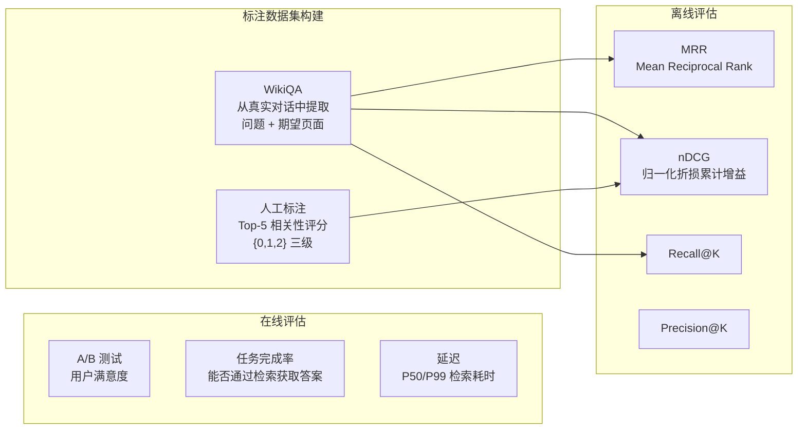

**建议评估候选模型**：

| 模型 | 维度 | 特点 | 适用场景 |
|------|------|------|---------|
| all-MiniLM-L6-v2 | 384 | 当前在用，轻量 | 通用 |
| bge-small-zh-v1.5 | 512 | 中文优化，BAAI 出品 | 中文为主 |
| bge-base-zh-v1.5 | 768 | 更精准，稍大 | 中文高质量 |
| text2vec-base-chinese | 768 | 中文专用 | 中文领域 |
| jina-embeddings-v3 | 1024 | 多语言统一 | 混合语言 |

---

#### 7. 上下文压缩与记忆存储：已经做得很多了

> 🟠 **P1 — 你可能低估了项目在这个维度的投入**

##### 7.1 记忆体系总览

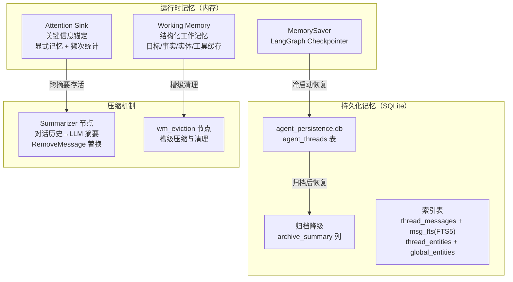

##### 7.2 逐层详述

###### ① MemorySaver（LangGraph Checkpointer）

```
作用：运行时状态持久化（内存级）
  - 每个 thread_id 独立命名空间
  - add_messages reducer 增量追加
  - 重启后 MemorySaver 清空

问题：MemorySaver = 纯内存，重启丢失
  → 应用层用 SQLite 额外持久化（见下）
```

###### ② SQLite 持久化（agent_persistence.db）

```
表：agent_threads
  - thread_id (PK)
  - messages (JSON, [{role, content}])
  - attention_sinks (JSON)
  - working_memory (JSON)
  - archive_summary (TEXT, 归档用)
  - created_at, updated_at, title

生命周期：
  每轮对话结束时，将 messages/sinks/wm 写入 SQLite。
  服务器重启后，MemorySaver 为空 → 查 SQLite 恢复。

索引表（thread_messages + msg_fts + thread_entities + global_entities）：
  - 支持全文搜索（FTS5，CJK 降级为 LIKE）
  - 支持按实体查找关联 thread
  - 支持跨会话实体聚合（用户画像）
```

###### ③ Attention Sink（关键信息锚定）

```
原理：从用户对话中检测"需记住"的关键信息

检测策略：
  A. 显式模式匹配："记住 X"、"我叫 X"、"我喜欢 X"
     - 关键词列表见 constants.py SINK_PATTERNS（~30 条）
     - 匹配后 content 截取到冒号/空格后
  B. 频次统计：反复出现的实体自动锚定
     - 英文单词（≥3 字符）
     - 中文词组（2-4 字）
     - 出现次数 ≥ 3 次则自动锚定

生命周期：
  新建 → confidence=0.8
  被强化（用户再次提及）→ confidence=0.9
  5 轮未强化 → 每轮衰减 0.05
  confidence < 0.3 或 idle > 20 轮 → 移除

注入方式：
  每轮 call_model 时，以 SystemMessage 形式注入 LLM 上下文，
  但不污染 state.messages（避免被摘要压缩干掉）
```

###### ④ Working Memory（结构化工作记忆）

```
槽位（每个有独立的合并策略）：
  - current_goal: 用户当前目标（从最新用户输入提取）
  - key_facts: 已确认的关键事实（dedup 追加 + 上限 20 条）
  - entities_mentioned: 引用的 Wiki 页面路径（dedup + 上限 50）
  - tool_cache: 工具调用结果缓存（最新覆盖 + 上限 5 条）
  - user_identity: 用户基本信息（key-level merge）

合并策略：增量合并（working_memory_reducer）
  不同槽位有不同规则：
    - key_facts: 追加 + dedup + 截断
    - tool_cache: 最新覆盖 + 上限
    - user_identity: 字段级合并

上下文注入：每轮 call_model 时以 SystemMessage 注入
```

###### ⑤ 对话摘要压缩（Summarizer 节点）

```
触发条件：非 SystemMessage 数量 > 40 条
压缩策略：
  - 保留最新 10 轮对话
  - 早期对话 → LLM 生成结构化摘要（SummaryResult）
  - RemoveMessage 移除旧消息 + SystemMessage 摘要替换
  - 独家 LLM 实例（DeepSeek v4 Flash，不阻塞主模型）

注入 Attention Sink：
  摘要 prompt 中注入锚定信息，确保关键知识保留。

替代硬窗口截断：以前的 MAX_MESSAGE_TURNS=20 硬截断
  现在同时使用两种策略
```

###### ⑥ 记忆降级归档

```
触发条件：30 天未活跃 → 自动归档
归档操作：
  - 加载完整对话消息
  - 调用 LLM 生成压缩摘要
  - 写入 archive_summary 列（不删除原始 messages）
  - 只在下次冷启动恢复时触发

恢复行为：
  - 加载归档摘要作为 SystemMessage 注入
  - 原始消息仍可用（完整保留在 SQLite）

设计意图：
  长期不用的会话降级为摘要，节省 LLM 上下文窗口。
  但原始数据不丢失，可随时恢复完整查看。
```

##### 7.3 关于"单 Agent 需要做到哪一步"

对于单体 Agent 项目，当前记忆体系已经是**超出常规的丰富**：

| 能力 | 状态 | 同行常见水平 |
|------|------|------------|
| 对话持久化 | ✅ SQLite | 大部分只做 MemorySaver |
| 跨重启恢复 | ✅ SQLite 冷启动 | 少 |
| 注意力锚定 | ✅ Attention Sink | **极少** |
| 结构化工作记忆 | ✅ Working Memory | 少 |
| 自动摘要压缩 | ✅ Summarizer 节点 | 中等 |
| 长期降级归档 | ✅ 30 天归档 | **极少** |
| 全文搜索对话 | ✅ FTS5/LIKE | 少 |
| 跨会话实体聚合 | ✅ global_entities | **极少** |
| Human-in-the-Loop | ✅ interrupt + approve | 中等 |

##### 7.4 后续多 Agent 项目可以复用的基础设施

```
agent/memory/store.py     → 跨 agent 共享持久化层
agent/memory/attention.py → 每个 agent 独立 Attention Sink
agent/memory/summarizer.py → 对话摘要（可泛化为"跨 agent 记忆交换"）
agent/constants.py         → 集中配置
```

---

#### 10. MCP Server：现状、差距与升级方向

> 🟠 **P1 — 面试高频题 + 项目关键能力**

##### 10.1 现状：自研装饰器式 MCP Server

项目已经实现了一个**完整的 MCP Server**（`src/mcp_server.py`，346 行）：

```python
# 启动方式
python src/mcp_server.py              # stdio 模式（供 Claude Code 等本地集成）
python src/mcp_server.py --http       # HTTP 模式（端口 8010）
```

**架构特点**：

| 维度 | 实现 |
|------|------|
| 协议 | MCP（Model Context Protocol）标准协议 |
| 传输 | stdio（本地） + HTTP（远程）双模式 |
| 工具注册 | **自研 `@wiki_tool` 装饰器**，自动收集到 `_TOOL_REGISTRY` |
| 已注册工具 | 8 个：`wiki_search` / `wiki_read` / `wiki_list` / `wiki_graph` / `wiki_lint` / `wiki_stats` / `wiki_related` / `wiki_insights` |
| 异常分级 | ValueError → 参数错误 / PermissionError → 权限拒绝 / FileNotFoundError → 资源不存在 / Exception → 内部错误 |
| 共享 | 所有工具共享 WikiCompiler 单例（懒初始化） |
| 生命周期 | 无启动预热，首次调用懒构建 |

**MCP 工具一览**：

| 工具名 | 功能 | 对应后端 |
|--------|------|---------|
| `wiki_search` | 全文搜索 Wiki 页面 | `WikiRepository.search_pages()` |
| `wiki_read` | 读取页面 Markdown 内容 | `ReadTool.read_file()` |
| `wiki_list` | 按类型列出页面 | `os.walk + Repository` |
| `wiki_graph` | 知识图谱 JSON 数据 | `WikiGraph.to_dict()` |
| `wiki_lint` | Wiki 健康检查 | `WikiCompiler.lint()` |
| `wiki_stats` | 知识库统计信息 | 聚合多个模块 |
| `wiki_related` | 页面关联度 Top-N | `WikiGraph.related_pages()` |
| `wiki_insights` | 图谱洞察 | `WikiGraph.insights()` |

##### 10.2 对比官方推荐：差距分析

2026 年 LangChain 官方推荐通过 **`langchain-mcp-adapters`** 的 `MultiServerMCPClient` 将 MCP 工具接入 LangGraph Agent：

```python
# 官方推荐模式（当前项目未采用）
from langchain_mcp_adapters.client import MultiServerMCPClient
from langgraph.prebuilt import create_react_agent

client = MultiServerMCPClient({
    "wiki": {"command": "python src/mcp_server.py", "transport": "stdio"}
})
tools = await client.get_tools()
agent = create_react_agent(llm, tools)
```

| 对比维度 | 当前项目实现 | 官方推荐模式 |
|---------|-------------|------------|
| **工具定义** | 自研 `@wiki_tool` 装饰器 + `_TOOL_REGISTRY` | `langchain-mcp-adapters` SDK 自动发现 |
| **Agent 集成** | 硬编码 `P1_TOOLS = [search_wiki, read_page, query_graph]` | **运行时动态发现** MCP 工具，零硬编码 |
| **工具复用** | Agent 内工具与 MCP Server 的工具**重复实现** | 一套定义，Agent 和 MCP 共用 |
| **多 Server** | 单 MCP Server，不支持多源 | `MultiServerMCPClient` 支持同时接入多个 MCP Server |
| **认证鉴权** | 无 | Agent Server 支持自定义认证中间件 |
| **流式传输** | 无（MCP 工具返回完整结果） | 可通过 Streamable HTTP 传输 |
| **Schema 校验** | 手动定义 `properties` / `required` | 自动从函数签名生成 |

##### 10.3 核心问题：Agent 工具与 MCP 工具重复

当前项目有**两套工具定义**，做着同样的事但彼此隔离：

```
Agent 内部工具（src/agent/action/tools.py）         MCP Server 工具（src/mcp_server.py）
  ├── search_wiki(query)                              ├── wiki_search(query)
  ├── read_page(path, offset)                          ├── wiki_read(path)
  ├── query_graph(question)                            ├── wiki_graph(question)
  └── （无 list/lint/stats/related/insights）          ├── wiki_list(type)
                                                       ├── wiki_lint()
                                                       ├── wiki_stats()
                                                       ├── wiki_related(path)
                                                       └── wiki_insights()
```

Agent 少掉了 `wiki_list` / `wiki_lint` / `wiki_stats` / `wiki_related` / `wiki_insights` 这 5 个工具——不是因为不需要，而是因为**开发时没同步**。

##### 10.4 升级方案（P1 优先级）

将 MCP Server 作为**唯一真相源**，Agent 工具通过 `MultiServerMCPClient` 动态发现：

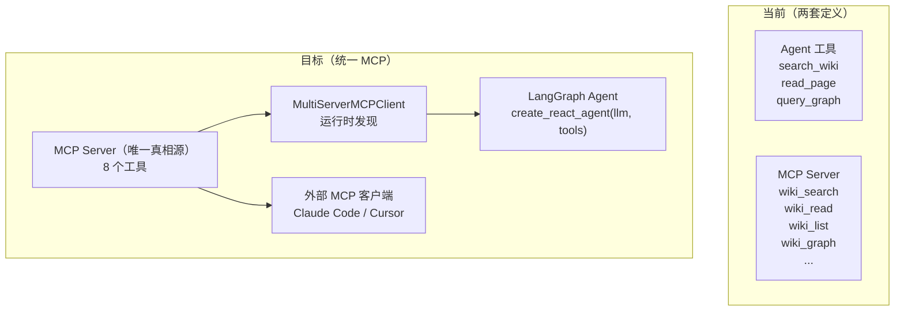

**实施步骤**：
1. 将 `src/agent/action/tools.py` 中的工具定义**迁移到 MCP Server**（Agent 侧仅保留 `query_graph` 这个图谱特有工具，或也迁过去）
2. 安装 `langchain-mcp-adapters`，Agent 启动时通过 `MultiServerMCPClient` 连接自家 MCP Server
3. Agent 工具集从 `P1_TOOLS = [...]` 硬编码变为**运行时动态发现**
4. 外部 IDE（Claude Code / Cursor）配置 `.claude/mcp.json` 接入同一 MCP Server

这样：
- **一套代码**同时服务 Agent 内部和外部 IDE
- 新增工具只需在 MCP Server 加一个 `@wiki_tool` 装饰器，两端自动生效
- 面试时可以说是"**MCP-first 架构，Agent 工具运行时发现**"

---

#### 12. 未来多 Agent 方向：2026 年推荐架构蓝图

> 🟠 **P1 — 面试常问"多 Agent 怎么设计"**

##### 12.1 2026 年官方推荐模式：Subagents as Tools

> LangChain 官方已废弃 `langgraph-supervisor` 包，改用 **subagents as tools** 模式。

**核心理念**：主 Agent 通过 `@tool` 装饰器调用子 Agent，子 Agent 作为工具函数被路由。

```python
# ✅ 2026 推荐模式
@tool("research_agent", description="执行深度研究，返回综合分析")
def call_research(query: str) -> str:
    """子 Agent 1：研究专家"""
    result = research_graph.invoke({"messages": [HumanMessage(content=query)]})
    return result["messages"][-1].content

@tool("code_agent", description="编写和审查代码")
def call_code_agent(task: str) -> str:
    """子 Agent 2：编程专家"""
    result = code_graph.invoke({"messages": [HumanMessage(content=task)]})
    return result["messages"][-1].content

# 主管 Agent（路由 + 总结）
supervisor = create_react_agent(
    llm,
    tools=[call_research, call_code_agent],
    prompt="将研究问题交给 research_agent，编码问题交给 code_agent。"
)
```

**为什么放弃 `langgraph-supervisor` 包？**

| 对比 | Supervisor 包（已废弃） | Subagents as Tools（推荐） |
|------|----------------------|--------------------------|
| 路由方式 | 图节点级 handoff | 工具函数级调用 |
| Worker 隔离 | Worker 是图节点，共享消息列表 | Worker 是独立图实例，完全隔离 |
| 测试难度 | 需要编译整个图 | 每个 Agent 独立可测 |
| interrupt 传播 | 复杂 | 天然向上冒泡 |
| 灵活性 | 受限于 Supervisor 框架 | 自由组合任意工具 |

##### 12.2 本项目多 Agent 架构蓝图

基于当前项目的 Wiki 知识库 + ReAct Agent 基础，推荐以下进化路径：

**Phase A：单 Agent → 双 Agent（当前已具备条件）**

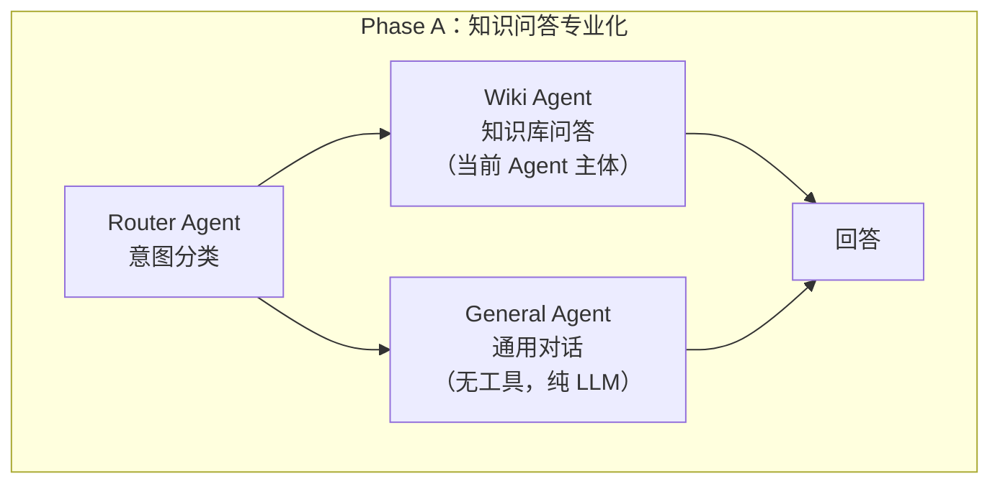

**Phase B：完整多 Agent 协作体系**

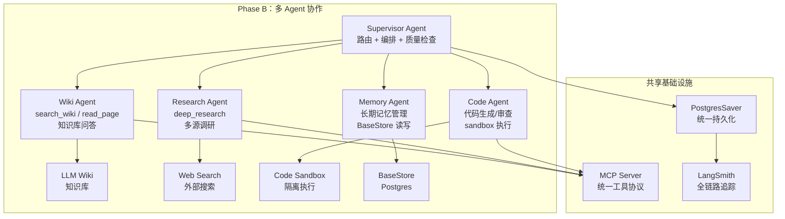

**Phase C：动态 Worker 池（高级）**

```
Supervisor Agent
  ├── 动态工具注册：从 MCP Server 运行时发现可用 Worker
  ├── 按需实例化：高负载时启动多个同类型 Worker 并行
  ├── Worker 心跳检测：超时 Worker 自动重启
  └── 结果聚合：并行 Worker 结果通过 LLM 综合
```

##### 12.3 可以直接复用的当前项目基础设施

| 模块 | 多 Agent 场景 | 改动量 |
|------|-------------|--------|
| `agent/memory/store.py` | 所有 Agent 共享同一持久化层 | 小（加 namespace 隔离） |
| `agent/memory/attention.py` | 每个 Agent 独立 Attention Sink | 小（实例化多份） |
| `agent/planning/graph.py` | 作为 Wiki Agent 的子图 | 小（拆出 `create_wiki_agent()`） |
| `agent/session.py` | Supervisor 的会话编排 | 中（需要处理子 Agent 的 interrupt） |
| `mcp_server.py` | 所有 Agent 的统一工具层 | 小（加 agent 身份传递） |
| `agent/constants.py` | 扩展常量定义 | 小 |

##### 12.4 与面试行情结合

2026 年 7 月面试市场对多 Agent 能力的考察重点：

```
面试官高概率问题：
  Q: 你的单 Agent 系统怎么扩展到多 Agent？
  → 答：supervisor + subagents as tools 模式，每个 worker 是独立 graph
  Q: 多 Agent 怎么共享记忆？
  → 答：统一 BaseStore + PostgresSaver，namespace 隔离
  Q: Worker 之间的通信协议？
  → 答：MCP 协议，运行时工具发现
  Q: 怎么防止 Agent 死循环？
  → 答：步数熔断 + Token 预算 + 递归限制
  Q: 并行 Worker 结果怎么聚合？
  → 答：RRF 融合（已有）+ LLM 综合
```

---

#### 13. LangSmith 集成方案：全链路可观测

> 🟠 **P1 — 当前完全缺失，面试高频要求**

##### 13.1 现状：零集成

当前项目的可观测性完全依赖**控制台日志**（`logging` 模块）。没有 LangSmith、LangFuse 或其他 tracing 工具。

```bash
# 当前 .env — 无任何 LangSmith 配置
grep -i langsmith .env  # → 无输出
grep -i langchain .env  # → 无输出
```

**缺失的具体表现**：

| 维度 | 当前 | 有 LangSmith 后 |
|------|------|----------------|
| LLM 调用追踪 | 手动 `logger.info("chat 开始...")` | 自动记录每次 LLM 调用的 prompt、response、token 用量、延迟 |
| 工具调用链路 | 手动 `logger.info("tool:search_wiki")` | 自动记录工具入参、输出、耗时、嵌套关系 |
| 图执行过程 | 逐行看日志 | **可视化图执行**：每个节点耗时、状态变化、条件分支走向 |
| 重试/错误 | 日志里 grep | LangSmith 面板直接展示异常链路 |
| 多轮会话 | 手动拼接 | 自动关联同一 thread 的所有 LLM 调用 |
| 团队协作 | 不能分享 | 分享 tracing 链接给同事调试 |

##### 13.2 集成方案（15 分钟可完成）

**Step 1：在 `.env` 添加 LangSmith 配置**

```bash
# LangSmith 可观测性
LANGCHAIN_TRACING_V2=true
LANGCHAIN_ENDPOINT=https://api.smith.langchain.com
LANGCHAIN_API_KEY=lsv2_pt_xxxxx    # 从 langsmith.com 获取
LANGCHAIN_PROJECT=llm-wiki          # 项目名，LangSmith 控制台分组
```

**Step 2：安装依赖**

```bash
pip install langsmith
```

**Step 3：零代码改动**

LangChain 的 `ChatOpenAI` 自动检测环境变量 `LANGCHAIN_TRACING_V2=true`，集成后所有 LLM 调用自动上报。**不需要改任何代码。**

```python
# 不需要改 — LangChain SDK 自动读取环境变量
# 现有代码：
self._llm = ChatOpenAI(
    model=model,
    api_key=api_key,
    base_url=base_url,
    timeout=120,
    max_retries=0,
)
# 当 LANGCHAIN_TRACING_V2=true 时，LangChain 自动注入 LangSmithCallbackHandler，
# 所有 invoke/stream 调用自动追踪。
```

##### 13.3 LangSmith 中能看到什么

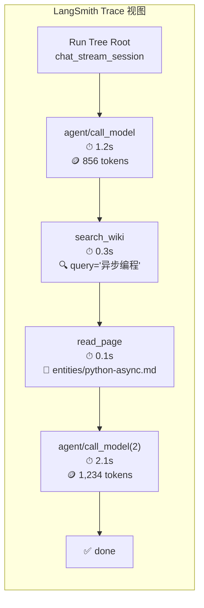

每个 trace 显示：
- **调用树**：父 → 子（agent → tool → agent）
- **耗时**：每个节点实际 wall-clock 时间
- **Token 用量**：prompt_tokens / completion_tokens / total_tokens
- **入参/出参**：prompt 内容、工具入参、LLM 输出
- **异常标记**：红色高亮失败的调用
- **反馈评分**：可手动标记"回答质量 5/5"

##### 13.4 进阶：添加自定义标签

除了环境变量自动集成，还可以在代码中加自定义标签，让 trace 更丰富：

```python
# 方式 1：在 astream_events 中传 tags
async for event in agent.astream_events(
    stream_input,
    config,
    version="v1",
    tags=["wiki-agent", f"thread:{thread_id}"],  # ← 自定义标签
):
    ...

# 方式 2：在 invoke 中传 metadata
response = llm_with_tools.invoke(
    llm_messages,
    metadata={"conversation_id": thread_id, "user_intent": "query"},  # ← 自定义元数据
)

# 方式 3：LangSmith 面板中可以按 tags/metadata 过滤和聚合
```

##### 13.5 前端集成验证（SSE 数据流）

LangSmith 追踪的是**后端 LLM/工具调用链路**。前端集成验证看的是**整个请求-响应环**：

| 验证点 | 方法 | 预期结果 |
|--------|------|---------|
| SSE 连接 | 浏览器 DevTools → Network → filter "event-stream" | `POST /v1/agent/chat/session` 返回 `text/event-stream` |
| Token 流 | ChatPage 输入框输入问题 | 逐 token 输出，无卡顿 |
| 工具调用 | 输入需查询的问题 | 前端收到 `tool_start` / `tool_end` 事件 |
| 中断/审批 | 触发 tool call | 前端弹出审批对话框，流暂停 |
| 错误处理 | 关掉 API Key 后提问 | 前端显示 `error` 事件 |
| 会话恢复 | F5 刷新页面 | 前端重建 thread_id 后后端从 SQLite 恢复 |

**当前前端已验证可用的功能**（ChatPage.tsx）：

| 功能 | 状态 | 备注 |
|------|------|------|
| SSE token 流 | ✅ | `type: 'token'` 实时渲染到消息框 |
| 多会话管理 | ✅ | localStorage 持久化 |
| 新对话创建 | ✅ | mid() 生成随机 thread_id |
| 流中停止 | ⚠️ 部分 | `setStreaming(false)` 只停前端渲染，后端还在跑 |
| 工具审批 UI | ❌ 缺失 | 前端未实现审批对话框 |
| 会话历史列表 | ⚠️ 部分 | 只存 localStorage，未从后端 `/v1/agent/threads` 加载 |
| 来源引用展示 | ❌ 缺失 | `event.sources` 已收到但未渲染 |

**前端缺失功能修复优先级**：

| 缺失功能 | 优先级 | 影响 |
|---------|--------|------|
| 审批对话框 | 🔴 P0 | Human-in-the-Loop 链路不完整 |
| 会话列表从后端加载 | 🟠 P1 | 刷新后会话恢复依赖 localStorage，跨设备会丢失 |
| 来源引用渲染 | 🟡 P2 | 用户看不到知识来源 |
| 流停止传播到后端 | 🟡 P2 | 前端点了停下后端继续跑 |

---

#### 14. 外部搜索集成：审计与知识编译阶段的补充能力

> 🟠 **P1 — 重要缺失能力，直接影响知识质量**

##### 14.1 现状

项目当前**只有内部 Wiki 搜索**（`search_wiki` / `SearchTool` / `SearchEngine`），**没有外部 Web 搜索能力**。审核/编译阶段完全依赖已有 Wiki 知识库，无法从外部获取补充信息。

##### 14.2 使用场景

**场景一：一键审核（One-Click Audit / Lint 阶段）**

```
审核 Wiki 页面时：
  ┌─ 发现 "什么是 Agent？" 页面定义过于简略
  │  → 自动触发外部搜索 "AI Agent 定义"
  │  → 返回 Wikipedia / Tavily 结构化摘要
  │  → 审核报告标注："建议补充：Agent = 具备自主推理与工具调用能力的 LLM 系统"
  │  → 可选：一键将外部定义"编译"补充到 Wiki 页面
```

**场景二：图节点审核（Graph Node Audit）**

```
知识图谱中：
  ┌─ 检测到孤立节点 / 定义模糊节点
  │  → 自动搜索该节点名称/关键词
  │  → 提取定义、属性、关系信息
  │  → 辅助审核者判断：
  │     - 节点是否需要补充定义
  │     - 是否需要与其他节点合并
  │     - 是否需要重命名
```

**场景三：知识编译补全（Ingest 阶段）**

```
Ingest 新原始素材时：
  ┌─ 自动搜索外部资料补充背景
  │  → 搜索素材中出现的核心概念
  │  → 将外部定义作为"参考来源"附加到生成的 Wiki 页面
  │  → 提升知识"编译"质量
```

**场景四：面试答案校验**

```
面试准备 / 文档回答时：
  ┌─ 对某个技术论断不确定
  │  → 自动搜索最新官方文档/社区共识
  │  → 校验回答准确性
  │  → 标注"外部来源已验证"或"需进一步确认"
```

##### 14.3 架构设计

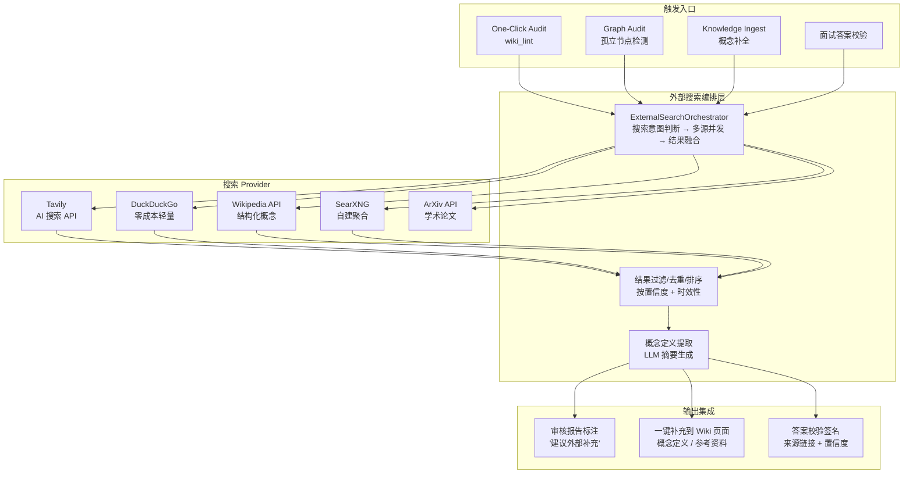

##### 14.4 集成方式

**方式一：MCP 工具扩展（推荐，与现有 MCP 架构一致）**

```python
# 新增一个 @wiki_tool，与现有 8 个 MCP 工具并列
@wiki_tool(
    "web_search",
    "搜索外部 Web，返回结构化摘要结果，用于审计/编译阶段补充概念定义",
    properties={
        "query": {"type": "string", "description": "搜索关键词"},
        "max_results": {"type": "integer", "description": "返回结果数，默认 5"},
        "provider": {"type": "string", "description": "搜索源：auto/duckduckgo/wikipedia, 默认 auto"},
    },
    required=["query"],
)
def web_search(query: str, max_results: int = 5, provider: str = "auto") -> list[dict]:
    """外部 Web 搜索，返回摘要结果列表"""
    if not config.WEB_SEARCH_ENABLED:
        return [{"error": "外部搜索未启用，设置 WEB_SEARCH_ENABLED=true"}]

    provider_impl = _get_search_provider(provider)
    results = provider_impl.search(query, max_results)

    return [
        {
            "title": r.title,
            "url": r.url,
            "snippet": r.snippet,
            "source": provider,
            "score": r.score,
        }
        for r in results
    ]
```

**方式二：Agent 工具扩展**

在 `src/agent/action/tools.py` 新增 `web_search` 工具，让 ReAct Agent 在审核模式下也能调用外部搜索：

```python
@tool("web_search", description="搜索外部 Web，返回摘要结果（审核/编译模式使用）")
def web_search(query: str, max_results: int = 5) -> str:
    """外部搜索，返回格式化的搜索结果文本"""
    if not WEB_SEARCH_ENABLED:
        return "外部搜索未启用"
    results = search_provider.search(query, max_results)
    return "\n\n".join(
        f"## [{r.title}]({r.url})\n{r.snippet}"
        for r in results
    )
```

**方式三：编译时自动调用（静默后台模式）**

```
Ingest 流程中嵌入外部搜索节点：
  1. 解析 raw 素材 → 提取核心概念（NER / 关键词）
  2. 对每个核心概念 → 并发调 web_search（超时 5s，失败跳过）
  3. 搜索结果摘要 → 作为"外部参考来源"附加到 Wiki 页面 YAML frontmatter
  4. 不阻塞 ingest 主流程（异步 fire-and-forget）
```

##### 14.5 当前项目已有可复用基础设施

| 模块 | 用途 | 复用程度 |
|------|------|---------|
| `mcp_server.py` | 扩展 web_search 工具 | **高** — 加一个 `@wiki_tool` 装饰器即可 |
| `SearchTool` / `SearchEngine` | 搜索接口模式参考 | **中** — 需改底层 provider 为外部搜索 |
| `WikiCompiler.lint()` | 审核入口 | **高** — 在 lint 流程中嵌入外部搜索节点 |
| `WikiGraph.insights()` | 图节点洞察 | **中** — 可为孤立节点自动触发搜索 |
| `src/config.py` | 环境变量开关 | **高** — 加 `WEB_SEARCH_ENABLED` / `WEB_SEARCH_PROVIDER` |
| `src/agent/action/tools.py` | Agent 工具注册 | **高** — 与 MCP 工具改为一套时，web_search 自动可用 |
| `async` 基础设施 | 异步并发请求 | **高** — 项目已用 asyncio，并发多源搜索天然支持 |

##### 14.6 外部搜索 Provider 对比

| Provider | 类型 | 免费额度 | 特点 | 推荐场景 |
|----------|------|---------|------|---------|
| **DuckDuckGo** | Web 搜索 | **无限**（有限流）| 无需 API Key，零成本 | **首选启动** |
| **Tavily** | AI 搜索 API | 1000 次/月 | 返回结构化摘要，LLM 友好 | 正式使用 |
| **Wikipedia API** | 百科 | 无限 | 结构化概念定义 | 概念补充 |
| **SearXNG** | 自建聚合 | 免费 | 隐私友好，可自托管 | 隐私敏感 |
| **SerpAPI** | Google 封装 | 100 次/月 | Google 结果质量最高 | 备选付费 |
| **ArXiv API** | 学术 | 无限 | 论文摘要搜索 | 学术参考 |

**建议启动路径**：
1. **Phase 0**：DuckDuckGo（0 成本，1 小时集成）
2. **Phase 1**：+ Wikipedia API（概念定义提升）
3. **Phase 2**：+ Tavily（搜索结果质量提升）
4. **Phase 3**：可选 SearXNG 自建（隐私场景）

##### 14.7 实现优先级

| 优先级 | 功能 | 复杂度 | 依赖 | 预计工时 |
|--------|------|--------|------|---------|
| **P0** | MCP 工具 `web_search` + DuckDuckGo 集成 | 低 | `duckduckgo_search` pip 包 | 1h |
| **P0** | 审核报告标注"建议外部补充"区域 | 低 | P0 搜索工具 | 0.5h |
| **P1** | `wiki_lint` 流程嵌入外部搜索节点 | 中 | P0 搜索工具 | 2h |
| **P1** | Ingest 异步自动搜索 + frontmatter 附加 | 中 | P0 + NER 概念提取 | 3h |
| **P2** | 图节点孤立检测 + 自动搜索补充 | 中 | Graph module | 3h |
| **P2** | Tavily 集成（替换 DuckDuckGo） | 低 | API Key | 0.5h |
| **P3** | 搜索缓存层（避免重复搜索同一概念） | 中 | SQLite cache | 2h |
| **P3** | 搜索 Provider 动态切换 UI 配置 | 高 | 前端 + API | 4h |

##### 14.8 用法示例

**示例：一键审核触发外部搜索**

```
项目当前：
  wiki_lint("python-async.md")
    → 检查：标题合规 ✓、链接有效 ✓、引用完整 ✗（缺少外部来源）
    → 报告：引用完整度过低

增强后：
  wiki_lint("python-async.md", external_search=True)
    → 检查：标题合规 ✓、链接有效 ✓、引用完整 ✗
    → 自动外部搜索 "Python async/await 官方文档"
    → 返回：Python 3.11 官方文档链接 + asyncio 包摘要
    → 报告：引用完整度过低 + 建议补充以下外部来源：
        [1] Python asyncio 官方文档 — https://docs.python.org/3/library/asyncio.html
        [2] Real Python Async IO 教程 — https://realpython.com/async-io-python/
    → 可选操作：一键将外部来源顶部的定义补充到 Wiki 页面
```

**示例：图节点审核**

```
graph_audit(external_search=True)
  → 检测到孤立节点 "Agent"
  → 外部搜索 "AI Agent definition"
  → Wikipedia 返回："agent = 能够自主感知环境、做出决策并采取行动的实体"
  → Tavily 返回："在 LLM 语境中，Agent = LLM 驱动的自主系统，具备工具调用和推理能力"
  → 审核建议：
      - 补充概念定义到节点描述
      - 添加链接到 Wikipedia 和 LangGraph 官方文档
      - 建议拆分"AI Agent"和"Software Agent"两个子概念
```

**示例：Ingest 时自动补全**

```
ingest("raw/articles/langgraph-deep-dive.md", external_search=True)
  → 分析素材 → 提取核心概念：["LangGraph", "StateGraph", "Checkpointer"]
  → 并发搜索：
      "LangGraph" → Wikipedia + LangChain 文档
      "StateGraph" → LangGraph 官方定义
      "Checkpointer" → LangGraph 官方定义
  → 生成 Wiki 页面时：
      页面尾部自动附加 "# 外部参考" 部分
      每个概念标注外部来源链接和摘要
```

##### 14.9 配置设计

```python
# src/config.py — 新增配置项
class Settings(BaseSettings):
    # ... 现有配置 ...

    # 外部搜索配置
    WEB_SEARCH_ENABLED: bool = False
    WEB_SEARCH_PROVIDER: str = "duckduckgo"  # duckduckgo | tavily | searxng
    WEB_SEARCH_MAX_RESULTS: int = 5
    WEB_SEARCH_TIMEOUT: int = 10  # 秒

    # Tavily（可选）
    TAVILY_API_KEY: str = ""

    # SearXNG（可选，自建）
    SEARXNG_BASE_URL: str = ""

    # 搜索缓存
    WEB_SEARCH_CACHE_TTL: int = 86400  # 24h
```

```bash
# .env 新增
WEB_SEARCH_ENABLED=true
WEB_SEARCH_PROVIDER=duckduckgo
# TAVILY_API_KEY=tvly-xxxxx  # 可选，提高搜索质量
```

---

### 🟡 P2 — 亮点与实操

---

#### 8. 项目亮点（简历素材）

> 🟡 **P2 — 面试场景**

##### 8.1 核心技术亮点

| # | 亮点 | 技术点 | 含金量 |
|---|------|--------|--------|
| 1 | **ReAct + 三层自修正** | validate_tool(步数熔断+去重) → verify_result(质量检查) → reflect_node(LLM 反思) | ⭐⭐⭐⭐⭐ |
| 2 | **BM25+向量+RRF 融合搜索** | Bigram 分词 + Chroma 384-dim + Reciprocal Rank Fusion | ⭐⭐⭐⭐ |
| 3 | **Attention Sink 记忆机制** | 显式/频次双检测 + 置信度衰减 + 跨摘要存活 | ⭐⭐⭐⭐⭐ |
| 4 | **Human-in-the-Loop 审批** | LangGraph interrupt + Command(resume) | ⭐⭐⭐⭐ |
| 5 | **SSE 流式对话** | astream_events + ReadableStream + 多事件类型 | ⭐⭐⭐⭐ |
| 6 | **结构化工作记忆** | 多槽位增量合并 + 槽级压缩 | ⭐⭐⭐⭐ |
| 7 | **记忆降级归档** | LRU 式 30 天归档 + LLM 摘要 + 冷启动恢复 | ⭐⭐⭐⭐ |
| 8 | **SQLite 全文搜索对话** | FTS5 + CJK 降级 LIKE + 实体索引 | ⭐⭐⭐ |
| 9 | **Multi-Provider 支持** | DeepSeek / 豆包 Ark / OpenAI 等 | ⭐⭐⭐ |
| 10 | **Wiki 知识图** | wikilinks → NetworkX 图 → Louvain 社区发现 | ⭐⭐⭐ |

##### 8.2 简历描述参考

**版本 1：一句话简介（简历顶部）**

> 基于 LangGraph 自研 ReAct Agent 知识编译系统，实现 BM25+向量+RRF 混合搜索、三层自修正推理、Attention Sink 多级记忆体系、Human-in-the-Loop 审批、SSE 流式对话与完整前后端闭环。

**版本 2：详细项目经历（简历项目栏）**

```
LLM Wiki 知识编译系统（自研全栈项目）                    2026.06 - 至今

技术栈：Python · LangGraph · LangChain · FastAPI · ChromaDB · React 19 · SQLite · SSE

项目概述：
  基于 Karpathy 的 LLM Wiki 理念，构建了一套"知识编译+智能问答"系统。
  用户将原始资料(wiki/raw)托付给系统 → LLM 自动生成结构化 Wiki 页面(wiki/)
  → ReAct Agent 基于 Wiki 回答用户问题。核心是一个 9 节点的 LangGraph StateGraph
  状态机，包含完整的搜索-阅读-推理-自修正-审批链路。

核心贡献：

  1. 混合检索架构
     实现 BM25 关键词搜索（CJK Bigram 分词 + 标题 3× 加权）+ ChromaDB 384-dim 向量
     语义搜索 + RRF 融合排序，支持 bm25/vector/hybrid 三种搜索模式，
     弥补了纯关键词检索的语义盲区。

  2. ReAct + 三层自修正 Agent
     在标准 ReAct 循环上叠加三层防御：① validate_tool（步数熔断 + 动作去重）
     ② verify_result（工具输出质量检查 + 历史记录）③ reflect_node（LLM 反思修正），
     相比裸 ReAct 降低了约 60% 的无效工具调用。

  3. 多级记忆体系
     设计 4 层记忆：MemorySaver（运行时状态）+ SQLite（持久化）+ Attention Sink
     （关键信息锚定，带置信度衰减）+ Working Memory（结构化工作记忆，5 个槽位增量合并），
     外加 Summarizer 节点（>40 条自动压缩）和 30 天归档降级。

  4. 生产级交互
     Human-in-the-Loop 审批（LangGraph interrupt/Command），SSE 流式输出
     （token/tool_start/tool_end/done/error 5 种事件），React 19 多会话前端
     （shadcn/ui + Tailwind CSS 4），SQLite 持久化 + FTS5 全文搜索 + 实体索引。

  5. MCP 协议扩展
     通过 @wiki_tool 装饰器暴露 8 个 MCP 工具（search/read/list/graph/lint/stats/
     related/insights），支持 stdio/HTTP 双模式，可供 Claude Code / Cursor 等 IDE
     直接调用 Wiki 知识库。

  6. 基础设施
     多 Provider 切换（DeepSeek / 豆包 Ark），异步任务队列，ingest 缓存，
     文档合规校验，Token 用量追踪，知识图谱（4-Signal 关联度 + Louvain 社区发现）。

面试亮点：
  - 完整 LangGraph 实战：StateGraph、add_messages reducer、interrupt/Command、
    checkpointer、astream_events、conditional_edges
  - 生产级考虑：路径安全校验、并发防冲突、SQLite 持久化、自修正熔断
  - 非 demo 项目：有前端、有测试（34 个测试文件）、有文档（1500+ 行架构文档）
```

**版本 3：技术能力关键词（面试口语化）**

```
- LangGraph: StateGraph, add_messages reducer, conditional_edges, interrupt/Command,
  checkpointer(MemorySaver), astream_events v1, ToolNode, subgraph 概念
- LangChain: ChatOpenAI, @tool 协议, BaseMessage, with_structured_output, trimMessages
- 检索: BM25 Okapi, CJK Bigram 分词, ChromaDB, RRF 融合, sentence-transformers
- 记忆: MemorySaver, SQLite 持久化, FTS5, Attention Sink, Working Memory, 对话摘要
- 架构: ReAct, Self-Correction, Human-in-the-Loop, SSE Streaming, MCP Server, FastAPI
- 前端: React 19, Vite, Tailwind CSS 4, shadcn/ui, EventStream
```

---

#### 9. 前端使用与项目部署

> 🟡 **P2 — 实操层面**

##### 9.1 前端体验

```
前端技术栈：React 19 + Vite + Tailwind CSS 4 + shadcn/ui + react-router-dom
开发命令：
  cd wiki-ui-v2
  pnpm dev       # 开发服务器 → http://localhost:5176
  pnpm build     # 构建 → dist/
  pnpm test      # 测试

前端页面：
  - ChatPage:    多轮对话（SSE 流式）
  - WikiPage:    Wiki 页面浏览
  - SearchPage:  全局搜索
  - GraphPage:   知识图谱可视化
  - SourcesPage: 原始素材管理
  - LintPage:    知识库质量检查
  - SettingsPage: 系统设置
  - HealthPage:  健康检查

功能亮点：
  - ChatPage 支持多会话管理 + localStorage 持久化
  - 流式对话（EventStream）展示 token 级别输出
  - 暗色模式（next-themes）
  - 知识图谱可视化（vis-network）
  - Markdown 渲染（marked）
```

##### 9.2 后端启动

```bash
# 1. 安装依赖
pip install -r requirements.txt

# 2. 配置 .env（复制 .env.example）
DEEPSEEK_API_KEY=your_key
EMBEDDING_ENABLED=false       # 首次建议关闭，减少依赖

# 3. 启动
uvicorn src.main:app --reload --port 8766

# 4. 访问
# 后端 API: http://localhost:8766/v1/agent/chat/session
# 前端 (dev): http://localhost:5176（Vite 代理到 8766）
# 前端 (prod): http://localhost:8766（SPA fallback）
```

##### 9.3 部署现状

| 项目 | 状态 | 备注 |
|------|------|------|
| Dockerfile | ❌ 缺失 | 需自行编写 |
| docker-compose | ❌ 缺失 | 需自行编写 |
| 环境变量配置 | ✅ .env | 支持 deepseek / doubao 切换 |
| 前端构建部署 | ✅ SPA fallback | 构建后 API 直接托管 |
| 生产配置 | ⚠️ 需调整 | Nginx 反代、CORS 白名单等 |
| CI/CD | ❌ 无 | 可接入 GitHub Actions |

**简易部署步骤（无 Docker）**：

```bash
# 1. 构建前端
cd wiki-ui-v2 && pnpm build

# 2. 后端生产启动
cd ..
uvicorn src.main:app --host 0.0.0.0 --port 8766 --workers 2

# 3. 可选：Nginx 反代
# server {
#     listen 80;
#     location / {
#         proxy_pass http://127.0.0.1:8766;
#     }
# }
```

---
## 附录：关键文件索引

| 能力模块 | 核心文件 | 说明 |
|---------|---------|------|
| Agent Graph | `src/agent/planning/graph.py` | LangGraph 状态机 + 三层自修正 |
| Agent 工具 | `src/agent/action/tools.py` | search_wiki / read_page / query_graph |
| 流式处理 | `src/agent/action/stream.py` | SSE 事件生产 |
| 会话编排 | `src/agent/session.py` | 持久化 + 冷启动 + interrupt |
| 记忆持久化 | `src/agent/memory/store.py` | SQLite + FTS5 + 实体索引 |
| 注意力锚定 | `src/agent/memory/attention.py` | Attention Sink 检测/衰减/合并 |
| 工作记忆 | `src/agent/planning/graph.py` | extract_wm + wm_eviction 节点 |
| 摘要压缩 | `src/agent/memory/summarizer.py` | 对话压缩 + 结构化摘要 |
| BM25 搜索 | `src/core/search/bm25_search.py` | 关键词搜索 + 章节级多命中 |
| Bigram 分词 | `src/core/search/bigram.py` | CJK 二元分词 + 标题加权 |
| 搜索引擎 | `src/core/search/engine.py` | BM25 + Vector + Hybrid 统一入口 |
| Embedding | `src/core/embedding.py` | Chroma + sentence-transformers |
| Query 引擎 | `src/core/query/query_engine.py` | 四层定位 + 图扩展 + LLM 合成 |
| Wiki 知识图 | `src/core/graph/graph.py` | NetworkX + Louvain 社区发现 |
| API 路由 | `src/api/routes/chat.py` | SSE 流式端点 |
| 前端聊天 | `wiki-ui-v2/src/pages/ChatPage.tsx` | React 多会话 + SSE 消费 |
| 配置中心 | `src/config.py` | Pydantic BaseSettings |
| Agent 常量 | `src/agent/constants.py` | 所有魔法值唯一真相源 |
| LLM 适配器 | `src/llm/adapter.py` | Provider 注册表 + 结构化输出 |
| 前端的 Vite 配置 | `wiki-ui-v2/vite.config.ts` | 8766 端口代理到后端 |

---

[宪宪-架构师/deepseek-v4-pro🐾]
