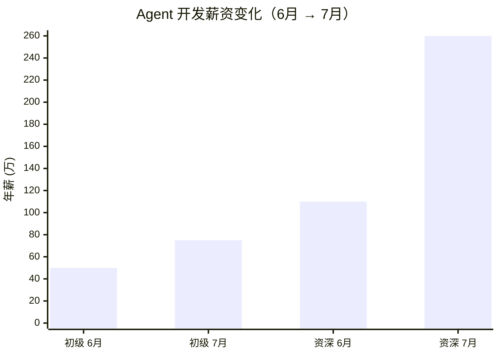
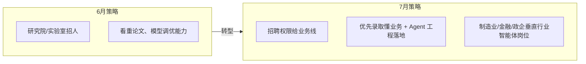

# 2026年6月→7月 AI Agent 面试行情与招聘变化

> 📋 **规范**：遵循 `docs/规则/文档规范.md`
> 📌 **更新时间**：2026-08-12
> 📝 **版本变更记录**（永久保存，只追加不删除）：
> | 版本 | 日期 | 具体改动 |
> |------|------|---------|
> | v1 | 2026-08-12 | 初版：自 `docs/学习/2026-07-27-学习-AI-agent面试市场.md` 迁移（仅补规范头，正文未改） |

> **关联**（双向）：`docs/索引.md`

## 目录

- [一、整体供需结构性巨变](#一、整体供需结构性巨变)
- [二、面试考察内容硬核升级](#二、面试考察内容硬核升级)
- [三、薪资与 offer 趋势](#三、薪资与-offer-趋势)
- [四、面试流程与招聘策略变化](#四、面试流程与招聘策略变化)
- [五、海外市场同步变化](#五、海外市场同步变化)
- [六、针对当前项目（LangGraph + 多智能体）的求职建议](#六、针对当前项目LangGraph-+-多智能体的求职建议)
- [七、面试高频考点自查清单](#七、面试高频考点自查清单)

---

> 关联文档：[Agent 架构图 — 当前节点与未来拓展](./学习/2026-07-27-学习-agent架构图.md)  
> 本文档记录 AI Agent 赛道面试行情、考察内容变化、薪资趋势，以及针对当前项目技术栈（LangGraph + 多智能体）的求职策略。

---

## 一、整体供需结构性巨变（6月温和扩张 → 7月两极分化）

### 1. 岗位侧：收缩通用算法，疯狂扩招 Agent 落地岗

- **6月状态**：大厂通用大模型预训练、基座微调岗仍有稳定 HC，同时开放 Agent 试点岗位，岗位分散、各团队独立招人；秋招提前批刚启动，投递量缓慢上涨，竞争比约 60:1。
- **7月核心变化**：
  1. **纯基座算法岗大幅缩 HC**：亚马逊、微软、阿里通义 7 月砍掉通用预训练/基础微调编制，只保留推理优化、算力框架团队；纯调参、SFT 标注类岗位大量缩减，海外同步裁员通用 AGI 团队。
  2. **Agent/企业数字员工岗逆势扩招（7月爆发）**：WAIC 世界人工智能大会（7.20）现场释放 6 万+ AI 全职岗，**45% 全部是 Agent 开发、智能体架构、多智能体协同**；字节、DeepSeek、智谱新增独立 Harness/智能体安全团队，HC 翻倍。
  3. 传统后端、功能测试、基础数据清洗岗需求暴跌 45%，面试邀约大幅减少，大量岗位合并为"AI 应用开发"复合岗。
- **总结**：6 月是「大模型算法+应用并行招人」，7 月变成「砍掉底层通用算法，all in Agent 产业落地」。

### 2. 求职供给侧：7 月投递量暴涨，竞争难度显著上升

| 维度 | 6月 | 7月 |
|:----|:---|:---|
| 投递人群 | 应届生提前批 + 少量跳槽者 | 暑期实习结束 + 大批 27 届秋招 + 传统开发转 AI 涌入 |
| 热门 Agent 岗竞争比 | 50:1 | **120–180:1** |
| 简历 AI 初筛淘汰率 | 40% | **65%**，无落地项目直接初筛挂 |
| 海外反差 | 维持招聘 | 一边裁员通用研发，一边高薪抢 Agent 落地人才，薪资溢价 30%–50% |

---

## 二、面试考察内容硬核升级（6月理论为主 → 7月全流程工程落地 + Agent 专项）

### 1. 笔试/机考变化

| 项目 | 6月 | 7月 |
|:----|:---|:---|
| 考察重点 | Transformer、RLHF、向量库基础算法 | **LangGraph 多智能体工作流**、Checkpoint 持久化 |
| 新增考点 | — | **Agent 安全沙箱、权限分级、MCP 协议** |
| AI 辅助编码 | 允许简单 AI 辅助 | 禁止无限制 AI 抄代码，要求展示完整思考链路 |
| 纯模型理论分值 | 高 | **下降 40%**，被 Agent 工程落地题取代 |

### 2. 真人技术面提问转向（最直观变化）

| 6月高频问题 | 7月替换为 Agent 落地实操问题 |
|:-----------|:---------------------------|
| LLaMA 微调、训练 loss 调优、预训练分布式 | **LangGraph 状态管理、多 Agent 分工调度、任务规划器实现** |
| 基础 RAG 召回、Chunk 分割 | **生产级 Agent 记忆分层、长期/短期记忆冲突解决、海量工具编排** |
| 通用 Prompt 工程 | **Human-in-the-loop 审批流程、Agent 自主工具调用容错、SWE 智能体代码执行沙箱** |
| 模型精度指标 | **Agent 业务闭环指标**（任务完成率、人工干预率、运行稳定性）、全链路可观测（LangSmith） |

### 3. 项目面试门槛抬高

- 6 月：有简单 RAG/单智能体 Demo 即可过关
- 7 月硬性要求：**线上可访问、带完整工程部署、处理过复杂业务流程的多 Agent 项目**
  - 仅本地 Demo 直接降分
  - 面试官强制追问：线上压测、并发调度、异常崩溃恢复方案

---

## 三、薪资与 offer 趋势（6月平稳 → 7月两极分化，Agent 溢价拉大）

### 薪资变化概览

> **说明**：上方为示意性数据图表，具体数值见下表。

| 岗位 | 6月年薪范围 | 7月年薪范围 | 变化 |
|:----|:-----------|:-----------|:-----|
| 初级 Agent 开发（1-3 年） | 40–60w | 50–75w | ⬆️ 月薪上浮 8k–15k |
| 资深 Agent 架构（3-8 年） | 110–230w | 130–260w | ⬆️ 头部厂到 260w |
| DeepSeek Agent 研究员（应届） | — | 最高 140w | ⬆️ 新增校招高薪 HC |
| 纯算法基座岗 | 120–260w | 下浮 10%–15% | ⬇️ HC 减少，部分取消签字费 |

### 转型红利

- Java 后端转 Agent 开发，7 月跳槽普遍薪资上浮 **40%–70%**（6 月仅 20%–30%）
- 海外 Agent 工程师薪资中位数 13.4–23w 美元

### offer 发放节奏

| 维度 | 6月 | 7月 |
|:----|:---|:---|
| 发放周期 | 面后 3-5 天 | 7-10 天（候选人增多、背调拉长） |
| 企业议价权 | 低 | 收紧，热门岗大量候选人对比 offer |

---

## 四、面试流程与招聘策略变化

### 1. AI 自动初筛全面加码（7月全覆盖）

- 6 月：仅大厂校招使用 AI 视频面试
- 7 月：社招、中小 AI 公司全部上线 AI 初面
  - 自动深挖简历 Agent 项目细节，实时追问技术细节
  - **无 Agent 项目直接淘汰**，无二次反馈通道

### 2. 企业招聘策略：从"招研究员"变为"招能落地的工程人才"

### 3. 淘汰逻辑变化

| 6月淘汰点 | 7月核心淘汰点 |
|:----------|:-------------|
| 算法基础薄弱、代码能力差 | ① 只会单智能体，不懂多 Agent 协同调度 |
| | ② 无线上生产部署经验，只做玩具 Demo |
| | ③ 不懂 Agent 安全、权限管控、状态持久化 |
| | ④ 只会调库，无法自主改造 LangGraph、处理分布式并发问题 |

---

## 五、海外市场同步变化

- 6 月：Meta、Amazon 维持基础模型团队招聘
- 7 月：**21 家海外科技公司**官宣因 AI 转型裁员
  - 砍掉：通用基础算法、重复研发团队
  - 扩招：Agent 自动化、企业工作流智能体团队
- 美国 Agent 工程师薪资中位数 13.4–23w 美元
- 远程岗位增多但面试难度大幅提升

---

## 六、针对当前项目（LangGraph + 多智能体）的求职建议

### 1. 简历核心重构

| 方向 | 操作 |
|:----|:-----|
| 删除 | 过时大模型微调内容 |
| 重点突出 | **LangGraph 多智能体、Checkpoint 持久化、人工审批、沙箱隔离**完整工程案例 |

### 2. 面试准备重心转移

- 减少：预训练、微调理论复习
- 主攻：**多 Agent 调度、记忆机制、生产级故障处理、LangSmith 链路调试**

### 3. 投递策略

- 避开：纯基座算法岗
- 优先投：企业数字员工、办公 Agent、自动化工作流、SWE 代码智能体团队
  - 这类岗位 7 月通过率、薪资双高

### 4. 项目升级路线（与本项目技术栈对应）

| 面试要求 | 本项目已有 | 待补充 |
|:---------|:----------|:-------|
| LangGraph 多智能体 | ✅ `agent.py` StateGraph + supervisor/worker 规划 | 需实现 supervisor 路由节点 |
| Checkpoint 持久化 | ✅ `persistence.py` SQLite + MemorySaver 混合 | — |
| 人工审批流程 | ✅ `human_approval_node` + interrupt | — |
| 对话摘要压缩 | ✅ `summarizer_node` | — |
| 生产级可观测 | ❌ | 需集成 LangSmith/LangFuse |
| 并发压测 | ❌ | 需补充压测报告 |
| Agent 安全沙箱 | ❌ | 需实现子 Agent 隔离沙箱 |
| 线上部署 | ❌ | 需部署到公网可访问 |

### 5. 对应项目技术点速查

> 以下关键技术点在本项目的 `学习/2026-07-27-学习-agent架构图.md` 中有详细图解和代码逻辑。

| 面试考点 | 对应文档位置 |
|:---------|:------------|
| LangGraph StateGraph 节点与边 | `学习/2026-07-27-学习-agent架构图.md` §1.1–1.2 |
| MemorySaver + SQLite 混合持久化 | `学习/2026-07-27-学习-agent架构图.md` §2.1–2.4 |
| Human-in-the-Loop 审批流程 | `学习/2026-07-27-学习-agent架构图.md` §1.5 |
| 对话摘要压缩 (summarizer) | `学习/2026-07-27-学习-agent架构图.md` §1.6 |
| 工具节点设计 (search_wiki / read_page) | `学习/2026-07-27-学习-agent架构图.md` §三 |
| 多智能体拓展规划 (supervisor/worker) | `学习/2026-07-27-学习-agent架构图.md` §4.2–4.4 |
| 常量体系 (100+ 常量) | `学习/2026-07-27-学习-agent架构图.md` §五 |
| 测试覆盖 (149 个测试) | `学习/2026-07-27-学习-agent架构图.md` §六 |

---

## 七、面试高频考点自查清单

> 根据 7 月行情变化，划重点。

- [ ] LangGraph `StateGraph` 节点与边编排
- [ ] `create_react_agent` vs 手写 StateGraph
- [ ] Checkpoint/MemorySaver 持久化机制
- [ ] `interrupt()` / `Command(resume=...)` 人工审批
- [ ] `add_messages` reducer 与消息管理
- [ ] `RemoveMessage` 对话摘要压缩
- [ ] 多 Agent 分工调度（Supervisor + Worker）
- [ ] 工具调用容错与降级
- [ ] Agent 安全沙箱与权限分级
- [ ] MCP 协议与工具发现机制
- [ ] 全链路可观测（LangSmith 调试）
- [ ] SSE 流式接口实现
- [ ] 并发会话隔离与线程安全
