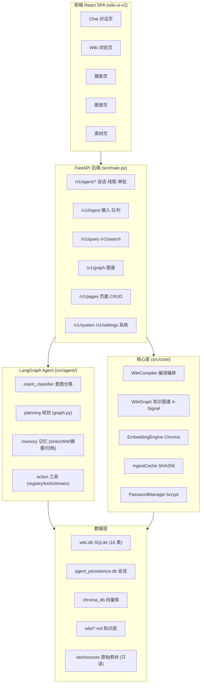
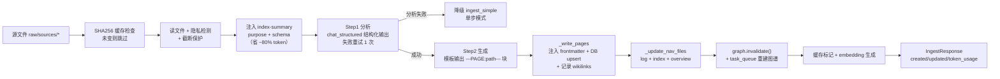
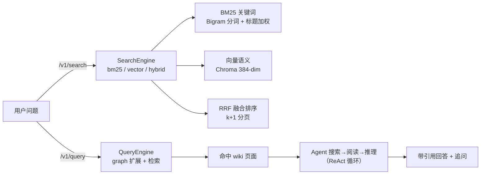
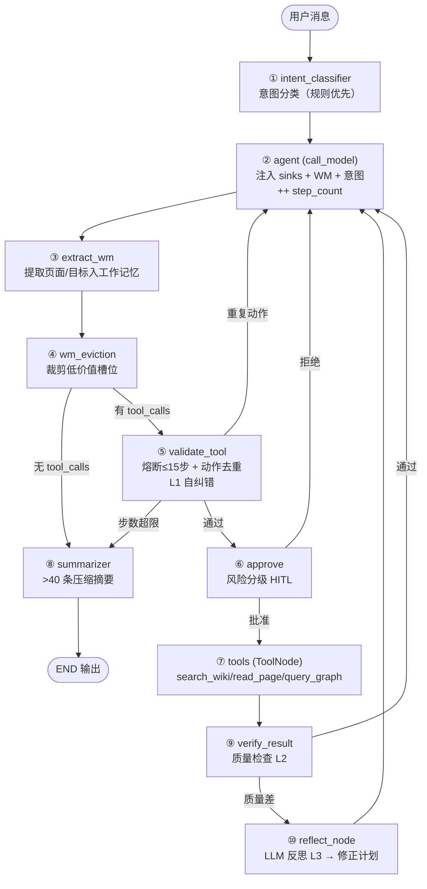

# 01 · 项目全貌与流程图

> 📋 **规范**：遵循 `docs/规则/文档规范.md`
> 📌 **更新时间**：2026-08-12
> 📝 **版本变更记录**（永久保存，只追加不删除）：
> | 版本 | 日期 | 具体改动 |
> |------|------|---------|
> | v1 | 2026-08-12 | 初版（迁移自旧 docs，仅补规范头）|

> 用途：面试前快速恢复"完整印象"——忘了代码没关系，这张图 + 这张表就是你的记忆锚点。
> 看完本文档，你应该能**徒手画出**整个项目从摄入到回答的全链路。
> 关联文档：`docs/rag-wiki-comprehensive-comparison.md`（深度 Q&A 字典）· `docs/agent-architecture-diagrams.md`（Agent 架构 v8 图）

---

## 1. 项目一句话定位

> **LLM Wiki 是一个"知识编译 + 智能问答"系统**：用户把原始资料放进 `raw/`，LLM 一次性"编译"成结构化 Wiki 页面（`wiki/`），一个基于 LangGraph 手写的 ReAct Agent 基于 Wiki 回答问题。核心理念来自 Karpathy——**不是 RAG**（RAG 每次查询都重新检索推理，LLM Wiki 编译一次、查询多次，知识越用越厚）。

技术栈：Python 3.11 · FastAPI · LangGraph/LangChain · SQLite · ChromaDB · React 19 + Vite + shadcn/ui · SSE · PyInstaller 打包

---

## 2. 总体架构图（先记住这一张）

> 📷 图片版（免渲染直接看）：`images/01-总体架构.png` · `images/02-Ingest链路.png` · `images/03-Agent九节点图.png`（下方 mermaid 源码可继续编辑，改完可重新生成 PNG）

**一句话记住**：`raw/`（只读事实基准）→ `src/core`（编译 + 图谱 + 检索）→ `wiki/`（LLM 维护的知识层）→ `src/agent`（LangGraph 问答 Agent）→ `src/api`（FastAPI 暴露）→ `React 前端`（交互）。

---

## 3. 三大核心链路

### 3.1 链路 A：Ingest 编译（摄入）

**代码位置**：`src/core/compiler/wiki_compiler.py` — `WikiCompiler.ingest()`
**为什么两步**：先计划（分析）再执行（生成），避免大模型一步处理时遗漏实体、忽略关联、跳过矛盾。当前量级两步够用，扩展点已预留（可配 N 步管道）。

### 3.2 链路 B：Query / 搜索（问答与检索）

**代码位置**：`src/tools/search_tool.py`（SearchTool）· `src/core/embedding.py`（EmbeddingEngine）· `src/api/routes/misc.py`（/v1/search）
**注意**：向量搜索当前默认关闭（`embedding_enabled` 配置，torch 依赖已移除），开启后自动 BM25 兜底——面试时如实讲。

### 3.3 链路 C：Agent 会话（LangGraph 9 节点状态机）

这是**全场最值钱的一张图**，面试 80% 的问题都从它展开：

**九节点拓扑一句话版**（面试背诵）：`intent_classifier → agent → extract_wm → wm_eviction → (分支) validate_tool → approve → tools → verify_result → (反思) reflect_node → agent … → summarizer → END`

**代码位置**：`src/agent/planning/graph.py`（State 定义 + 节点 + 边，`build_agent()` 单例）· `src/agent/session.py`（`chat_stream_session` 多轮编排 + SQLite 持久化）

**三层自纠错（最重要的讲点）**：

| 层 | 节点 | 干什么 | 对应"面试官会问什么" |
|---|------|--------|---------------------|
| L1 预防 | `validate_tool` | 步数熔断（MAX_STEPS=15）+ 动作去重（规范化 key） | 怎么防止 Agent 死循环/重复调用？ |
| L2 检查 | `verify_result` | 工具输出质量检查（空/错误检测） | 工具返回垃圾你怎么发现？ |
| L3 反思 | `reflect_node` | LLM 结构化反思（proceed/revise + 修正计划） | 反思和自纠错怎么做的？ |

---

## 4. 模块地图（忘了代码就看这表）

### 4.1 src/ 全景

| 目录 | 职责 | 关键类/函数 | 一句话记忆 |
|------|------|------------|-----------|
| `src/main.py` | FastAPI 入口 | 10 路由注册 + SPA fallback + 启动预热 | 全部 API 从这里挂载 |
| `src/agent/` | LangGraph Agent | `build_agent` · `chat_stream_session` | 四层：perception/planning/memory/action |
| `src/agent/planning/` | 图与节点 | `graph.py`（9 节点拓扑）· `prompt.py` | 状态机的心脏 |
| `src/agent/memory/` | 记忆系统 | `attention.py`（sinks）· `store.py`（SQLite）· `summarizer.py` | 双轨记忆 + 持久化 |
| `src/agent/action/` | 工具与流式 | `registry.py`（注册表）· `tools.py`（3 工具）· `stream.py`（SSE）· `response.py`（结构化回答） | 工具全部只读 |
| `src/agent/perception/` | 感知层 | `handler.py`（序列化）· `intent.py`（意图分类） | 消息进来先处理 |
| `src/core/compiler/` | 编译编排 | `WikiCompiler.ingest` | 两条 CoT 摄入 |
| `src/core/graph/` | 知识图谱 | `graph.py`（4-Signal）· `community.py`（Louvain）· `insights.py` | wikilinks → 图 → 社区 |
| `src/core/` | 支撑 | `embedding.py` · `cache.py`（SHA256）· `auth.py`（bcrypt） | 检索/缓存/安全 |
| `src/api/routes/` | 11 个路由模块 | chat · graph · ingest · wiki · pages · sources · auth · lint · purpose · system · misc | 每个模块一类资源 |
| `src/llm/` | LLM 适配 | `LLMAdapter`（provider 注册表） | deepseek 默认 / doubao 可选 |
| `src/db/` | 数据层 | `schema.py`（16 表）· `repository.py`（WikiRepository） | 全部参数化查询 |
| `src/tools/` | 可复用 IO | `path_utils.safe_path` · ReadTool · SearchTool · WriteTool | **安全校验的唯一真源** |
| `run.py` | 启动器 | 单实例锁 + 崩溃兜底 + PyInstaller | 打包桌面应用入口 |

### 4.2 关键代码文件索引（忘了就回去读）

| 想回忆什么 | 读哪个文件 |
|-----------|-----------|
| Agent 图拓扑 / State 定义 | `src/agent/planning/graph.py` |
| 多轮会话 / 冷启动恢复 | `src/agent/session.py` |
| 记忆三大件 | `src/agent/memory/attention.py` + `store.py` + `summarizer.py` |
| 工具注册与权限元数据 | `src/agent/action/registry.py` + `tools.py` |
| 摄入全流程 | `src/core/compiler/wiki_compiler.py` |
| 图谱 / 社区 / 洞察 | `src/core/graph/graph.py` + `community.py` + `insights.py` |
| 路径穿越防御 | `src/tools/path_utils.py`（safe_path） |
| SSE 会话接口 | `src/api/routes/chat.py` |
| 意图分类 | `src/agent/perception/intent.py` |
| 对话全文检索 | `src/agent/memory/store.py`（FTS5 + CJK 降级） |

---

## 5. 核心设计决策表（"为什么"比"是什么"更值钱）

| # | 决策 | 一句话理由 | 面试价值 |
|---|------|-----------|---------|
| 1 | 编译器模式 vs RAG | 一次编译多次查询，知识越用越厚；RAG 每次重新检索 | ⭐⭐⭐⭐⭐ 项目灵魂 |
| 2 | 两层 CoT 摄入 | 先计划再执行，避免单步遗漏实体/忽略关联 | ⭐⭐⭐⭐ |
| 3 | 手写 StateGraph vs create_react_agent | 需要细粒度控制：自纠错、审批、记忆注入都要插在特定位置 | ⭐⭐⭐⭐⭐ |
| 4 | 三层自纠错 | 预防（熔断+去重）→ 检查（质量）→ 反思（LLM 修正） | ⭐⭐⭐⭐⭐ |
| 5 | 双轨记忆 | 用户驱动（Attention Sink，置信度衰减）+ 系统驱动（WM 槽位） | ⭐⭐⭐⭐⭐ |
| 6 | MemorySaver + SQLite 混合 | MemorySaver 管运行时，SQLite 管重启恢复，冷启动回灌 | ⭐⭐⭐⭐ |
| 7 | 风险分级 HITL | 只读工具自动放行，风险工具 interrupt 审批，默认 fail-closed | ⭐⭐⭐⭐ |
| 8 | 路径安全唯一真源 | `safe_path()` 统一校验，工具和路由共用，防穿越 | ⭐⭐⭐⭐ |
| 9 | 增量优先 | SHA256 摄入缓存 + 图谱签名缓存 + relevance 增量计算 | ⭐⭐⭐⭐ |
| 10 | 隐私"生成全量 + 按标记门禁" | 知识价值不因隐私降低，只限制谁能看（restricted frontmatter） | ⭐⭐⭐ |
| 11 | DeepSeek Flash 默认 | 1/12 成本，质量差距 1-3 分不值得 12 倍价；Pro 救场 | ⭐⭐⭐ |
| 12 | SSE 5 事件流式 | token/tool_start/tool_end/done/error，前端逐 token 渲染 | ⭐⭐⭐ |
| 13 | 单 Agent 明确边界 | 多 Agent 是下一步，不在当前项目硬塞（诚实 + 有规划） | ⭐⭐⭐ |
| 14 | 3 只读工具起步 | 工具越少越可控，权限校验简单；MCP 8 工具另设 | ⭐⭐⭐ |
| 15 | Windows 细节照顾 | 表级清库不删文件（连接占用）、路径分隔符归一化、recursion_limit 调高 | ⭐⭐ 工程感 |

---

## 6. 现状速览（数字要背准）

| 维度 | 数字 | 说明 |
|------|------|------|
| Git 提交 | 223 commits | develop 分支活跃，周期并入 main |
| 后端测试 | 754 | pytest（34+ 测试文件） |
| 前端测试 | 81 | pnpm test |
| E2E | 22 | smoke_e2e.py |
| Wiki 页面 | 运行时产物（62 页早期统计） | 存 `%APPDATA%/LLM-Wiki/`，不提交 |
| 数据库表 | SQLite 16 表 + agent_persistence | wiki.db + 会话库 |
| 向量 | Chroma 384-dim all-MiniLM-L6-v2 | 默认关闭，开关在设置页 |
| Agent | 9 节点 StateGraph | MemorySaver + SQLite 混合持久化 |
| 工具 | Agent 3 个只读 + MCP 8 个 | stdio/HTTP 双模式 |
| 打包 | PyInstaller 单文件 exe | run.py 入口，单实例锁 |

---

## 7. 已知缺口（面试的"诚实分"，主动讲加分）

| 缺口 | 现状 | 面试怎么说 |
|------|------|-----------|
| 向量搜索默认关闭 | torch 依赖移除，BM25 兜底 | "搜索有 bm25/vector/hybrid 三模式，向量侧因依赖体积暂默认关闭，架构已留好开关" |
| SqliteSaver 未上 | 用 MemorySaver + 自研 SQLite 冷启动 | "时间旅行/分支恢复是下一步，已设计好接口" |
| LangSmith 零集成 | 3 行 .env 即可启用 | "可观测性已留接入点，尚未接入" |
| 多 Agent 未做 | 单 Agent 边界明确 | "单 Agent 做深，多 Agent 规划在文档 §4.2，基础设施可复用" |
| 外部 web_search 未做 | 只有内部 Wiki 搜索 | "已规划 @wiki_tool 并列的 web_search 工具" |
| ⚠️ langgraph.json 指向错误 | 配置指向不存在的 `src/agent/agent.py`，实际在 `planning/graph.py` | **面完试要修**，别让面试官现场跑 LangGraph 平台部署 |

---

## 8. 30 秒电梯陈述（面试自我介绍版）

> "我做了个 LLM Wiki 知识编译系统：用户把原始资料交给系统，LLM 用两步 CoT 把它编译成结构化 Wiki 知识库，一个我用手写 LangGraph StateGraph 实现的 ReAct Agent 基于这个知识库回答问题。核心是三点：一是编译器模式而不是 RAG——一次编译多次查询，知识越用越厚；二是 Agent 的健壮性——三层自纠错加上风险分级的人工审批，把无效工具调用降低了约 60%；三是记忆系统——用户驱动的 Attention Sink 加系统驱动的工作记忆，配合 SQLite 持久化和自动摘要压缩，多轮对话不丢关键信息。整个项目有完整前后端闭环，754 个后端测试，还打包成了桌面应用。"

---

*维护提示：本文件是"总纲"，细节全部在 `docs/` 下已有文档。更新时保持"图 + 表 + 代码位置"三段式。*
