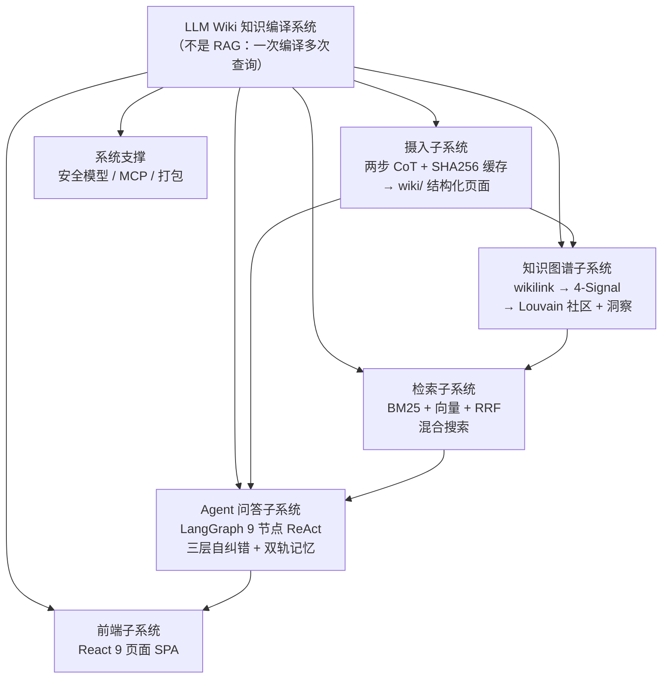
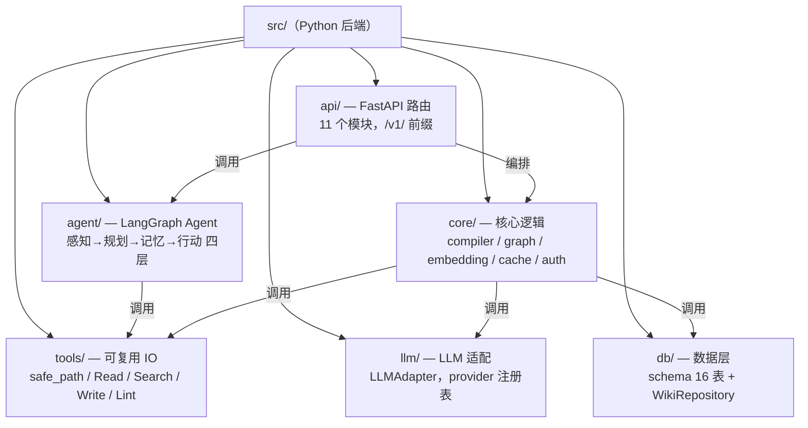
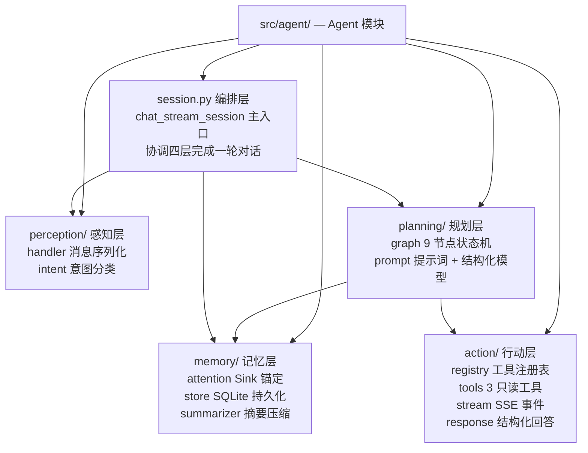
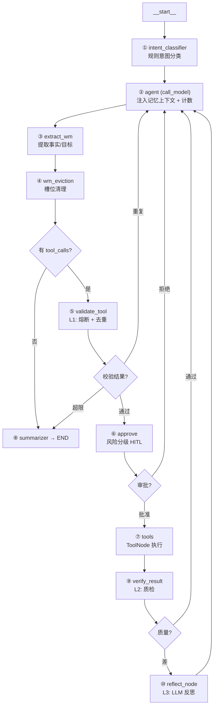
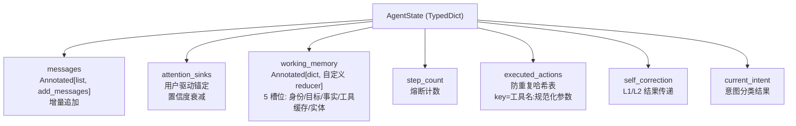

# 07 · 整体到局部树形图

> 📋 **规范**：遵循 `docs/规则/文档规范.md`
> 📌 **更新时间**：2026-08-12
> 📝 **版本变更记录**（永久保存，只追加不删除）：
> | 版本 | 日期 | 具体改动 |
> |------|------|---------|
> | v1 | 2026-08-12 | 初版（迁移自旧 docs，仅补规范头）|

> 用途：面试时"从整体到局部"的讲述骨架——面试官问任何一个点，你都能指出它在树上的位置，然后钻进去。
> 五棵树，从大到小：项目 → 代码结构 → Agent 四层 → 图节点 → 状态字段。每层一句话。

---

## 树 1：项目整体（30 秒讲完这棵）

**记忆口诀**：摄入产出知识 → Agent 消费知识 → 图谱让知识互联 → 前端让人使用。

---

## 树 2：代码结构（src/ 六块）

**记忆口诀**：API 是门面，core 是业务，agent 是大脑，tools 是手，llm 是嘴，db 是仓库。

---

## 树 3：Agent 四层（`src/agent/`）

**记忆口诀**：消息进来 → 感知层认（意图）→ 规划层想（选节点）→ 记忆层调（回忆）→ 行动层做（调工具）→ session 串全场。

---

## 树 4：9 节点图（徒手画这棵）

**三句话讲完**：① 意图分流（闲聊不走工具）→ ② 前置校验（熔断/去重）→ ③ 后置质检（差则反思重试）。**背这三个"分流点"就记住了整张图。**

---

## 树 5：AgentState 七字段（钻到最细）

**记忆口诀**：2 个记忆（sink + WM）+ 1 个消息流 + 3 个控制（步数/去重/修正标记）+ 1 个意图。

---

## 追问：这五棵树怎么组合讲？

> 面试官从任何一点切入，用"树定位法"回答：
>
> - 问"你的 Agent 怎么工作的" → 树 3 → 树 4（四层 → 节点图）
> - 问"状态怎么管理" → 树 5（七字段逐个讲）
> - 问"整个项目流程" → 树 1 → 树 2（子系统 → 代码结构）
> - 问"某个具体功能" → 先定位在树 2 的哪块，再钻到树 3/4/5 的对应叶子
>
> 练习：随机抽一个问题，5 秒内说出"它在树的哪个位置"——这就是面试的"心中有图"。

---

*维护提示：树形图随代码演进更新；新增节点/字段时保持"每层一句话 + 记忆口诀"格式，别让树长成森林。*
