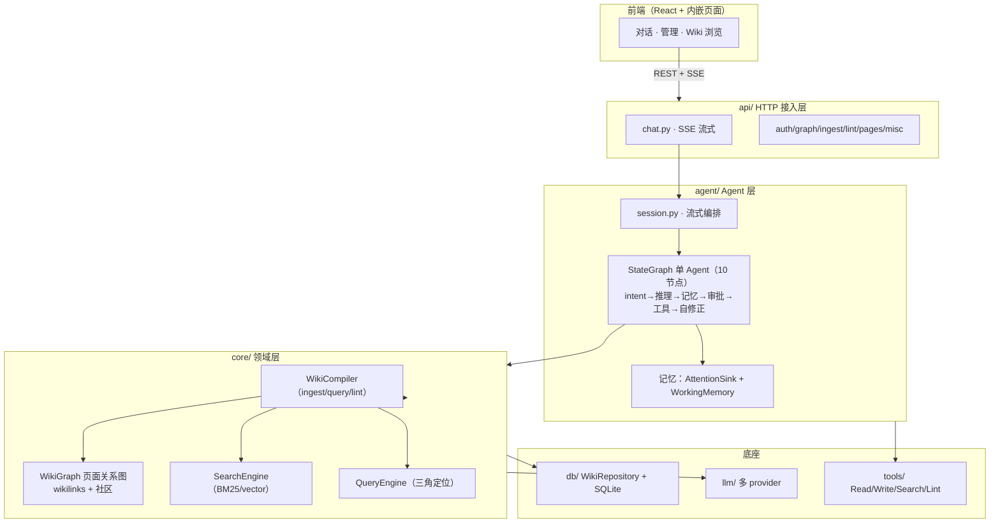
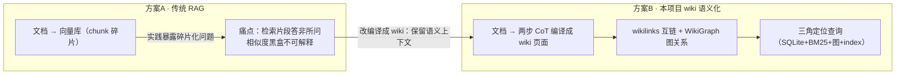

# 面试描述点-架构总纲 v1（LLM Wiki）

> 📋 **规范**：遵循 `docs/规则/文档治理规则.md`、`docs/规则/面试描述点规则.md`（R0-R5）
> 📌 **更新时间**：2026-08-12
> 📝 **版本变更记录**（永久保存，只追加不删除）：
> | 版本 | 日期 | 具体改动 |
> |------|------|---------|
> | v1 | 2026-08-12 | 初版：LLM Wiki 后端架构总纲——单 Agent + wiki 语义化存储（非 RAG），核心卖点「数据组织成 wiki 而非塞进向量库」；mermaid 静态分层图 + 动态演进图 |

> **目录**：§1 总 ｜ §2 分（单Agent/存储/决策/演进）｜ §3 mermaid 流程图（静态 + 动态）｜ §4 总 ｜ §5 数据弹药

> **关联**（双向）：`docs/规则/面试描述点规则.md` ｜ `docs/架构/后端架构目录.md`（分层/决策）｜ `docs/架构/后端功能全景.md`（功能）｜ `docs/架构/参考-后端接口.md`（SSE）｜ `docs/学习/2026-07-27-学习-agent架构图.md`（Agent 节点）｜ `docs/索引.md`

---

## §1 总（30s）

> "我做的是一个**单 Agent 的 wiki 语义化存储系统**——核心不是 RAG（不做向量检索为主的问答），而是把非结构化资料**编译成互链的结构化 wiki 页面**，Agent 在编译后的 wiki 上问答。核心卖点：**数据不是塞进向量库，而是组织成 wiki**——有语义上下文、可编辑、可审计。后端 18,324 行 Python，782 个测试全绿。"

---

## §2 分（广度叙事：单Agent → 存储方案 → 核心决策 → 演进）

### ① 单 Agent 架构（四模块）

| 模块 | 目录 | 职责 |
|------|------|------|
| 感知 | `agent/perception/` | 意图分类（intent_classifier）|
| 规划 | `agent/planning/` | StateGraph 构建（10 节点）|
| 记忆 | `agent/memory/` | AttentionSink + WorkingMemory + summarizer |
| 执行 | `agent/action/` | 工具注册/调用/流式事件 |

- **StateGraph 10 节点**：intent → agent → extract_wm → wm_eviction → [validate_tool → approve → tools → verify_result → (reflect)] → summarizer
- **三层自修正**：validate_tool（步数熔断+去重）→ verify_result（质量校验）→ reflect（LLM 反思）
- **HITL 审批**：工具风险分级，只读放行、风险工具 interrupt() 暂停等人工
- **为什么单 Agent**：领域单一（wiki 编译+问答），拆多 Agent 的成本（2-8×）/延迟不划算

### ② 核心：wiki 存储而非 RAG

| 维度 | RAG（烂大街方案）| 本项目（wiki 语义化）|
|------|------------------|---------------------|
| 数据形态 | 文档 → 向量库（chunk 碎片）| 文档 → **编译成 wiki 页面**（有标题/分类/语义上下文）|
| 检索 | 向量相似度 top-k | 三角定位：SQLite + BM25 + **wikilinks 图扩展** + LLM 读 index.md |
| 语义关系 | 向量隐含 | **显式 [[wikilinks]] 互链 + WikiGraph 社区/洞察** |
| 可解释 | 黑盒相似度 | 页面可读、可编辑、可审计 |
| 增强 | 重排序/混合检索 | 图关联度扩展（4-Signal）+ 社区洞察 |

### ③ 核心决策表（每个回链功能描述点）

| 决策 | 选择 | 权衡 |
|------|------|------|
| a. 存储 = wiki 非 RAG | 编译成结构化页面 | 避免检索碎片/答非所问；可编辑可审计 |
| b. 查询三角定位 | SQLite+BM25+图扩展+index兜底 | 不依赖向量也答准；图关系弥补全文检索 |
| c. 单 Agent StateGraph | 手写 LangGraph 10 节点 | 领域单一不拆多 Agent；手写理解核心 |
| d. 两层记忆 | AttentionSink + WorkingMemory | 长对话防丢失，锚定关键信息 |
| e. 三层自修正 | 熔断 → 校验 → 反思 | 工具/结果/推理三处兜底 |
| f. HITL 审批 | 风险分级 + interrupt | 防误操作，人工在环 |
| g. 搜索三模式 | BM25 默认/vector 可选 | 最小依赖可部署，向量是增强 |

### ④ 演进路径（为什么选 wiki 而非 RAG——面试必讲）

从"最初想用 RAG"到"决定编译成 wiki"，核心判断：
1. **RAG 的痛**：chunk 碎片化 → 检索片段答非所问；向量相似度是黑盒，错了解释不了
2. **wiki 的收益**：页面有语义上下文（标题/分类/互链），**WikiGraph 图关系**能答"哪些页面相关""社区聚类"
3. **实现路径**：两步 CoT 编译（结构化分析 → LLM 生成页面）→ wikilinks 互链 → 图构建 → 查询三角定位

---

## §3 mermaid 流程图（R2）

### 3.1 静态：分层架构全貌

### 3.2 动态：存储方案演进（RAG → wiki 语义化）

---

## §4 总（20s）

> "核心一句话：**别人做 RAG 把文档塞进向量库，我把文档编译成 wiki**。单 Agent StateGraph 承载编译+问答，WikiGraph 图关系让语义显式化，查询三角定位不依赖向量也答准。782 个测试、18K 行后端，从 Ingest 管道到图谱到对话闭环。面试官问任意功能点，都能从这张图上定位。"

---

## §5 数据弹药（R3）

| 数据 | 值 | commit |
|------|-----|--------|
| 后端规模 | 18,324 行 Python | — |
| 测试 | 782 个 / 45 文件 | `3d06bc3` |
| 两步 CoT 编译 | Ingest 管道核心 | `1f5d264` |
| StateGraph 自修正 | 三层（熔断/校验/反思）| `d3342d8` |
| 搜索降级 | 向量默认关 → BM25 | `7033c3d` |
| 图能力 | wikilinks + 社区 + 洞察 | `a6a29f8`（图解析器）|
| Agent 模块化 | 四层重构 | `364b870` |

> 📌 双向链接：架构真相源 `docs/架构/后端架构目录.md`；功能全景 `docs/架构/后端功能全景.md`；接口 `docs/架构/参考-后端接口.md`；Agent 细节 `docs/学习/2026-07-27-学习-agent架构图.md`。
