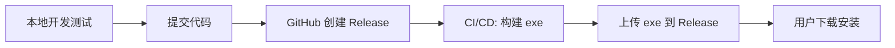

# Release 发布指南

> 📋 **规范**：遵循 `docs/规则/文档规范.md`
> 📌 **更新时间**：2026-08-12
> 📝 **版本变更记录**（永久保存，只追加不删除）：
> | 版本 | 日期 | 具体改动 |
> |------|------|---------|
> | v1 | 2026-08-12 | 初版：自 `docs/踩坑/2026-07-30-踩坑-发布指南.md` 迁移（仅补规范头，正文未改） |

> **关联**（双向）：`docs/索引.md`

## 目录

- [发布流程](#发布流程)
- [分步操作](#分步操作)
- [版本号规范](#版本号规范)
- [常见问题](#常见问题)

---


## 发布流程



## 分步操作

### 1. 本地开发测试

```bash
# 确保测试全部通过
python -m pytest tests/ -q --no-header

# 手动冒烟测试
python -m uvicorn src.main:app --reload --port 8766
# 浏览器打开 http://localhost:8766
# 验证：页面正常加载、搜索可用、Agent 问答正常
```

### 2. 构建前端

```bash
cd wiki-ui-v2
npm run build
```

产物：`wiki-ui-v2/dist/`（打包 exe 时需要）

### 3. 构建 exe

两种方式：

**方式 A — 一键脚本（推荐）**：
```bash
scripts\build-exe.bat
```

**方式 B — 分步执行**：
```bash
# 1. 构建前端
cd wiki-ui-v2 && npm run build && cd ..

# 2. 打包
pyinstaller wiki-llm.spec --clean --noconfirm
```

产物：`dist/LLM-Wiki.exe`（~80-120 MB）

### 4. 创建 GitHub Release

1. 在 GitHub 仓库页面，点击 **Releases → Create a new release**
2. 标签版本：`v0.1.0`、`v0.2.0` ...（遵循语义化版本）
3. 标题：`LLM Wiki v0.1.0`
4. 说明：列出本次更新的主要内容
5. 上传附件：`dist/LLM-Wiki.exe`
6. 点击 **Publish release**

### 5. 用户安装使用

1. 用户从 GitHub Releases 下载 `LLM-Wiki.exe`
2. 双击运行（Windows Defender 可能报误报，选择"仍要运行"）
3. 浏览器自动打开 `http://localhost:8766`
4. 首次使用：在设置页面配置 API Key
5. 开始使用

## 版本号规范

遵循 [SemVer](https://semver.org/)：

| 版本 | 说明 |
|:----|:------|
| v0.1.0 | 首次发布 |
| v0.1.1 | Bug 修复 |
| v0.2.0 | 新增功能 |
| v1.0.0 | 稳定版 |

## 常见问题

### Q: exe 被 Windows Defender 拦截怎么办？

PyInstaller 打包的 exe 容易被杀软误报。解决方案：
1. 提交给微软申请签名认证（~$300/年）
2. 或用户在 Defender 中添加排除项
3. 或使用 7-zip 压缩包发布（压缩后不易误报）

### Q: 如何更新到新版本？

1. 下载新版 `LLM-Wiki.exe`
2. 直接替换旧版 exe
3. 重启应用
4. 用户数据（设置、对话历史、知识库）自动保留在 `%APPDATA%/LLM-Wiki/`

### Q: 打包前需要准备什么？

```bash
# 1. 安装 PyInstaller
pip install pyinstaller

# 2. 安装前端依赖
cd wiki-ui-v2 && npm install

# 3. 确保测试通过
python -m pytest tests/ -q --no-header
```
